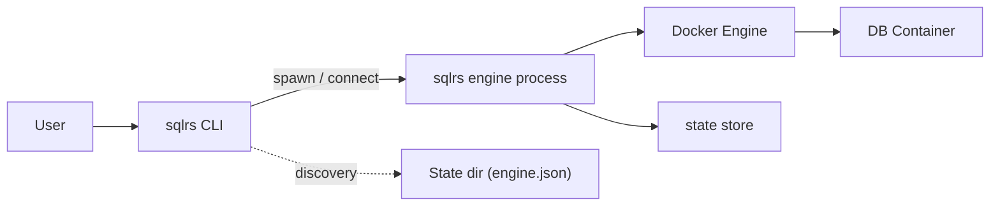

# Архитектура локального деплоймента (sqlrs)

Этот документ описывает, как `sqlrs` разворачивается и выполняется на **рабочей станции разработчика** в MVP.

Фокус:

- тонкий CLI
- эфемерный процесс engine
- взаимодействие с Docker и psql

Этот документ намеренно не повторяет детали запуска скриптов; интеграция Liquibase планируется
и описана в [`liquibase-integration.RU.md`](liquibase-integration.RU.md).
Внутренности engine описаны в [`engine-internals.RU.md`](engine-internals.RU.md).
Team/Cloud вариант описан в [`shared-deployment-architecture.RU.md`](shared-deployment-architecture.RU.md).

---

## 1. Цели

- Быстрый запуск CLI
- Минимальный постоянный след на хосте
- Кросс-платформенность (Linux, macOS, Windows через WSL2)
- Четкое разделение CLI и тяжелой runtime-логики
- Простая эволюция в daemon или team/cloud deployment

---

## 2. Высокоуровневая топология (MVP)

---

## 3. sqlrs CLI

### 3.1 Ответственности

- Парсить команды и флаги пользователя
- Работать с локальной файловой системой (конфиг проекта, пути)
- Находить или запускать локальный процесс engine
- Общаться с engine по HTTP через loopback или Unix socket
- Выполнять `run` команды локально против подготовленного экземпляра
- Завершаться сразу после выполнения команды
- Опционально: pre-flight проверки (Docker доступен, state store доступен для записи), вывод endpoint/version для диагностики

CLI намеренно **тонкий** и без состояния.

### 3.2 Не-ответственности

- Нет логики оркестрации Docker
- Нет логики snapshotting
- Нет прямого выполнения скриптов

---

## 4. Процесс Engine (эфемерный)

### 4.1 Характеристики

- Запускается по требованию CLI
- Работает как дочерний процесс (не системный daemon)
- Слушает локальный endpoint (loopback или socket)
- Управляет runtime-состоянием пока активен

### 4.2 Ответственности

- Оркестрация Docker-контейнеров
- Snapshotting и управление состояниями
- Cache rewind и eviction
- Выполнение скриптов через `psql` внутри контейнера
- Connection / proxy слой (если нужен)
- Трекинг подключений для TTL и безопасного удаления
- IPC/API для CLI и будущих IDE-интеграций
- Планирование/исполнение prepare; `run` команды не выполняет
- Создание эфемерных экземпляров для prepare

### 4.3 Жизненный цикл

- Спавнится по требованию
- Может жить короткий TTL после последнего запроса
- Автоматически завершается в простое
- Пишет endpoint/lock и auth token в `<StateDir>/engine.json`, чтобы последующие CLI могли переиспользовать процесс

Это избегает постоянных background-сервисов в MVP.

---

## 5. IPC: CLI <-> Engine

- **Транспорт/протокол**: REST по HTTP; только loopback. Unix domain socket на Linux/macOS; TCP loopback на Windows хосте с WSL forwarding. В локальном режиме TLS нет.
- **Discovery endpoint**:
  - CLI проверяет env var `TAIDON_ENGINE_ADDR`.
  - Иначе читает `<StateDir>/engine.json` (endpoint, socket path / TCP port, PID, instanceId, auth token).
  - Если не найден или устарел, CLI запускает новый engine; engine пишет `engine.json` при готовности.
- **Security**: запрет bind на не-loopback; auth token обязателен для non-health endpoint-ов; опора на права файлов (UDS) или loopback firewall; engine отказывает в соединениях с нелокальных адресов.
- **Versioning**: CLI отправляет свою версию; engine отклоняет несовместимую major; CLI может предложить апгрейд.

Ключевые endpoint-ы engine (логически):

- `POST /v1/prepare-jobs` - старт prepare job (plan/execute steps, snapshot states, создание экземпляра); `plan_only` считает только задачи
- `GET /v1/prepare-jobs/{jobId}` - статус job
- `GET /v1/prepare-jobs/{jobId}/events` - стрим событий job (NDJSON)
- список names/instances/states (JSON array или NDJSON через `Accept`)
- `GET /v1/names/{name}` - чтение name binding
- `GET /v1/instances/{instanceId}` - чтение экземпляра (если найдено по имени, engine отвечает 307 redirect на канонический URL по id)
- `DELETE /v1/instances/{instanceId}` - удаление экземпляра (идемпотентно; поддерживает dry-run)
- `GET /v1/states/{stateId}` - чтение state
- `DELETE /v1/states/{stateId}` - удаление state (идемпотентно; поддерживает recurse/force/dry-run)
- `POST /snapshots` - ручной snapshot
- `GET /cache/{key}` - cache lookup
- `POST /engine/shutdown` - опциональная мягкая остановка

### 5.1 Долгие операции: async jobs, sync CLI

- Engine выполняет prepare как асинхронные job; `POST /v1/prepare-jobs` отвечает `201 Created` с job id.
- CLI сразу начинает наблюдать job через статус/стрим и завершает работу после терминального статуса.
- У CLI пока нет detach-режима; `--watch/--no-watch` — future extension.

---

## 6. Взаимодействие с psql

Engine выполняет `psql` внутри DB-контейнера через `docker exec`.
При наличии файловых входов он монтирует корень скриптов read-only и
переписывает `-f` аргументы на путь внутри контейнера.

Интеграция Liquibase планируется; детали провайдера описаны в
[`liquibase-integration.RU.md`](liquibase-integration.RU.md).

---

## 6. Взаимодействие с Docker

- Docker обязателен в MVP
- Engine управляет DB-контейнерами и выполняет `psql` через `docker exec`
- Все persistent data directories монтируются из host-managed хранилища
- Engine проверяет доступность Docker на старте; CLI выводит понятные ошибки, если Docker недоступен

На Windows:

- Docker работает внутри WSL2
- State store живет внутри Linux файловой системы

---

## 7. Особенности Windows / WSL2

- Engine и snapshotter работают внутри WSL2
- CLI может работать на Windows host или внутри WSL2
- Коммуникация через localhost forwarding
- Engine пишет `engine.json` внутри WSL state directory; Windows CLI читает его через `wslpath`/interop, чтобы подключиться через проброшенный TCP порт
- Snapshot backend может откатываться на copy-based стратегию

---

## 8. Путь эволюции

### Phase 1 (MVP)

- Эфемерный engine процесс
- Тонкий CLI
- Только локальный деплоймент

### Phase 2

- Опциональный постоянный локальный daemon (`sqlrsd`)
- Переиспользование warm instance
- IDE интеграции

### Phase 3

- Team-shared engine
- Remote cache
- Cloud-hosted control plane

---

## 9. Не-цели

- System-wide background service по умолчанию
- OS-specific installers или service managers
- Глубокий embedding Liquibase

---

## 10. Открытые вопросы

- Unix socket vs TCP loopback как дефолт IPC?
- Дефолтный TTL engine после последней команды?
- Нужно ли CLI авто-обновлять engine binary?
