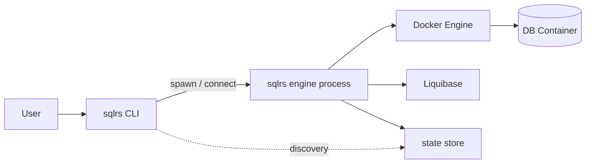

# Local Deployment Architecture (sqlrs)

This document describes how `sqlrs` is deployed and executed on a **developer workstation** in the MVP.

It focuses on:

- thin CLI design
- ephemeral engine process
- interaction with Docker and Liquibase

This document intentionally avoids repeating Liquibase-specific details; those are covered in `liquibase-integration.md`.
Engine internals are detailed in `engine-internals.md`.
Team/Cloud variant is covered in `shared-deployment-architecture.md`.

---

## 1. Goals

- Fast CLI startup
- Minimal permanent footprint on the host system
- Cross-platform operation (Linux, macOS, Windows via WSL2)
- Clear separation between user-facing CLI and heavy runtime logic
- Easy evolution toward a persistent daemon or team/cloud deployment

---

## 2. High-Level Topology (MVP)

---

## 3. sqlrs CLI

### 3.1 Responsibilities

- Parse user commands and flags
- Interact with local filesystem (project config, paths)
- Discover or spawn a local engine process
- Communicate with engine via HTTP over loopback or Unix socket
- Exit immediately after command completion
- Optional: pre-flight checks (Docker reachable, state store writable), show engine endpoint/version for diagnostics

The CLI is intentionally **thin** and stateless.

### 3.2 Non-Responsibilities

- No Docker orchestration logic
- No snapshotting logic
- No direct Liquibase execution

---

## 4. Engine Process (Ephemeral)

### 4.1 Characteristics

- Started on-demand by the CLI
- Runs as a child process (not a system daemon)
- Listens on a local endpoint (loopback or socket)
- Manages runtime state while active

### 4.2 Responsibilities

- Docker container orchestration
- Snapshotting and state management
- Cache rewind and eviction
- Liquibase orchestration (via providers)
- Connection / proxy layer (when needed)
- IPC/API for CLI and future IDE integrations

### 4.3 Lifecycle

- Spawned when required
- May persist for a short TTL after last request
- Terminates automatically when idle
- Writes its endpoint/lock into the state store root to allow subsequent CLI invocations to reuse the same process

This avoids permanent background services in MVP.

---

## 5. IPC: CLI <-> Engine

- **Transport/Protocol**: REST over HTTP; loopback-only. Unix domain socket on Linux/macOS; TCP loopback on Windows host with WSL forwarding. No TLS in local mode.
- **Endpoint discovery**:
  - CLI checks `TAIDON_ENGINE_ADDR` env var.
  - Else reads `state-store/engine.json` (contains socket path / TCP port and PID).
  - If not found or stale, CLI spawns a new engine and writes `engine.json`.
- **Security**: deny non-loopback binds; no auth in local mode; rely on file perms (UDS) or loopback firewall; engine refuses connections from non-local addresses.
- **Versioning**: CLI sends its version; engine rejects incompatible major; CLI may suggest upgrade.

Key engine endpoints (logical):

- `POST /runs` — start run (migrate/apply/run scripts)
- `POST /snapshots` — manual snapshot
- `GET /cache/{key}` — cache lookup
- `POST /engine/shutdown` — optional graceful stop

### 5.1 Long-running operations: sync vs async CLI modes

- **Async (fire-and-forget)**: CLI sends the request, receives `run_id` and status URL, prints it, exits. User can poll or stream later.
- **Sync (watch)**: CLI sends the request, then polls/streams status/events until terminal state; prints progress/logs; exits with engine result code.
- Engine side: all long ops are asynchronous; even sync mode is just CLI-side watch on top of the same REST endpoints (`GET /runs/{id}`, `GET /runs/{id}/stream`).
- Flags: e.g., `--watch/--no-watch` to switch mode; default can be `--watch` for interactive, `--no-watch` for scripted/CI.

---

## 6. Interaction with Liquibase

The engine delegates Liquibase execution to a _Liquibase provider_:

- system-installed Liquibase
- Docker-based Liquibase runner

Provider selection and compatibility checks are defined in `liquibase-integration.md`.

The engine consumes **structured logs** from Liquibase for observability and control.

---

## 6. Interaction with Docker

- Docker is required in MVP
- Engine controls DB containers and Liquibase containers
- All persistent data directories are mounted from host-managed storage
- Engine validates Docker availability on start; CLI surfaces actionable errors if missing/denied

On Windows:

- Docker runs inside WSL2
- State store lives inside the Linux filesystem

---

## 7. Windows / WSL2 Considerations

- Engine and snapshotter run inside WSL2
- CLI may run on Windows host or inside WSL2
- Communication via localhost forwarding
- Engine writes `engine.json` inside WSL state store; Windows CLI reads it via `wslpath`/interop to connect through forwarded TCP port
- Snapshot backend may fall back to copy-based strategy

---

## 8. Evolution Path

### Phase 1 (MVP)

- Ephemeral engine process
- Thin CLI
- Local-only deployment

### Phase 2

- Optional persistent local daemon (`sqlrsd`)
- Warm sandbox reuse
- IDE integrations

### Phase 3

- Team-shared engine
- Remote cache
- Cloud-hosted control plane

---

## 9. Non-Goals

- System-wide background service by default
- OS-specific installers or service managers
- Deep Liquibase embedding

---

## 10. Open Questions

- Unix socket vs TCP loopback as default IPC?
- Default engine TTL after last command?
- Should CLI auto-upgrade engine binary?
