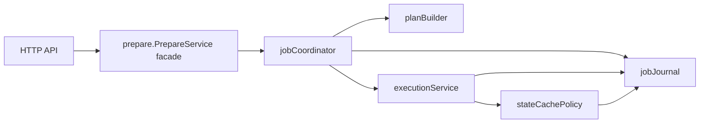
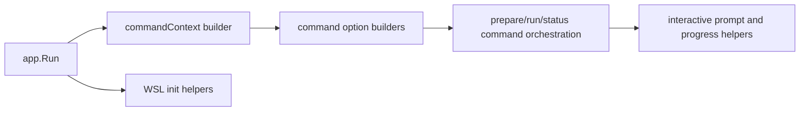

# Рефакторинг maintainability локального engine и CLI

Статус: Proposed (2026-03-08)

## 1. Контекст

Текущая реализация локального engine и CLI функционально стабильна и хорошо
покрыта тестами, но несколько ключевых файлов остаются слишком крупными и
смешивают несколько слоёв ответственности:

- `backend/local-engine-go/internal/prepare/manager.go`
- `backend/local-engine-go/internal/prepare/execution.go`
- `backend/local-engine-go/internal/httpapi/httpapi.go`
- `frontend/cli-go/internal/app/app.go`
- `frontend/cli-go/internal/app/init_wsl.go`
- `frontend/cli-go/internal/cli/commands_prepare.go`

Предыдущий `prepare-manager-refactor.md` уже уменьшил часть концентрации,
введя роли coordinator/executor/snapshot внутри `internal/prepare`.
Этот split улучшил форму пакета prepare, но не решил три оставшиеся проблемы
maintainability:

1. пакет prepare по-прежнему напрямую владеет слишком большим числом helper-ов
   и точек записи queue/log/cache;
2. HTTP-слой по-прежнему собирает всё поведение маршрутов в одном `NewHandler`;
3. CLI по-прежнему дублирует разрешение окружения и смешивает transport flow с
   terminal UI и platform-specific orchestration.

Этот документ задаёт следующий проход рефакторинга. Он инкрементальный и
сохраняет внешнее поведение.

## 2. Цели

- Сохранить CLI syntax, OpenAPI surface, storage schema и runtime behavior.
- Уменьшить концентрацию ответственности в engine prepare, HTTP API и CLI
  entrypoint-ах.
- Создать более узкие внутренние границы, чтобы дальнейшие изменения не
  требовали правок в крупных файлах.
- Сохранить возможность двигаться маленькими, тестируемыми шагами.

## 3. Не-цели

- Без изменений публичных CLI command-ов и flag-ов.
- Без изменений `/v1/*` endpoint paths и shapes payload-ов.
- Без нового persistence backend-а или редизайна схемы.
- Без переписывания проекта на другую архитектуру или framework.

## 4. Целевая форма

### 4.1 Engine: `internal/prepare`

`prepare.PrepareService` остаётся package facade, используемым из `httpapi`,
но следующий проход ещё сильнее сужает внутреннее владение:

- `jobCoordinator`
  - держит только job state machine;
  - оркестрирует planning, progression step-ов, terminal transitions и retries;
  - делегирует queue/event/log persistence отдельному коллаборатору;
- `planBuilder`
  - владеет request normalization и построением plan-а для `psql` и `lb`;
  - вычисляет task hash-и и normalized prepare signature;
- `executionService`
  - владеет runtime acquisition, execution step-ов и созданием instance;
  - делегирует cache и snapshot decisions, а не встраивает их inline;
- `stateCachePolicy`
  - владеет cached-state lookup, dirty-state invalidation, retention-triggered
    cleanup checks, build markers и lock-driven rebuild rules;
- `jobJournal`
  - владеет queue updates, event appends, log writes и heartbeat emission через
    небольшой внутренний API.

Ограничение реализации:

- Первый проход сохраняет эти роли в том же Go package
  (`internal/prepare`), чтобы избежать лишнего package churn.
- Публичные методы `PrepareService` не меняются.
- Существующие типы `jobCoordinator`, `taskExecutor` и `snapshotOrchestrator`
  могут сохраниться, но их helper-ы переезжают за более узкие коллабораторы.

### 4.2 Engine: `internal/httpapi`

Текущий HTTP handler заменяется на route modules, ориентированные на ресурс.

Целевая структура:

- `NewHandler(opts Options)`
  - только связывает mux и делегирует регистрацию;
- `configRoutes`
  - `/v1/config`, `/v1/config/schema`;
- `prepareRoutes`
  - `/v1/prepare-jobs`, `/v1/prepare-jobs/*`, `/v1/tasks`;
- `runRoutes`
  - `/v1/runs`;
- `registryRoutes`
  - `/v1/names*`, `/v1/instances*`, `/v1/states*`;
- shared helpers
  - auth/method guards;
  - JSON и NDJSON writing;
  - query parsing и common error mapping.

Правило владения:

- route modules занимаются только HTTP concerns;
- mapping domain errors делается явно и локально к ресурсу;
- write/flush errors уходят в shared response helper вместо молчаливого
  игнорирования в каждом call site.

### 4.3 CLI: invocation context и option builders

`internal/app` перестаёт inline собирать большие command-specific option literals.

Целевая структура:

- `commandContext`
  - разрешается один раз на invocation;
  - содержит workspace, profile, auth, daemon/runtime settings, output mode и
    timeouts;
- option builders
  - конвертируют `commandContext` в `cli.PrepareOptions`, `cli.RunOptions`,
    `cli.StatusOptions`, `cli.ConfigOptions` и deletion helpers;
- cleanup helper
  - инкапсулирует reporting cleanup prepared instance, который сейчас
    дублируется в `run:psql` и `run:pgbench`.

Правило владения:

- `app.Run` становится только orchestration-слоем;
- config/profile/WSL resolution выполняется до dispatch command-а;
- каждая ветка command-а получает уже собранные входы, а не пересобирает их.

### 4.4 CLI: interactive prepare и WSL init

Два тяжёлых файла разделяются по границе поведения:

- `commands_prepare.go`
  - network workflow и job-control flow остаются в command logic;
  - terminal prompt/raw-mode/progress rendering выносятся в отдельный helper;
- `init_wsl.go`
  - host prerequisite checks;
  - VHDX/disk provisioning;
  - WSL mount/systemd configuration;
  - post-mount verification
  становятся отдельными internal helper-ами с узкими контрактами.

Цель не в том, чтобы спрятать сложность, а в том, чтобы каждый sub-flow можно
было ревьюить и тестировать без чтения всего orchestration файла.

## 5. Взаимодействие компонентов

### 5.1 Prepare flow engine после рефакторинга

Ключевое правило:

- queue/event/log side effects идут через `jobJournal`;
- cache/snapshot decisions идут через `stateCachePolicy`;
- coordinator владеет порядком шагов, а не низкоуровневыми деталями persistence.

### 5.2 CLI invocation flow после рефакторинга

Ключевое правило:

- `app.Run` один раз строит context и дальше делегирует специализированной логике.

## 6. Фазы реализации

### Фаза 1: cleanup границ route-ов и CLI

- Выделить HTTP route groups и shared response helpers из `httpapi.go`.
- Ввести `commandContext` и option builders в `internal/app`.
- Выделить helper cleanup prepared instance.

Эта фаза сначала снижает дублирование, не трогая engine behavior.

### Фаза 2: cleanup внутренних границ prepare

- Ввести `jobJournal` и перенести в него queue/event/log/heartbeat helper-ы.
- Ввести `planBuilder` для request normalization и plan/task hash building.
- Ввести `stateCachePolicy` для cache/lock/marker/dirty-state helper-ов.

Эта фаза сохраняет package-level behavior, но уменьшает `manager.go` и
`execution.go`.

### Фаза 3: cleanup тяжёлых interaction file-ов

- Разделить rendering interactive prepare и transport/job-control logic.
- Разделить домены helper-ов WSL init.

Эта фаза уменьшает хрупкость тестов вокруг terminal и platform workflows.

## 7. Ограничения и совместимость

- Сохранить все существующие внешние command names и endpoint paths.
- Сохранить существующие queue/store schemas.
- Держать существующие behavior tests зелёными на каждом промежуточном шаге.
- Сначала переносить helper-ы за internal interfaces/structs и только потом
  менять какую-либо business logic.

## 8. Ожидаемые эффекты

- Меньшая поверхность ревью для поведенческих изменений.
- Меньше повторяющегося option plumbing в CLI.
- Меньше route-local duplication и более явное разделение HTTP/domain.
- Более сфокусированные тесты вокруг planner/cache/journal/UI boundaries.

## 9. Подход к верификации

Реализация по этому дизайну должна проверяться так:

1. сохранить текущее unit и integration coverage для engine и CLI модулей;
2. добавлять точечные тесты для новых builders/helper-ов, а не только
   наращивать крупные end-to-end test files;
3. держать внешние проверки на prepare jobs, run commands, WSL init failure
   paths и HTTP response semantics.
