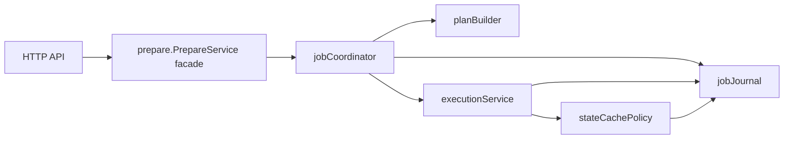
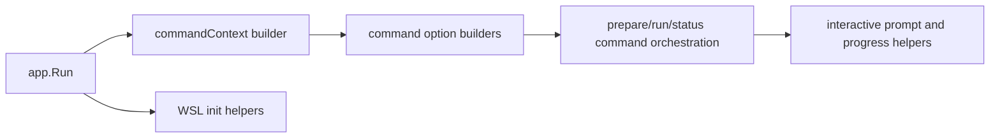

# Local Engine and CLI Maintainability Refactor

Status: Proposed (2026-03-08)

## 1. Context

The current local engine and CLI implementation is functionally healthy and
well-covered by tests, but several core files remain oversized and mix multiple
responsibility layers:

- `backend/local-engine-go/internal/prepare/manager.go`
- `backend/local-engine-go/internal/prepare/execution.go`
- `backend/local-engine-go/internal/httpapi/httpapi.go`
- `frontend/cli-go/internal/app/app.go`
- `frontend/cli-go/internal/app/init_wsl.go`
- `frontend/cli-go/internal/cli/commands_prepare.go`

The previous `prepare-manager-refactor.md` reduced part of the concentration by
introducing coordinator/executor/snapshot roles inside `internal/prepare`.
That split improved the shape of the prepare package, but it did not yet address
three remaining maintainability issues:

1. the prepare package still owns too many low-level helpers and queue/log/cache
   write points directly;
2. the HTTP layer still assembles all route behavior in one `NewHandler`;
3. the CLI still duplicates environment resolution and mixes transport flow with
   terminal-UI/platform-specific orchestration.

This document defines the next refactoring pass. It is incremental and keeps
external behavior stable.

## 2. Goals

- Preserve CLI syntax, OpenAPI surface, storage schema, and runtime behavior.
- Reduce responsibility concentration in engine prepare, HTTP API, and CLI entry
  points.
- Create narrower internal seams so later changes do not require large
  file-level edits.
- Keep the refactoring testable in small steps.

## 3. Non-goals

- No change to public CLI commands or flags.
- No change to `/v1/*` endpoint paths or payload shapes.
- No new persistence backend or schema redesign.
- No rewrite into a different architecture or framework.

## 4. Target shape

### 4.1 Engine: `internal/prepare`

`prepare.PrepareService` remains the package facade used by `httpapi`, but the
next refactoring pass narrows internal ownership further:

- `jobCoordinator`
  - keeps the job state machine only;
  - orchestrates planning, step progression, terminal transitions, and retries;
  - delegates queue/event/log persistence to a separate collaborator;
- `planBuilder`
  - owns request normalization and plan construction for `psql` and `lb`;
  - computes task hashes and normalized prepare signatures;
- `executionService`
  - owns runtime acquisition, step execution, and instance creation;
  - delegates cache and snapshot decisions instead of embedding them inline;
- `stateCachePolicy`
  - owns cached-state lookup, dirty-state invalidation, retention-triggered
    cleanup checks, build markers, and lock-driven rebuild rules;
- `jobJournal`
  - owns queue updates, event appends, log writes, and heartbeat emission behind
    a small internal API.

Implementation constraint:

- The first pass keeps these roles in the same Go package
  (`internal/prepare`) to avoid unnecessary package churn.
- The public `PrepareService` methods stay unchanged.
- Existing `jobCoordinator`, `taskExecutor`, and `snapshotOrchestrator` types may
  remain, but their helper functions move behind the narrower collaborators above.

### 4.2 Engine: `internal/httpapi`

The current HTTP handler is replaced by resource-focused route modules.

Target structure:

- `NewHandler(opts Options)`
  - wires the mux and delegates registration only;
- `configRoutes`
  - `/v1/config`, `/v1/config/schema`;
- `prepareRoutes`
  - `/v1/prepare-jobs`, `/v1/prepare-jobs/*`, `/v1/tasks`;
- `runRoutes`
  - `/v1/runs`;
- `registryRoutes`
  - `/v1/names*`, `/v1/instances*`, `/v1/states*`;
- shared helpers
  - auth/method guards;
  - JSON and NDJSON writing;
  - query parsing and common error mapping.

Ownership rule:

- route modules perform HTTP concerns only;
- domain error mapping is explicit and local to the resource;
- write/flush errors are returned to one shared response helper instead of being
  silently discarded at every call site.

### 4.3 CLI: invocation context and option builders

`internal/app` stops building large command-specific option literals inline.

Target structure:

- `commandContext`
  - resolved once per invocation;
  - contains workspace, profile, auth, daemon/runtime settings, output mode, and
    timeouts;
- option builders
  - convert `commandContext` into `cli.PrepareOptions`, `cli.RunOptions`,
    `cli.StatusOptions`, `cli.ConfigOptions`, and deletion helpers;
- cleanup helper
  - encapsulates prepared-instance cleanup reporting currently duplicated in
    `run:psql` and `run:pgbench`.

Ownership rule:

- `app.Run` becomes orchestration-only;
- config/profile/WSL resolution happens before command dispatch;
- each command branch receives already-built inputs instead of reassembling them.

### 4.4 CLI: interactive prepare and WSL init

Two heavy files are split by behavior boundary:

- `commands_prepare.go`
  - network workflow and job-control flow stay in command logic;
  - terminal prompt/raw-mode/progress rendering move to a dedicated interaction
    helper;
- `init_wsl.go`
  - host prerequisite checks;
  - VHDX/disk provisioning;
  - WSL mount/systemd configuration;
  - post-mount verification
  become separate internal helpers with narrow contracts.

In the accepted CLI-only staging, this WSL split is tracked as optional
CLI maintainability `PR5` and remains package-local inside `internal/app`
instead of introducing a new public/package boundary.

The goal is not to hide complexity, but to make each sub-flow reviewable and
testable without reading the full end-to-end orchestration file.

## 5. Component interaction

### 5.1 Engine prepare flow after refactor

Key rule:

- queue/event/log side effects flow through `jobJournal`;
- cache/snapshot decisions flow through `stateCachePolicy`;
- coordinator owns ordering, not low-level persistence details.

### 5.2 CLI invocation flow after refactor

Key rule:

- `app.Run` builds context once and delegates specialized logic.

## 6. Implementation phases

### Phase 1: route and CLI boundary cleanup

- Extract HTTP route groups and shared response helpers from `httpapi.go`.
- Introduce `commandContext` and option builders in `internal/app`.
- Extract prepared-instance cleanup helper.

This phase should reduce duplication first, without touching engine behavior.

### Phase 2: prepare internal boundary cleanup

- Introduce `jobJournal` and migrate queue/event/log/heartbeat helpers to it.
- Introduce `planBuilder` for request normalization and plan/task hash building.
- Introduce `stateCachePolicy` for cache/lock/marker/dirty-state helpers.

This phase keeps package-level behavior intact while shrinking `manager.go` and
`execution.go`.

### Phase 3: heavy interaction file cleanup

- Split prepare interaction rendering from transport/job-control logic.
- Split WSL init helper domains.

This phase reduces test brittleness around terminal and platform workflows.

## 7. Constraints and compatibility

- Keep all existing external command names and endpoint paths.
- Keep existing queue/store schemas untouched.
- Keep existing behavior tests green at every intermediate step.
- Prefer moving helpers behind internal interfaces/structs before changing any
  business logic.

## 8. Expected benefits

- Smaller review surface for behavior changes.
- Less repeated option plumbing in CLI.
- Less route-local duplication and clearer HTTP/domain separation.
- More focused tests around planner/cache/journal/UI boundaries.

## 9. Verification approach

The implementation following this design should be verified by:

1. preserving current unit and integration coverage for engine and CLI modules;
2. adding focused tests for newly extracted builders/helpers rather than only
   extending large end-to-end test files;
3. keeping external behavior checks on prepare jobs, run commands, WSL init
   failure paths, and HTTP response semantics.
