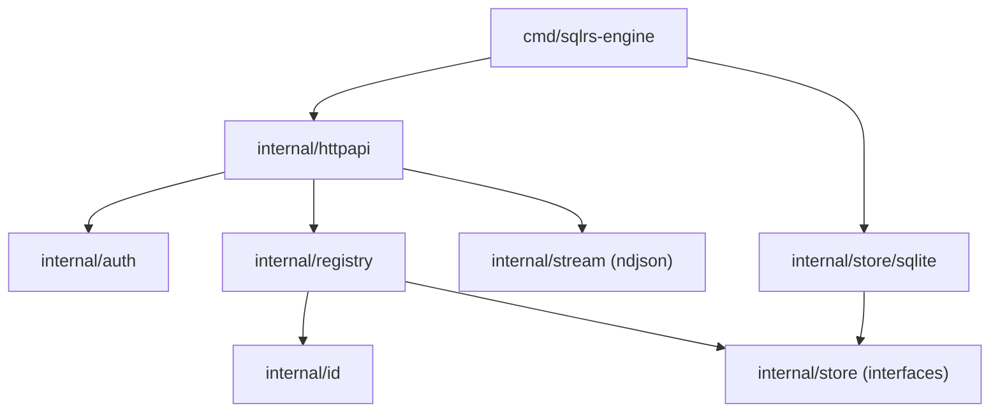

# Компонентная структура локального engine

Документ описывает внутреннюю структуру локального sqlrs engine.

## 1. Цели

- Явно зафиксировать границы модулей до реализации.
- Разделить HTTP, auth, доменную логику и хранилище.
- Хранить names/instances/states в персистентном storage, а не только в памяти.

## 2. Пакеты и ответственность

- `cmd/sqlrs-engine`
  - Парсинг флагов и сборка зависимостей.
  - Старт HTTP сервера.
- `internal/httpapi`
  - Роутинг и handlers.
  - JSON/NDJSON кодирование.
  - Использует auth + registry + store interfaces.
- `internal/auth`
  - Проверка Bearer токена.
  - Исключение для `/v1/health`.
- `internal/registry`
  - Доменные правила для lookup и redirect.
  - Разрешение ID vs name для instances.
  - Запрет имен, совпадающих с форматом instance id.
- `internal/id`
  - Парсинг/валидация форматов id.
- `internal/store`
  - Интерфейсы для names, instances, states.
  - Типы фильтров для list вызовов.
- `internal/store/sqlite`
  - Реализация на SQLite.
  - Файл БД под `<StateDir>`.
  - Реализует интерфейсы `internal/store`.
- `internal/stream`
  - NDJSON writer helpers.

## 3. Владение данными

- Персистентные данные (names/instances/states) живут в SQLite под `<StateDir>`.
- In-memory структуры — только кэши или request-scoped данные.

## 4. Диаграмма зависимостей

