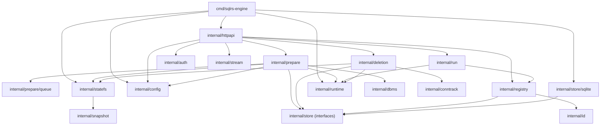

# Компонентная структура локального engine

Документ описывает текущую внутреннюю структуру локального `sqlrs-engine`.

## 1. Цели

- Разделить HTTP/API слой и слои исполнения/персистентности.
- Хранить метаданные state и очереди в SQLite.
- Явно зафиксировать ответственность за snapshot-на-уровне файловой системы.

## 2. Пакеты и ответственность

- `cmd/sqlrs-engine`
  - Парсит флаги и связывает зависимости.
  - Открывает SQLite state DB, config manager, runtime, statefs, prepare/run/delete managers.
  - Запускает HTTP сервер и пишет/удаляет `engine.json`.
- `internal/httpapi`
  - HTTP роутинг для `/v1/*`.
  - JSON и NDJSON ответы (prepare events, run stream).
  - Делегирует в `prepare`, `run`, `deletion`, `registry`, `config`.
- `internal/config`
  - Управляет дефолтами и persisted overrides (`config.json`).
  - Отдает схему и поддерживает path-based get/set/remove.
- `internal/prepare`
  - Полная оркестрация prepare: валидация, план, выполнение, snapshot, создание state/instance.
  - Поддерживает prepare kind `psql` и `lb`.
  - Обрабатывает `plan_only`, стрим событий и жизненный цикл job.
- `internal/prepare/queue`
  - Персистентная очередь jobs/tasks/events в SQLite.
  - Recovery для queued/running jobs и retention trimming по сигнатуре.
- `internal/run`
  - Выполняет `run:psql` и `run:pgbench` по существующим instances.
  - При возможности пересоздает отсутствующий runtime container из `runtime_dir`.
- `internal/deletion`
  - Строит и применяет delete tree для instances/states.
  - Учитывает `recurse`, `force`, `dry_run`.
- `internal/registry`
  - Разрешение name/id и list/get операции для names/instances/states.
- `internal/statefs`
  - Path layout state store + интерфейс StateFS.
  - Оборачивает операции snapshot backend-а (clone/snapshot/remove/validate).
- `internal/snapshot`
  - Реализации и выбор backend-а (`auto`, `overlay`, `btrfs`, `copy`).
- `internal/runtime`
  - Docker runtime adapter (init base, start/stop, exec, run container).
- `internal/dbms`
  - DBMS-специфичные snapshot hooks (Postgres stop/resume через `pg_ctl`).
- `internal/conntrack`
  - Абстракция трекинга подключений (в текущей локальной wiring используется `conntrack.Noop`).
- `internal/auth`
  - Bearer-token проверка для защищенных endpoint-ов.
- `internal/id`
  - Хелперы валидации формата ID.
- `internal/store`
  - Интерфейсы хранения и фильтры для names/instances/states.
- `internal/store/sqlite`
  - Реализация `internal/store` на SQLite.
- `internal/stream`
  - Хелперы list/NDJSON стриминга для HTTP-ответов.

## 3. Ключевые типы и интерфейсы

- `prepare.Manager`
  - Принимает prepare jobs, отдает status/events, обрабатывает удаление job.
- `prepare.Request`, `prepare.Status`, `prepare.PlanTask`
  - API payload prepare и модель задач плана.
- `queue.Store`
  - Персистентный API jobs/tasks/events для `prepare.Manager`.
- `run.Manager`, `run.Request`, `run.Event`
  - Менеджер исполнения run и stream runtime-событий.
- `deletion.Manager`, `deletion.DeleteResult`
  - Планировщик/исполнитель удаления и модель ответа-дерева.
- `config.Store` (`config.Manager`)
  - Runtime config API для `/v1/config*`.
- `store.Store`
  - Интерфейс персистентного хранения names/instances/states.
- `statefs.StateFS`
  - Файловая абстракция для clone/snapshot/remove + деривации путей.

## 4. Владение данными

- Metadata DB: `<state-store-root>/state.db` (names/instances/states + таблицы prepare queue).
- Snapshot store: `<state-store-root>/engines/<engine>/<version>/base|states/<state_id>`.
- Runtime-директории job: `<state-store-root>/jobs/<job_id>/runtime`.
- Конфиг engine: `<state-store-root>/config.json`.
- Discovery-файл для CLI: `<state-dir>/sqlrs/engine.json` (путь задается через `--write-engine-json`).

## 5. Диаграмма зависимостей

