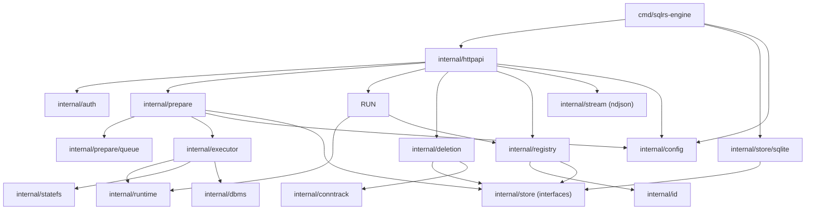

# Компонентная структура локального engine

Документ описывает внутреннюю структуру локального sqlrs engine.

## 1. Цели

- Явно зафиксировать границы модулей до реализации.
- Разделить HTTP, auth, доменную логику и хранилище.
- Хранить names/instances/states в персистентном storage, а не только в памяти.

## 2. Пакеты и ответственность

- `cmd/sqlrs-engine`
  - Парсинг флагов и сборка зависимостей.
  - Старт HTTP сервера.
  - Разрешает `SQLRS_STATE_STORE` и проверяет systemd-маунт WSL (если настроен).
- `internal/httpapi`
  - Роутинг и handlers.
  - JSON/NDJSON кодирование.
  - Использует auth + registry + prepare + store + config interfaces.
  - Экспортирует list endpoints для jobs/tasks и удаление job.
- `internal/config`
  - Загружает дефолты + сохраненные overrides при старте.
  - Предоставляет get/set/rm с path resolve и валидацией схемы.
  - Сохраняет JSON атомарно рядом со state store.
  - Экспортирует схему для HTTP handlers.
- `internal/prepare`
  - Координация prepare jobs (plan, cache lookup, execute, snapshot).
  - Обрабатывает `plan_only` и выводит список задач.
  - Хранит состояние jobs/tasks и историю событий через очередь.
  - Поддерживает list и deletion для jobs (force/dry-run).
- `internal/prepare/queue`
  - SQLite-хранилище очереди jobs/tasks и событий.
  - Поддерживает восстановление после рестарта.
  - Удаляет завершенные prepare jobs сверх лимита на сигнатуру из конфига (`orchestrator.jobs.maxIdentical`).
  - Удаляет `state-store/jobs/<job_id>` при удалении job.
- `internal/executor`
  - Последовательно исполняет задачи job и эмитит события.
  - Вызывает StateFS и DBMS-коннектор вокруг снапшотов.
- `internal/runtime`
  - Адаптер Docker runtime (CLI в MVP).
  - Старт/стоп контейнеров; задает `PGDATA` и trust auth для Postgres.
  - Держит warm контейнеры после prepare до решения оркестрации run.
- `internal/run`
  - Разрешает target instance (id/name).
  - Готовит контекст запуска и валидирует правила run-kind.
  - Выполняет команды внутри контейнера и стримит вывод.
  - Пересоздает отсутствующие контейнеры из `runtime_dir` и обновляет
    `runtime_id` перед выполнением run-команд.
- `internal/statefs`
  - Интерфейс StateFS, выбор backend и валидация стора.
  - OverlayFS или btrfs в MVP, fallback на копирование.
  - Владеет структурой путей и FS-specific cleanup.
- `internal/dbms`
  - DBMS-специфичные хуки для подготовки и возобновления.
  - Postgres использует `pg_ctl` для fast shutdown/restart без остановки контейнера.
- `internal/deletion`
  - Строит дерево удаления для экземпляров и состояний.
  - Применяет правила recurse/force и выполняет удаление.
- `internal/conntrack`
  - Трекинг активных подключений через DB introspection.
- `internal/auth`
  - Проверка Bearer токена.
  - Исключение для `/v1/health`.
- `internal/registry`
  - Доменные правила для lookup и redirect.
  - Разрешение ID vs name для instances.
  - Запрет имен, совпадающих с форматом instance id.
- `internal/id`
  - Парсинг/валидация форматов id.
- `internal/store`
  - Интерфейсы для names, instances, states.
  - Типы фильтров для list вызовов.
- `internal/store/sqlite`
  - Реализация на SQLite.
  - Файл БД под `<StateDir>`.
  - Реализует интерфейсы `internal/store`.
- `internal/stream`
  - NDJSON writer helpers.

## 3. Ключевые типы и интерфейсы

- `prepare.Manager`
  - Принимает jobs и отдает статус/события.
  - Для `plan_only` возвращает список задач.
- `run.Manager`
  - Валидирует run запросы и выполняет команды против instances.
  - Стримит stdout/stderr/exit обратно в HTTP.
  - Эмитит события восстановления при пересоздании контейнера экземпляра.
- `queue.Store`
  - Персистит jobs, tasks и события; поддерживает recovery запросы.
- `prepare.JobEntry`, `prepare.TaskEntry`
  - Представления списков для jobs и task queue.
- `prepare.Request`, `prepare.Status`
  - Payload запроса и статуса (включая `tasks` для plan-only).
- `prepare.PlanTask`, `prepare.TaskInput`
  - Описания задач и входов для planning/execute.
- `config.Manager`
  - Get/set/remove конфиг значений и схема.
- `config.Value`, `config.Schema`
  - Представление JSON значений и схемы.
- `store.Store`
  - Интерфейс хранения names/instances/states.
- `deletion.Manager`
  - Строит дерево удаления и выполняет удаление.

## 4. Владение данными

- Персистентные данные (names/instances/states) живут в SQLite под `<StateDir>`.
- Jobs, tasks и события jobs живут в SQLite под `<StateDir>`.
- In-memory структуры - только кэши или request-scoped данные.
- Данные state store живут в `<StateDir>/state-store`, если не задан `SQLRS_STATE_STORE`.
- Server config хранится в `<StateDir>/state-store/config.json` и дублируется в памяти.

## 5. Диаграмма зависимостей

