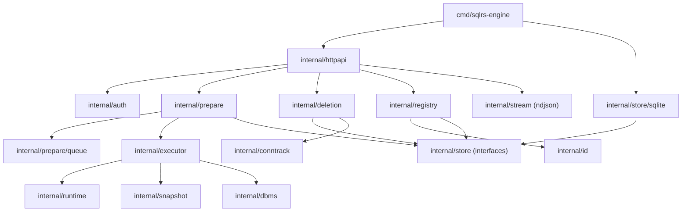

# Local Engine Component Structure

This document defines the internal component layout of the local sqlrs engine.

## 1. Goals

- Make module boundaries explicit before implementation.
- Separate HTTP, auth, domain logic, and persistence.
- Keep names/instances/states in persistent storage, not in-memory only.

## 2. Packages and responsibilities

- `cmd/sqlrs-engine`
  - Parse flags and build dependencies.
  - Start the HTTP server.
- `internal/httpapi`
  - HTTP routing and handlers.
  - JSON/NDJSON encoding.
  - Uses auth + registry + prepare + store interfaces.
  - Exposes job/task list endpoints and job deletion.
- `internal/prepare`
  - Prepare job coordination (plan, cache lookup, execute, snapshot).
  - Handles `plan_only` jobs and task list output.
  - Persists job/task state and event history via the queue store.
  - Supports job listing and deletion with force/dry-run.
- `internal/prepare/queue`
  - SQLite-backed queue store for jobs, tasks, and events.
  - Supports restart recovery by reloading queued/running work.
- `internal/executor`
  - Runs job tasks sequentially and emits task/job events.
  - Invokes snapshot manager and DBMS connector around snapshots.
- `internal/runtime`
  - Docker runtime adapter (CLI-based in MVP).
  - Starts/stops containers; sets `PGDATA` and trust auth for Postgres images.
  - Keeps warm containers after prepare until run orchestration decides to stop.
- `internal/snapshot`
  - Snapshot manager interface and backend selection.
  - OverlayFS-backed snapshots in the MVP, copy fallback.
- `internal/dbms`
  - DBMS-specific hooks for snapshot preparation and resume.
  - Postgres implementation uses `pg_ctl` for fast shutdown/restart without stopping the container.
- `internal/deletion`
  - Builds deletion trees for instances and states.
  - Enforces recurse/force rules and executes removals.
- `internal/conntrack`
  - Tracks active connections per instance via DB introspection.
- `internal/auth`
  - Bearer token verification.
  - Exempt `/v1/health`.
- `internal/registry`
  - Domain rules for lookups and redirect decisions.
  - ID vs name resolution for instances.
  - Reject names that match the instance id format.
- `internal/id`
  - Parsing/validation of id formats.
- `internal/store`
  - Interfaces for names, instances, states.
  - Filter types for list calls.
- `internal/store/sqlite`
  - SQLite-backed implementation.
  - Database file under `<StateDir>`.
  - Implements `internal/store` interfaces.
- `internal/stream`
  - NDJSON writer helpers.

## 3. Key types and interfaces

- `prepare.Manager`
  - Submits jobs and exposes status/events.
  - Handles `plan_only` by returning task lists.
- `queue.Store`
  - Persists jobs, tasks, and events; supports recovery queries.
- `prepare.JobEntry`, `prepare.TaskEntry`
  - List views for jobs and task queue entries.
- `prepare.Request`, `prepare.Status`
  - Job request and status payloads (includes `tasks` for plan-only).
- `prepare.PlanTask`, `prepare.TaskInput`
  - Task descriptions and input references for planning/execution.
- `store.Store`
  - Interface for names/instances/states persistence.
- `deletion.Manager`
  - Builds delete trees and executes deletions.

## 4. Data ownership

- Persistent data (names/instances/states) lives in SQLite under `<StateDir>`.
- Jobs, tasks, and job events live in SQLite under `<StateDir>`.
- In-memory structures are caches or request-scoped only.
- State store data lives under `<StateDir>/state-store`.

## 5. Dependency diagram

