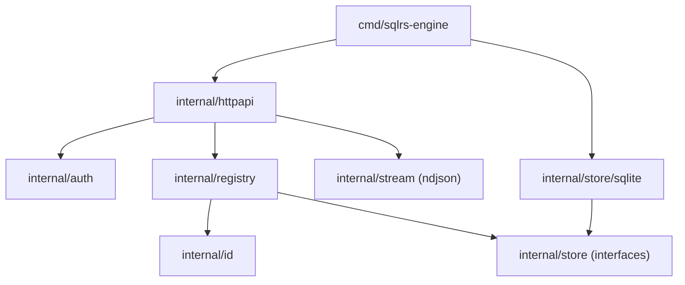

# Local Engine Component Structure

This document defines the internal component layout of the local sqlrs engine.

## 1. Goals

- Make module boundaries explicit before implementation.
- Separate HTTP, auth, domain logic, and persistence.
- Keep names/instances/states in persistent storage, not in-memory only.

## 2. Packages and responsibilities

- `cmd/sqlrs-engine`
  - Parse flags and build dependencies.
  - Start the HTTP server.
- `internal/httpapi`
  - HTTP routing and handlers.
  - JSON/NDJSON encoding.
  - Uses auth + registry + store interfaces.
- `internal/auth`
  - Bearer token verification.
  - Exempt `/v1/health`.
- `internal/registry`
  - Domain rules for lookups and redirect decisions.
  - ID vs name resolution for instances.
  - Reject names that match the instance id format.
- `internal/id`
  - Parsing/validation of id formats.
- `internal/store`
  - Interfaces for names, instances, states.
  - Filter types for list calls.
- `internal/store/sqlite`
  - SQLite-backed implementation.
  - Database file under `<StateDir>`.
  - Implements `internal/store` interfaces.
- `internal/stream`
  - NDJSON writer helpers.

## 3. Data ownership

- Persistent data (names/instances/states) lives in SQLite under `<StateDir>`.
- In-memory structures are caches or request-scoped only.

## 4. Dependency diagram

