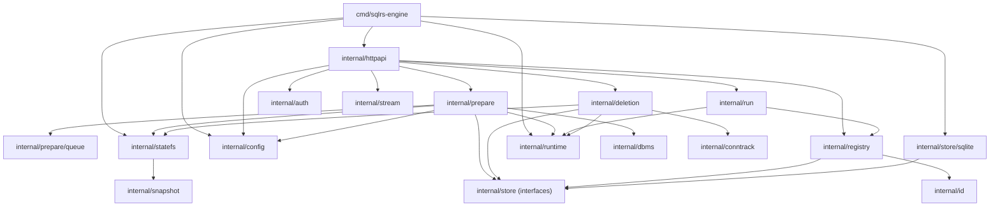

# Local Engine Component Structure

This document defines the current internal component layout of the local `sqlrs-engine`.

## 1. Goals

- Keep HTTP/API concerns separate from execution and persistence concerns.
- Keep state and queue metadata persistent in SQLite.
- Make filesystem snapshot responsibilities explicit.

## 2. Packages and responsibilities

- `cmd/sqlrs-engine`
  - Parses flags and wires dependencies.
  - Opens SQLite state DB, config manager, runtime, statefs, prepare/run/delete managers.
  - Resolves runtime mode from engine config: `container.runtime` (`auto|docker|podman`).
  - Allows operational override via `SQLRS_CONTAINER_RUNTIME`.
  - In `auto` mode, probes `docker` then `podman`.
  - For Podman, can set `CONTAINER_HOST` from the default podman connection when not already set.
  - Starts HTTP server and writes/removes `engine.json`.
- `internal/httpapi`
  - HTTP routing for `/v1/*` endpoints.
  - JSON and NDJSON responses (prepare events, run stream).
  - Delegates to `prepare`, `run`, `deletion`, `registry`, `config`.
- `internal/config`
  - Default config + persisted override management (`config.json`).
  - Schema exposure and path-based get/set/remove.
- `internal/prepare`
  - End-to-end prepare orchestration: validation, plan building, execution, snapshotting, state/instance creation.
  - Supports both `psql` and `lb` prepare kinds.
  - Handles `plan_only`, event streaming, and per-job lifecycle.
- `internal/prepare/queue`
  - Persistent job/task/event queue in SQLite.
  - Recovery for queued/running jobs and retention trimming by signature.
- `internal/run`
  - Executes `run:psql` and `run:pgbench` against existing instances.
  - Recreates missing runtime containers from `runtime_dir` when possible.
- `internal/deletion`
  - Builds and executes deletion trees for instances/states.
  - Applies `recurse`, `force`, `dry_run` rules.
- `internal/registry`
  - Name/id resolution and list/get operations for names/instances/states.
- `internal/statefs`
  - State store path layout + StateFS interface.
  - Wraps snapshot backend operations with cleanup and validation.
- `internal/snapshot`
  - Snapshot backend implementations and selection (`auto`, `overlay`, `btrfs`, `copy`).
- `internal/runtime`
  - Container runtime adapter (Docker/Podman CLI; init base, start/stop, exec, run container).
- `internal/dbms`
  - DBMS-specific snapshot hooks (Postgres stop/resume with `pg_ctl`).
- `internal/conntrack`
  - Connection tracking abstraction (current local wiring uses `conntrack.Noop`).
- `internal/auth`
  - Bearer token validation for protected endpoints.
- `internal/id`
  - ID format validation helpers.
- `internal/store`
  - Storage interfaces and filter models for names/instances/states.
- `internal/store/sqlite`
  - SQLite implementation of `internal/store`.
- `internal/stream`
  - List/NDJSON stream helpers for HTTP responses.

## 3. Key types and interfaces

- `prepare.Manager`
  - Submits prepare jobs, exposes status/events, and handles job deletion.
- `prepare.Request`, `prepare.Status`, `prepare.PlanTask`
  - Prepare API request/status payloads and planned task model.
- `queue.Store`
  - Persistent jobs/tasks/events API used by `prepare.Manager`.
- `run.Manager`, `run.Request`, `run.Event`
  - Run execution manager with streamed runtime events.
- `deletion.Manager`, `deletion.DeleteResult`
  - Deletion planner/executor and response tree model.
- `config.Store` (`config.Manager`)
  - Runtime config API for `/v1/config*`.
- `store.Store`
  - Persistent names/instances/states interface.
- `statefs.StateFS`
  - Filesystem abstraction for clone/snapshot/remove and path derivation.

## 4. Data ownership

- Metadata DB: `<state-store-root>/state.db` (names/instances/states + prepare queue tables).
- Snapshot store: `<state-store-root>/engines/<engine>/<version>/base|states/<state_id>`.
- Per-job runtime dirs: `<state-store-root>/jobs/<job_id>/runtime`.
- Engine config: `<state-store-root>/config.json`.
- Engine discovery file for CLI: `<state-dir>/sqlrs/engine.json` (path passed via `--write-engine-json`).

## 5. Dependency diagram

