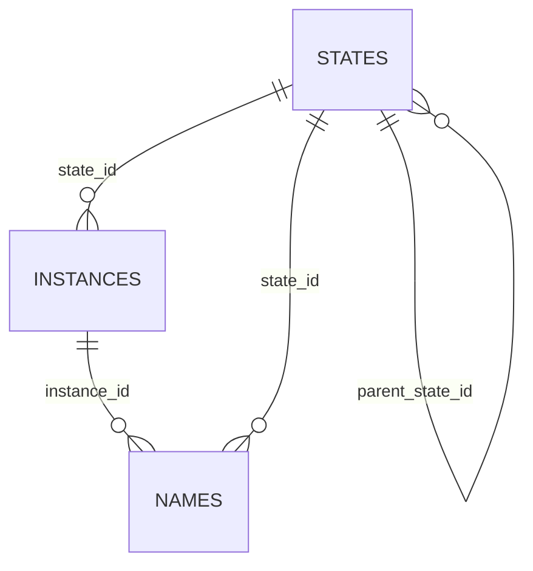

# Схема хранения локального engine (SQLite)

Документ описывает SQLite-схему для персистентных names/instances/states,
которые используются локальным engine и видны через `sqlrs ls`.

## 1. Цели

- Хранить names/instances/states в SQLite под `<StateDir>`.
- Поддержать фильтры списка для `sqlrs ls`.
- Держать вычисляемые поля (status, refcount) производными.

## 2. Расположение

- Файл SQLite: `<StateDir>/state.db`
- Один writer (engine), несколько readers (CLI).

## 3. Основные таблицы

Источник схемы: [`schema.sql`](../../backend/local-engine-go/internal/store/sqlite/schema.sql).
Запускать `pnpm run docs:schemas` для обновления встроенных сниппетов.

### 3.1 `states`

<!--ref:sql -->
[`schema.sql`](../../backend/local-engine-go/internal/store/sqlite/schema.sql#L3-L15)
<!--ref:body-->
```sql
CREATE TABLE IF NOT EXISTS states (
  state_id TEXT PRIMARY KEY,
  parent_state_id TEXT,
  state_fingerprint TEXT,
  image_id TEXT NOT NULL,
  prepare_kind TEXT NOT NULL,
  prepare_args_normalized TEXT NOT NULL,
  created_at TEXT NOT NULL,
  size_bytes INTEGER,
  last_used_at TEXT,
  use_count INTEGER,
  min_retention_until TEXT,
  evicted_at TEXT,
```
<!--ref:end-->

Примечания:
- `state_id` имеет формат UUID (см. state-cache design).
- `parent_state_id` nullable и задает иерархию состояний для рекурсивного удаления.
- `state_fingerprint` может совпадать с `state_id`; он нужен для name binding
  даже при эвикшне state.
- `status` зарезервирован для будущего использования (например, `success`, `failed`).

### 3.2 `instances`

<!--ref:sql -->
[`schema.sql`](../../backend/local-engine-go/internal/store/sqlite/schema.sql#L17-L28)
<!--ref:body-->
```sql
  status TEXT
);
CREATE UNIQUE INDEX IF NOT EXISTS idx_states_fingerprint ON states(state_fingerprint);
CREATE INDEX IF NOT EXISTS idx_states_parent ON states(parent_state_id);
CREATE INDEX IF NOT EXISTS idx_states_image ON states(image_id);
CREATE INDEX IF NOT EXISTS idx_states_kind ON states(prepare_kind);

CREATE TABLE IF NOT EXISTS instances (
  instance_id TEXT PRIMARY KEY,
  state_id TEXT NOT NULL,
  image_id TEXT NOT NULL,
  created_at TEXT NOT NULL,
```
<!--ref:end-->

Примечания:
- `instance_id` использует формат id, определенный engine.
- `runtime_id` хранит идентификатор runtime/контейнера для остановки или инспекции.
- `runtime_dir` хранит абсолютный путь к runtime директории job для очистки.
- `status` зарезервирован; текущий статус вычисляется.

### 3.3 `names`

<!--ref:sql -->
[`schema.sql`](../../backend/local-engine-go/internal/store/sqlite/schema.sql#L30-L42)
<!--ref:body-->
```sql
  runtime_id TEXT,
  runtime_dir TEXT,
  status TEXT,
  FOREIGN KEY(state_id) REFERENCES states(state_id)
);
CREATE INDEX IF NOT EXISTS idx_instances_state ON instances(state_id);
CREATE INDEX IF NOT EXISTS idx_instances_image ON instances(image_id);
CREATE INDEX IF NOT EXISTS idx_instances_expires ON instances(expires_at);

CREATE TABLE IF NOT EXISTS names (
  name TEXT PRIMARY KEY,
  instance_id TEXT,
  state_id TEXT,
```
<!--ref:end-->

Примечания:
- Несколько имен могут быть алиасами одного instance.
- `is_primary` - предпочтительное имя для listing instance.
- `state_id` nullable, чтобы имя могло жить дольше instance/state.

## 3.4 Трекинг подключений

Счетчик активных подключений хранится в памяти и не записывается в SQLite.

## 4. Вычисляемые поля

- **Статус instance**:
  - `expired`, если `expires_at` < now.
  - `orphaned`, если нет names, ссылающихся на instance.
  - иначе `active`.
- **Статус name**:
  - `missing`, если `instance_id` NULL или instance отсутствует.
  - `expired`, если instance просрочен.
  - иначе `active`.
- **State refcount**: число instances с данным `state_id`.

## 5. Формат ID и правила имен

- `state_id` использует формат UUID (см. state-cache design).
- `instance_id` использует формат id, определенный engine.
- Имена не должны совпадать с форматом instance id. Проверка в приложении
  (см. `internal/id` и `internal/registry`).

## 6. Связи


