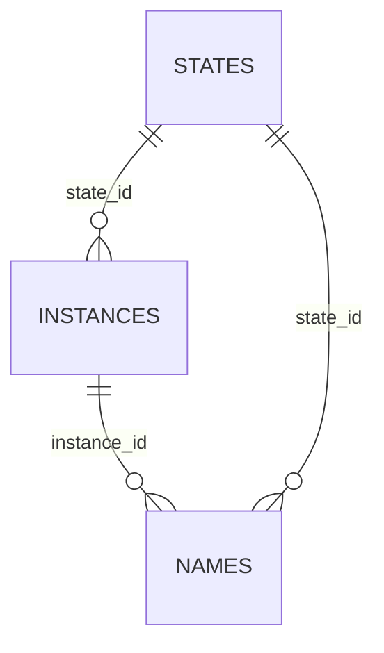

# Local Engine Storage Schema (SQLite)

This document defines the SQLite schema for persistent names/instances/states
used by the local engine and exposed via `sqlrs ls`.

## 1. Goals

- Persist names/instances/states in SQLite under `<StateDir>`.
- Support list filters for `sqlrs ls`.
- Keep derived fields (status, refcount) computed from stored data.

## 2. Storage location

- SQLite database file: `<StateDir>/state.db`
- One writer (engine), concurrent readers (CLI).

## 3. Core tables

Schema source: [`schema.sql`](../../backend/local-engine-go/internal/store/sqlite/schema.sql).
Run `pnpm run docs:schemas` to refresh embedded snippets.

### 3.1 `states`

<!--ref:sql -->
[`schema.sql`](../../backend/local-engine-go/internal/store/sqlite/schema.sql#L3-L15)
<!--ref:body-->
```sql
CREATE TABLE IF NOT EXISTS states (
  state_id TEXT PRIMARY KEY,
  state_fingerprint TEXT,
  image_id TEXT NOT NULL,
  prepare_kind TEXT NOT NULL,
  prepare_args_normalized TEXT NOT NULL,
  created_at TEXT NOT NULL,
  size_bytes INTEGER,
  status TEXT
);
CREATE UNIQUE INDEX IF NOT EXISTS idx_states_fingerprint ON states(state_fingerprint);
CREATE INDEX IF NOT EXISTS idx_states_image ON states(image_id);
CREATE INDEX IF NOT EXISTS idx_states_kind ON states(prepare_kind);
```
<!--ref:end-->

Notes:

- `state_id` is a UUID (see state-cache design).
- `state_fingerprint` may equal `state_id`; it is stored for name bindings even
  if the state is evicted.
- `status` is reserved for future use (e.g., `success`, `failed`).

### 3.2 `instances`

<!--ref:sql -->
[`schema.sql`](../../backend/local-engine-go/internal/store/sqlite/schema.sql#L17-L28)
<!--ref:body-->
```sql
CREATE TABLE IF NOT EXISTS instances (
  instance_id TEXT PRIMARY KEY,
  state_id TEXT NOT NULL,
  image_id TEXT NOT NULL,
  created_at TEXT NOT NULL,
  expires_at TEXT,
  status TEXT,
  FOREIGN KEY(state_id) REFERENCES states(state_id)
);
CREATE INDEX IF NOT EXISTS idx_instances_state ON instances(state_id);
CREATE INDEX IF NOT EXISTS idx_instances_image ON instances(image_id);
CREATE INDEX IF NOT EXISTS idx_instances_expires ON instances(expires_at);
```
<!--ref:end-->

Notes:

- `instance_id` uses the engine-defined id format.
- `status` is reserved for future use; current status is derived.

### 3.3 `names`

<!--ref:sql -->
[`schema.sql`](../../backend/local-engine-go/internal/store/sqlite/schema.sql#L30-L42)
<!--ref:body-->
```sql
CREATE TABLE IF NOT EXISTS names (
  name TEXT PRIMARY KEY,
  instance_id TEXT,
  state_id TEXT,
  state_fingerprint TEXT NOT NULL,
  image_id TEXT NOT NULL,
  last_used_at TEXT,
  is_primary INTEGER NOT NULL DEFAULT 0
);
CREATE INDEX IF NOT EXISTS idx_names_instance ON names(instance_id);
CREATE INDEX IF NOT EXISTS idx_names_state ON names(state_id);
CREATE INDEX IF NOT EXISTS idx_names_image ON names(image_id);
CREATE INDEX IF NOT EXISTS idx_names_primary ON names(instance_id, is_primary);
```
<!--ref:end-->

Notes:

- Multiple names may alias the same instance.
- `is_primary` marks the preferred name for instance listings.
- `state_id` is nullable to allow a name to outlive a missing instance/state.

## 4. Derived fields

- **Instance status**:
  - `expired` if `expires_at` < now.
  - `orphaned` if no names reference the instance.
  - otherwise `active`.
- **Name status**:
  - `missing` if `instance_id` is NULL or instance is missing.
  - `expired` if the referenced instance is expired.
  - otherwise `active`.
- **State refcount**: count of instances with `state_id`.

## 5. ID format and naming rules

- `state_id` uses UUID format (see state-cache design).
- `instance_id` uses the engine-defined id format.
- Names must not match the instance id format. Enforcement is in application
  logic (see `internal/id` and `internal/registry`).

## 6. Relationships


