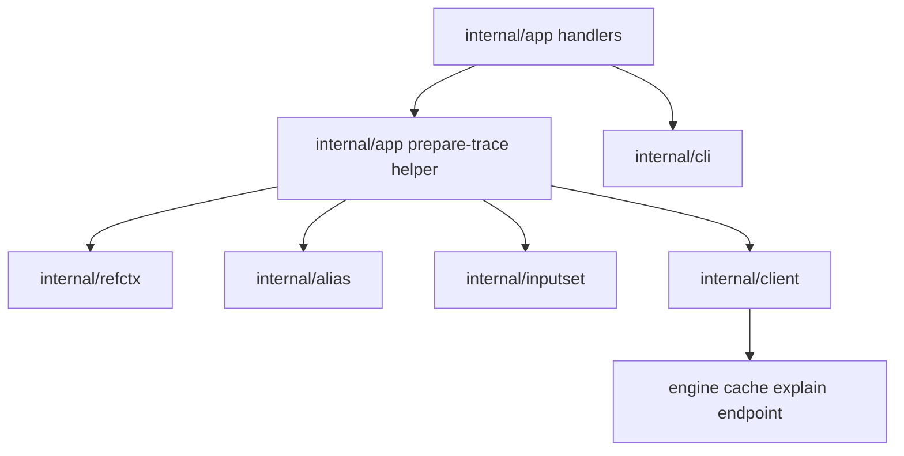

# Provenance и Cache Explain - Component Structure

Этот документ определяет утвержденную внутреннюю компонентную структуру для
следующего bounded local diagnostics slice:

- `--provenance-path <path>` у single-stage local `plan` / `prepare`
- `sqlrs cache explain prepare ...`

Он следует принятым CLI shapes в:

- [`../user-guides/sqlrs-provenance.md`](../user-guides/sqlrs-provenance.md)
- [`../user-guides/sqlrs-cache-explain.md`](../user-guides/sqlrs-cache-explain.md)

и принятому interaction flow в
[`provenance-cache-flow.RU.md`](provenance-cache-flow.RU.md).

## 1. Scope и assumptions

- Slice остается local-only.
- Provenance применяется только к single-stage `plan` и `prepare`.
- `cache explain` применяется только к single-stage prepare-oriented командам.
- Raw, alias-backed и bounded local `--ref` binding должен оставаться
  идентичным существующему пути `plan` / `prepare`.
- Provenance остается только JSON side artifact.
- `cache explain` остается read-only и не создает jobs и не мутирует cache.
- Дизайн должен избегать второго command-binding path только ради diagnostics.

## 2. Approved component split

| Component | Responsibility | Caller |
|-----------|----------------|--------|
| **Plan/prepare и cache-explain handlers** | Разбирать `--provenance-path`, разбирать `cache explain prepare ...`, отклонять out-of-scope wrapped stages и оркестрировать trace capture вокруг существующего stage runtime. | `internal/app` |
| **Package-local prepare trace helper** | Строить один переиспользуемый bound trace: command metadata, alias/ref metadata, normalized stage request, deterministic input manifest, pre-execution cache explanation и provenance serialization input. | handlers в `internal/app` |
| **Shared ref context resolver** | Переиспользовать существующую repo/ref/projected-cwd/worktree/blob механику для любой diagnostic-команды с `--ref`. | Prepare-trace helper и существующие handlers plan/prepare |
| **Alias resolver** | Резолвить alias refs и загружать alias YAML из выбранного filesystem view. | Prepare-trace helper |
| **Shared inputset kind components** | Применять per-kind parse/bind/collect semantics и вычислять deterministic input hash-ы. | Prepare-trace helper |
| **Cache explain API client** | Отправлять read-only bound prepare request в engine и декодировать cache decision response. | Prepare-trace helper |
| **Plan/prepare app flow** | Запускать существующий нормальный pipeline `plan` / `prepare` после любого опционального pre-execution explain step. | handlers plan/prepare |
| **CLI renderer** | Рендерить human/JSON `cache explain` output; существующие renderers `plan` / `prepare` оставить без изменений. | handlers в `internal/app` |

## 3. Shared owner нового slice: package-local trace helper в `internal/app`

Утвержденный baseline оставляет новую trace-building логику package-local в
`internal/app`, а не вводит сразу новый top-level CLI package.

Rationale:

- slice по-прежнему ограничен single-stage local prepare-oriented командами;
- ему нужен прямой доступ к существующему stage runtime и cleanup choreography;
- переиспользуемые domain objects пока относятся к CLI-orchestration, а не к
  второму долгоживущему источнику истины для path binding.

Boundary rules для этого helper-а:

- он может собирать command metadata, вызывать shared bind/collect helpers и
  объединять CLI-local metadata с engine explanation results;
- он может сериализовать provenance artifacts в caller-selected output path;
- он не должен заново определять repo/ref/worktree logic, которой уже владеет
  `internal/refctx`;
- он не должен заново определять alias target resolution, которой владеет
  `internal/alias`;
- он не должен заново определять per-kind input/hashing semantics, которыми
  владеет `internal/inputset`;
- он не должен становиться вторым renderer package; human/JSON formatting всё
  так же принадлежит `internal/cli`.

Если последующие slices расширят provenance или cache explanation до `run`,
remote profiles или composite workflows, этот helper можно вынести в
выделенный package. Текущий baseline пока не требует этой дополнительной
границы.

## 4. Suggested package/file layout

### `frontend/cli-go/internal/app`

- расширить parsing `plan` и `prepare` флагом `--provenance-path <path>`
- добавить dispatch команды `cache explain prepare ...`
- выделить package-local prepare-trace helpers, которые:
  - bind-ят raw или alias-backed stages
  - собирают deterministic input manifests
  - строят один engine explain request из того же bound stage runtime
  - пишут provenance artifacts после execution по запросу
- оставить `plan` / `prepare` execution и cleanup orchestration рядом с
  существующим stage pipeline

### `frontend/cli-go/internal/client`

- добавить `CacheExplainPrepareRequest`
- добавить `CacheExplainPrepareResponse`
- добавить один read-only client method для `POST /v1/cache/explain/prepare`

Package client остается источником истины для HTTP request/response shapes.

### `frontend/cli-go/internal/cli`

- добавить human renderer для cache explain
- добавить JSON view model для cache explain или helper для прямой JSON-эмиссии
- существующие renderers `plan` / `prepare` оставить без изменений

### `frontend/cli-go/internal/refctx`

- без новых responsibilities
- сохранить shared `--ref` context creation и cleanup как единственного owner-а
  projected-cwd и worktree/blob setup

### `frontend/cli-go/internal/alias`

- без новых responsibilities
- продолжать резолвить alias refs и загружать alias YAML из supplied
  filesystem view

### `frontend/cli-go/internal/inputset`

- без новых responsibilities
- продолжать владеть deterministic per-kind file collection и hashing

## 5. Key types and interfaces

- `app.prepareTrace`
  - package-local bound trace с command family, prepare kind/class,
    workspace/cwd metadata, optional alias/ref metadata, normalized args и
    deterministic input entries
- `app.provenanceArtifact`
  - package-local JSON-serializable document, объединяющий bound trace, engine
    cache decision и terminal command outcome
- `client.CacheExplainPrepareRequest`
  - read-only engine request, повторяющий bound single-stage prepare runtime
- `client.CacheExplainPrepareResponse`
  - final-state cache decision, signature, matched state id, resolved image id
    и reason code, если доступны
- `cli.CacheExplainView`
  - renderer-facing merged model для human и JSON output команды
    `cache explain`

## 6. Data ownership

- Raw argv и top-level command selection остаются owned by `internal/app`.
- Bound stage runtime и deterministic input manifests эфемерны и живут только
  в рамках одного CLI invocation.
- Engine владеет реальным cache lookup и signature computation.
- CLI владеет merged local trace view, используемым для provenance writing и
  cache-explain rendering.
- Provenance artifacts - это caller-owned output files, выбранные через
  `--provenance-path`.
- В этом slice не вводится новая persistent local cache metadata.

## 7. Dependency diagram

## 8. Consequences for existing docs

Поскольку этот slice добавляет новый diagnostics flow поверх существующего
bound prepare path:

- `cli-contract.RU.md` должен описывать `--provenance-path` и новую `cache`
  command group;
- `git-aware-passive.RU.md` должен синхронизировать свои сценарии provenance и
  cache explain с утвержденным user-facing syntax;
- `m2-local-developer-experience-plan.RU.md` должен сузить PR8 до
  утвержденного bounded baseline;
- engine OpenAPI spec должен получить `POST /v1/cache/explain/prepare`.

## 9. References

- User guides:
  - [`../user-guides/sqlrs-provenance.md`](../user-guides/sqlrs-provenance.md)
  - [`../user-guides/sqlrs-cache-explain.md`](../user-guides/sqlrs-cache-explain.md)
- Interaction flow: [`provenance-cache-flow.RU.md`](provenance-cache-flow.RU.md)
- CLI contract: [`cli-contract.RU.md`](cli-contract.RU.md)
- CLI component structure: [`cli-component-structure.RU.md`](cli-component-structure.RU.md)
- Ref flow: [`ref-flow.RU.md`](ref-flow.RU.md)
- Ref component structure: [`ref-component-structure.RU.md`](ref-component-structure.RU.md)
- Inputset layer: [`inputset-component-structure.RU.md`](inputset-component-structure.RU.md)
