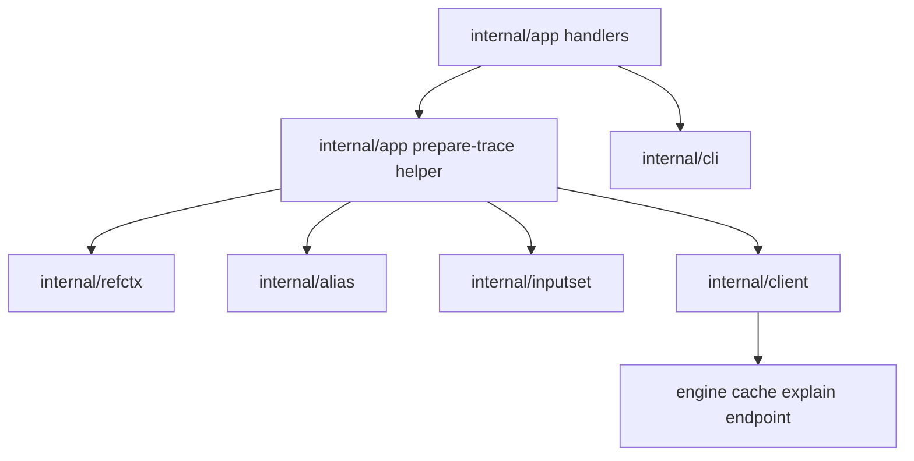

# Provenance and Cache Explain - Component Structure

This document defines the approved internal component structure for the next
bounded local diagnostics slice:

- `--provenance-path <path>` on single-stage local `plan` / `prepare`
- `sqlrs cache explain prepare ...`

It follows the accepted CLI shapes in:

- [`../user-guides/sqlrs-provenance.md`](../user-guides/sqlrs-provenance.md)
- [`../user-guides/sqlrs-cache-explain.md`](../user-guides/sqlrs-cache-explain.md)

and the accepted interaction flow in
[`provenance-cache-flow.md`](provenance-cache-flow.md).

## 1. Scope and assumptions

- The slice is local-only.
- Provenance applies only to single-stage `plan` and `prepare`.
- `cache explain` applies only to single-stage prepare-oriented commands.
- Raw, alias-backed, and bounded local `--ref` binding must stay identical to
  the existing `plan` / `prepare` path.
- Provenance remains a JSON side artifact only.
- `cache explain` remains read-only and does not create jobs or mutate cache.
- The design should avoid a second command-binding path just for diagnostics.

## 2. Approved component split

| Component | Responsibility | Caller |
|-----------|----------------|--------|
| **Plan/prepare and cache-explain handlers** | Parse `--provenance-path`, parse `cache explain prepare ...`, reject out-of-scope wrapped stages, and orchestrate trace capture around the existing stage runtime. | `internal/app` |
| **Package-local prepare trace helper** | Build one reusable bound trace: command metadata, alias/ref metadata, normalized stage request, deterministic input manifest, pre-execution cache explanation, and provenance serialization input. | `internal/app` handlers |
| **Shared ref context resolver** | Reuse the existing repo/ref/projected-cwd/worktree/blob machinery for any diagnostic command that carries `--ref`. | Prepare-trace helper and existing plan/prepare handlers |
| **Alias resolver** | Resolve alias refs and load alias YAML from the selected filesystem view. | Prepare-trace helper |
| **Shared inputset kind components** | Apply per-kind parse/bind/collect semantics and compute deterministic input hashes. | Prepare-trace helper |
| **Cache explain API client** | Submit a read-only bound prepare request to the engine and decode the cache decision response. | Prepare-trace helper |
| **Plan/prepare app flow** | Run the existing normal `plan` / `prepare` pipeline after any optional pre-execution explain step. | Plan/prepare handlers |
| **CLI renderer** | Render human/JSON `cache explain` output; keep existing `plan` / `prepare` renderers unchanged. | `internal/app` handlers |

## 3. Shared owner for the new slice: a package-local trace helper in `internal/app`

The approved baseline keeps the new trace-building logic package-local to
`internal/app` instead of introducing a new top-level CLI package immediately.

Rationale:

- the slice is still bounded to single-stage local prepare-oriented commands;
- it needs direct access to the existing stage runtime and cleanup choreography;
- the reusable domain objects are still CLI-orchestration concerns, not a
  second long-term source of truth for path binding.

Boundary rules for this helper:

- it may assemble command metadata, call shared bind/collect helpers, and merge
  CLI-local metadata with engine explanation results;
- it may serialize provenance artifacts for the caller-selected output path;
- it must not redefine repo/ref/worktree logic already owned by
  `internal/refctx`;
- it must not redefine alias target resolution owned by `internal/alias`;
- it must not redefine per-kind input or hashing semantics owned by
  `internal/inputset`;
- it must not become a second renderer package; human/JSON formatting still
  belongs to `internal/cli`.

If later slices extend provenance or cache explanation to `run`, remote
profiles, or composite workflows, this helper can be promoted into a dedicated
package. The current baseline does not need that extra boundary yet.

## 4. Suggested package/file layout

### `frontend/cli-go/internal/app`

- extend `plan` and `prepare` parsing with `--provenance-path <path>`
- add `cache explain prepare ...` command dispatch
- factor package-local prepare-trace helpers that:
  - bind raw or alias-backed stages
  - collect deterministic input manifests
  - build one engine explain request from the same bound stage runtime
  - write provenance artifacts after execution when requested
- keep `plan` / `prepare` execution and cleanup orchestration close to the
  existing stage pipeline

### `frontend/cli-go/internal/client`

- add `CacheExplainPrepareRequest`
- add `CacheExplainPrepareResponse`
- add one read-only client method for `POST /v1/cache/explain/prepare`

The client package stays the source of truth for HTTP request/response shapes.

### `frontend/cli-go/internal/cli`

- add cache-explain human renderer
- add cache-explain JSON view model or direct JSON emission helper
- keep existing `plan` / `prepare` renderers unchanged

### `frontend/cli-go/internal/refctx`

- no new responsibilities
- keep shared `--ref` context creation and cleanup as the only owner of
  projected-cwd and worktree/blob setup

### `frontend/cli-go/internal/alias`

- no new responsibilities
- continue to resolve alias refs and load alias YAML from a supplied filesystem
  view

### `frontend/cli-go/internal/inputset`

- no new responsibilities
- continue to own deterministic per-kind file collection and hashing

## 5. Key types and interfaces

- `app.prepareTrace`
  - package-local bound trace with command family, prepare kind/class,
    workspace/cwd metadata, optional alias/ref metadata, normalized args, and
    deterministic input entries
- `app.provenanceArtifact`
  - package-local JSON-serializable document that combines the bound trace,
    engine cache decision, and terminal command outcome
- `client.CacheExplainPrepareRequest`
  - read-only engine request mirroring the bound single-stage prepare runtime
- `client.CacheExplainPrepareResponse`
  - final-state cache decision, signature, matched state id, resolved image id,
    and reason code when available
- `cli.CacheExplainView`
  - renderer-facing merged model for human and JSON `cache explain` output

## 6. Data ownership

- Raw argv and top-level command selection stay owned by `internal/app`.
- Bound stage runtime and deterministic input manifests are ephemeral and live
  only for one CLI invocation.
- The engine owns the actual cache lookup and signature computation.
- The CLI owns the merged local trace view used for provenance writing and
  cache-explain rendering.
- Provenance artifacts are caller-owned output files selected by
  `--provenance-path`.
- No new persistent local cache metadata is introduced in this slice.

## 7. Dependency diagram

## 8. Consequences for existing docs

Because this slice adds a new diagnostics flow around the existing bound
prepare path:

- `cli-contract.md` must describe `--provenance-path` and the new `cache`
  command group;
- `git-aware-passive.md` must align its provenance and cache-explain scenarios
  with the approved user-facing syntax;
- `m2-local-developer-experience-plan.md` must narrow PR8 to the approved
  bounded baseline;
- the engine OpenAPI spec must add `POST /v1/cache/explain/prepare`.

## 9. References

- User guides:
  - [`../user-guides/sqlrs-provenance.md`](../user-guides/sqlrs-provenance.md)
  - [`../user-guides/sqlrs-cache-explain.md`](../user-guides/sqlrs-cache-explain.md)
- Interaction flow: [`provenance-cache-flow.md`](provenance-cache-flow.md)
- CLI contract: [`cli-contract.md`](cli-contract.md)
- CLI component structure: [`cli-component-structure.md`](cli-component-structure.md)
- Ref flow: [`ref-flow.md`](ref-flow.md)
- Ref component structure: [`ref-component-structure.md`](ref-component-structure.md)
- Inputset layer: [`inputset-component-structure.md`](inputset-component-structure.md)
