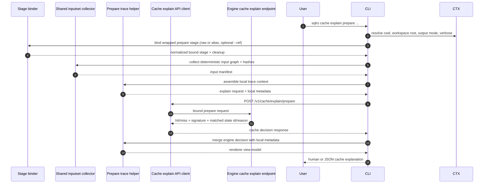
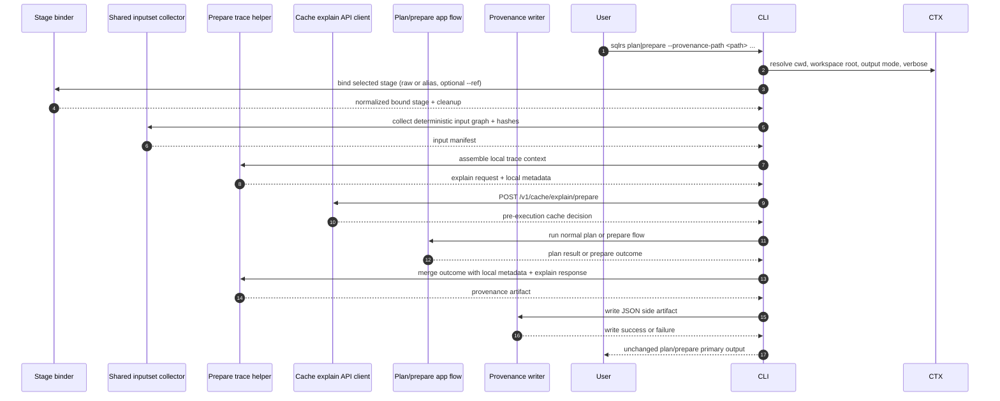

# Provenance и Cache-Explain Flow

Этот документ описывает утвержденный interaction flow для следующего bounded
local slice после ref-backed `plan` / `prepare`:

- `--provenance-path <path>` у single-stage local `plan` / `prepare`
- `sqlrs cache explain prepare ...` для одного single-stage prepare-oriented
  решения

Он следует принятым user-facing shapes в:

- [`../user-guides/sqlrs-provenance.md`](../user-guides/sqlrs-provenance.md)
- [`../user-guides/sqlrs-cache-explain.md`](../user-guides/sqlrs-cache-explain.md)

Этот slice намеренно узкий:

- он поддерживает только single-stage local `plan` и `prepare`;
- он поддерживает raw и alias-backed prepare flows;
- он поддерживает и обычное local filesystem execution, и bounded local `--ref`;
- provenance остается только JSON side artifact;
- `cache explain` остается read-only и только prepare-oriented;
- он пока не поддерживает standalone `run`;
- он пока не поддерживает composite `prepare ... run ...`;
- он пока не поддерживает remote/server-side execution или explanation.

## 1. Участники

- **User** - вызывает `sqlrs plan`, `sqlrs prepare` или `sqlrs cache explain`.
- **CLI parser** - разбирает command-specific flags и wrapped prepare stages.
- **Command context** - резолвит cwd, workspace root, output mode и verbose
  settings.
- **Stage binder** - привязывает raw или alias-backed prepare inputs, включая
  bounded local `--ref` resolution через shared ref-context path.
- **Shared inputset collector** - вычисляет детерминированный local input graph
  и content hash-ы для выбранного prepare kind.
- **Prepare trace helper** - объединяет local command metadata, ref metadata,
  normalized stage inputs и input hash-ы в один переиспользуемый diagnostic
  trace.
- **Cache explain API client** - отправляет bound prepare request в engine за
  read-only cache explanation.
- **Engine cache explain endpoint** - вычисляет ту же final prepare signature и
  тот же cache lookup, который engine использовал бы для реального execution.
- **Plan/prepare app flow** - запускает обычный существующий pipeline `plan`
  или `prepare`, когда команда не является read-only cache explanation.
- **Provenance writer** - сериализует итоговый provenance JSON artifact, когда
  запрошен `--provenance-path`.
- **Renderer** - выводит human/JSON `cache explain` output и существующие
  результаты команд `plan` / `prepare`.

## 2. Flow A: `sqlrs cache explain prepare ...`

Ключевое правило: wrapped stage привязывается ровно так же, как реальный
single-stage `prepare`, включая alias resolution, projected-cwd semantics у
`--ref` и kind-specific closure traversal.

## 3. Flow B: `sqlrs plan|prepare --provenance-path ...`

Важное правило поведения: provenance фиксирует cache decision, увиденное
непосредственно перед execution. Если состояние cache изменится между этим
read-only explain call и реальным `prepare`, artifact всё равно отражает
корректный pre-execution diagnostic snapshot для данного invocation.

Команды без `--provenance-path` сохраняют текущий flow `plan` / `prepare` и не
платят за дополнительный explain call.

## 4. Разделение trace payload

Переиспользуемый trace строится из двух источников.

### 4.1 CLI-local fields

Собираются локально до любого engine explain call:

- command family (`plan` или `prepare`)
- prepare kind и class (raw или alias)
- workspace root и caller cwd
- selected alias path при наличии
- metadata запрошенного ref и resolved ref context при наличии
- normalized prepare arguments
- детерминированный input manifest:
  - logical path
  - host path, используемый для execution, когда это важно
  - stable content hash

### 4.2 Engine-derived fields

Возвращаются read-only cache explain endpoint:

- final-state decision (`hit` или `miss`)
- engine-computed signature
- matched state id при наличии
- reason code, когда final state отсутствует
- resolved image id, если engine умеет его сообщить

### 4.3 Terminal outcome fields

Добавляются только для команд, пишущих provenance:

- финальный статус команды (`succeeded`, `failed`, `canceled`)
- plan-only vs prepare execution mode
- resulting state id или job id, если они доступны
- краткая ошибка, если execution падает после binding

## 5. Обработка ошибок

- Ранние usage- и parsing-ошибки не создают provenance.
- Если stage binding падает до появления детерминированного input manifest,
  команда завершается обычной ошибкой без записи provenance.
- Ошибки `cache explain` остаются обычными command errors; команда не печатает
  partial diagnostic output.
- Ошибки execution после построения trace всё равно должны писать provenance с
  failed terminal outcome.
- Если запись provenance падает уже после завершения основной команды, команда
  должна упасть и явно сообщить об этой write-ошибке.
- Cleanup detached-worktree или blob-staging по-прежнему следует тем же
  cleanup-правилам, которые уже приняты для ref-backed `plan` / `prepare`.

## 6. Out-of-scope follow-ups

- provenance для standalone `run`
- provenance для composite `prepare ... run ...`
- `sqlrs cache explain plan ...`
- `sqlrs cache explain run ...`
- советы по cache eviction или store-health diagnostics
- remote/server-side provenance capture
- remote/server-side cache explanation
