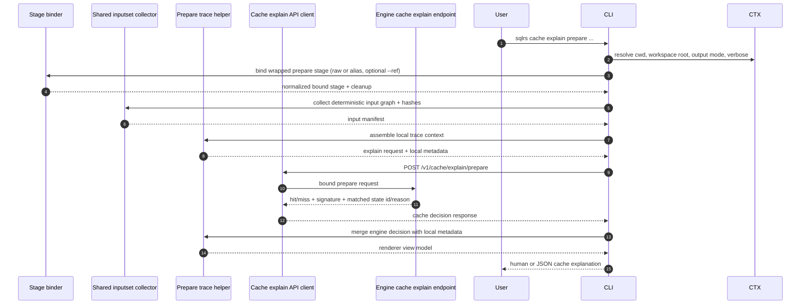
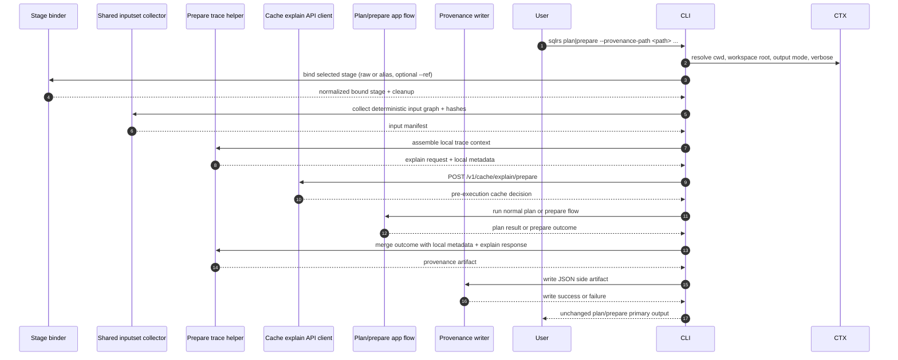

# Provenance and Cache-Explain Flow

This document describes the approved interaction flow for the next bounded
local slice after ref-backed `plan` / `prepare`:

- `--provenance-path <path>` on single-stage local `plan` / `prepare`
- `sqlrs cache explain prepare ...` for one single-stage prepare-oriented
  decision

It follows the accepted user-facing shapes in:

- [`../user-guides/sqlrs-provenance.md`](../user-guides/sqlrs-provenance.md)
- [`../user-guides/sqlrs-cache-explain.md`](../user-guides/sqlrs-cache-explain.md)

This slice is intentionally narrow:

- it supports single-stage local `plan` and `prepare` only;
- it supports raw and alias-backed prepare flows;
- it supports both normal local filesystem execution and bounded local `--ref`;
- provenance is a JSON side artifact only;
- `cache explain` is read-only and prepare-oriented only;
- it does not yet support standalone `run`;
- it does not yet support composite `prepare ... run ...`;
- it does not yet support remote/server-side execution or explanation.

## 1. Participants

- **User** - invokes `sqlrs plan`, `sqlrs prepare`, or `sqlrs cache explain`.
- **CLI parser** - parses command-specific flags and wrapped prepare stages.
- **Command context** - resolves cwd, workspace root, output mode, and verbose
  settings.
- **Stage binder** - binds raw or alias-backed prepare inputs, including
  bounded local `--ref` resolution through the shared ref context path.
- **Shared inputset collector** - computes the deterministic local input graph
  and content hashes for the selected prepare kind.
- **Prepare trace helper** - combines local command metadata, ref metadata,
  normalized stage inputs, and input hashes into one reusable diagnostic trace.
- **Cache explain API client** - submits the bound prepare request to the engine
  for a read-only cache explanation.
- **Engine cache explain endpoint** - computes the same final prepare signature
  and cache lookup the engine would use for real execution.
- **Plan/prepare app flow** - runs the normal existing `plan` or `prepare`
  pipeline when the command is not read-only cache explanation.
- **Provenance writer** - serializes the final provenance JSON artifact when
  `--provenance-path` is requested.
- **Renderer** - emits human/JSON `cache explain` output and the existing
  `plan` / `prepare` command results.

## 2. Flow A: `sqlrs cache explain prepare ...`

Key rule: the wrapped stage is bound exactly the same way as real single-stage
`prepare`, including alias resolution, projected-cwd `--ref` semantics, and
kind-specific closure traversal.

## 3. Flow B: `sqlrs plan|prepare --provenance-path ...`

Important behavior rule: provenance records the cache decision observed
immediately before execution. If cache state changes between that read-only
explain call and the real `prepare`, the artifact still reflects the correct
pre-execution diagnostic snapshot for this invocation.

Commands without `--provenance-path` keep the current `plan` / `prepare` flow
and do not pay for the additional explain call.

## 4. Trace payload split

The reusable trace is built from two sources.

### 4.1 CLI-local fields

Collected locally before any engine explain call:

- command family (`plan` or `prepare`)
- prepare kind and class (raw or alias)
- workspace root and caller cwd
- selected alias path when applicable
- requested ref metadata and resolved ref context when applicable
- normalized prepare arguments
- deterministic input manifest:
  - logical path
  - host path used for execution when relevant
  - stable content hash

### 4.2 Engine-derived fields

Returned by the read-only cache explain endpoint:

- final-state decision (`hit` or `miss`)
- engine-computed signature
- matched state id when present
- reason code when the final state is absent
- resolved image id when the engine can report it

### 4.3 Terminal outcome fields

Added only for provenance-writing commands:

- final command status (`succeeded`, `failed`, `canceled`)
- plan-only vs prepare execution mode
- resulting state id or job id when available
- error summary when execution fails after binding

## 5. Failure handling

- Early usage and parsing errors do not emit provenance.
- If stage binding fails before a deterministic input manifest exists, the
  command fails normally without writing provenance.
- `cache explain` failures stay regular command errors; the command does not
  print partial diagnostic output.
- Execution failures after the trace exists should still write provenance with a
  failed terminal outcome.
- If provenance writing fails after the main command completed, the command
  fails and reports that write error explicitly.
- Detached-worktree or blob staging cleanup still follows the same cleanup rules
  already accepted for ref-backed `plan` / `prepare`.

## 6. Out-of-scope follow-ups

- provenance for standalone `run`
- provenance for composite `prepare ... run ...`
- `sqlrs cache explain plan ...`
- `sqlrs cache explain run ...`
- cache-eviction advice or store-health diagnostics
- remote/server-side provenance capture
- remote/server-side cache explanation
