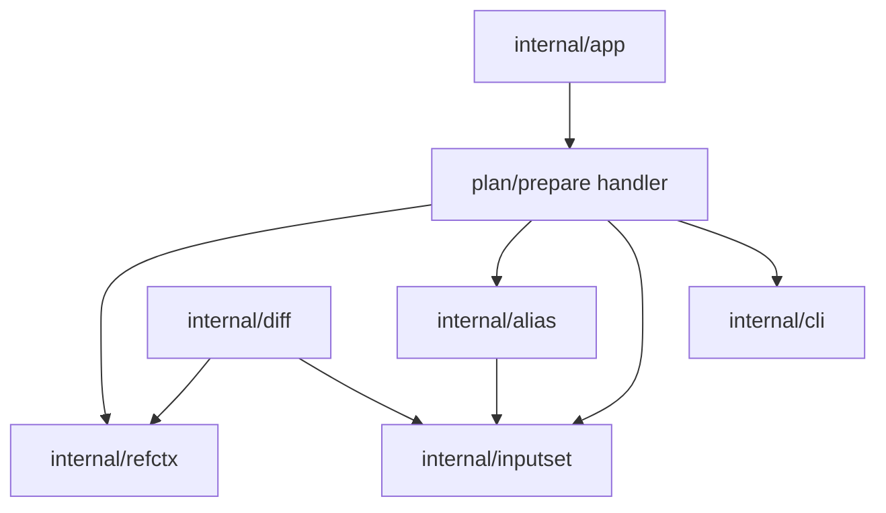

# Ref-Backed Plan/Prepare - структура компонентов

Этот документ определяет утвержденную внутреннюю компонентную структуру для
bounded local `--ref` slice у `sqlrs plan` и `sqlrs prepare`.

Он опирается на принятый CLI shape из
[`../user-guides/sqlrs-ref.md`](../user-guides/sqlrs-ref.md) и на утвержденный
interaction flow в [`ref-flow.RU.md`](ref-flow.RU.md).

## 1. Scope и предположения

- Slice остается **CLI-only** и **local-only**.
- Он применяется только к **single-stage** `plan` и `prepare`.
- Он поддерживает raw и alias-backed prepare flows.
- Ref-backed `prepare` в этом slice остается только в watch mode; асинхронная
  semantics через `--no-watch` пока вне scope.
- Он переиспользует ту же vocabulary `worktree` и `blob`, что уже принята для
  `sqlrs diff`.
- Он пока не добавляет:
  - более поздний утвержденный follow-up для standalone `run --ref`
  - `prepare ... run ...` с ref-backed prepare-stage
  - provenance или `cache explain`
- Архитектура не должна дублировать detached-worktree lifecycle и
  projected-cwd logic отдельно в `diff` и в `plan` / `prepare`.

## 2. Утвержденное разделение компонентов

| Компонент | Ответственность | Кто вызывает |
|-----------|-----------------|--------------|
| **Обработчик команды plan/prepare** | Парсить stage-local флаги `--ref`, отклонять неподдерживаемые composite shapes и оркестрировать ref-backed binding до входа в обычный flow plan/prepare. | `internal/app` -> существующий execution path plan/prepare |
| **Shared ref context resolver** | Разрешать repo root, Git ref, projected cwd внутри ref, открывать filesystem context в режиме worktree или blob и отдавать cleanup. | Обработчики `plan` / `prepare` и `internal/diff` |
| **Alias binder** | Разрешать prepare alias ref и загружать его YAML payload из выбранного filesystem context, а не только из live working tree. | Обработчик plan/prepare |
| **Shared inputset kind component** | Парсить file-bearing args, привязывать их к выбранному filesystem view и собирать детерминированные per-kind input closures. | Обработчик plan/prepare через `internal/inputset/*` |
| **Plan/prepare app flow** | Запускать существующий deterministic flow plan или prepare после полной привязки stage. | Обработчик plan/prepare |
| **Cleanup handler** | Удалять временные worktree, если пользователь не задал `--ref-keep-worktree`. | Потребитель shared ref context resolver |

## 3. Новый общий владелец: `internal/refctx`

Утвержденная структура вводит одного общего CLI-side владельца ref-backed
filesystem context:

- поиск repo root от caller cwd
- локальное разрешение Git ref
- разрешение projected cwd внутри выбранной ревизии
- setup и cleanup detached worktree
- setup blob-backed filesystem для чтения Git objects

Этот модуль нужен потому, что такое поведение не является специфичным для
`diff`.

Без общего владельца `plan` / `prepare --ref` либо:

- дублировали бы detached-worktree и projected-cwd logic, уже существующую
  вокруг `diff`, либо
- тянули бы execution concerns внутрь `internal/diff`, что даёт неверное
  направление зависимостей.

Утвержденное правило владения такое:

- `internal/diff` сохраняет **парсинг diff scope, сравнение и рендеринг**;
- `internal/refctx` владеет **одним ref-backed filesystem context**;
- и `plan` / `prepare`, и `diff` используют `internal/refctx`.

Чтобы это разделение оставалось проверяемым, для данного slice дополнительно
принимаются такие boundary rules:

- только `internal/refctx` может разрешать repo root, выбранный ref,
  проектировать cwd в эту ревизию и создавать или чистить временные worktree;
- только `internal/alias` может разрешать prepare-alias stem до конкретного
  файла и загружать alias YAML из переданного filesystem view;
- только `internal/inputset` может определять per-kind file-bearing closure
  rules;
- `internal/app` может оркестрировать эти части, но не должен становиться
  вторым владельцем generic ref-resolution или alias-path logic.

## 4. Предлагаемое размещение пакетов

### `frontend/cli-go/internal/app`

- расширить parsing `plan` и `prepare` флагами:
  - `--ref <git-ref>`
  - `--ref-mode worktree|blob`
  - `--ref-keep-worktree`
- отклонять неподдерживаемые `prepare ... run ...`, если prepare-stage несет
  `--ref`
- отклонять `prepare --ref --no-watch` в том же bounded slice
- держать в app-level helpers только orchestration и выбор kind
- если у psql и Liquibase ref binding есть общий lifecycle plumbing, вынести
  этот plumbing один раз вместо дублирования repo/ref/open/cleanup choreography
  в per-kind helpers
- передавать ref options в command executor

### `frontend/cli-go/internal/refctx`

- `types.go`
  - `Options`, `Context`, `Cleanup`, `Mode`
- `resolve.go`
  - поиск repo root
  - локальное разрешение ref
  - разрешение projected cwd
- `worktree.go`
  - создание и cleanup detached worktree
- `blob.go`
  - setup Git-object-backed filesystem adapter

Пакет владеет только созданием ref-backed context. Он не парсит grammar
команд plan, prepare или diff.

### `frontend/cli-go/internal/alias`

- отдавать filesystem-aware primitives для resolution и loading prepare alias
- сохранять suffix rules, YAML parsing и alias schema validation как источник
  истины
- владеть alias-target resolution как для ref-backed, так и для
  live-filesystem flow

Пакет не должен предполагать, что alias files всегда читаются из live host
filesystem.

### `frontend/cli-go/internal/inputset`

- продолжать владеть per-kind semantics parse/bind/collect
- принимать filesystem views, поставляемые потребителями `internal/refctx`

Никакой новый ref-specific per-kind collector в этом slice не вводится.

### `frontend/cli-go/internal/diff`

- сохранять `ParseDiffScope`, сравнение и рендеринг
- перестать быть долгосрочным владельцем generic ref-backed filesystem setup
- использовать `internal/refctx`, когда diff нужен один ref-backed side context

### `frontend/cli-go/internal/cli`

- сохранять human/JSON rendering для `plan` и `prepare`
- отдельный renderer package для `--ref` не вводится
- при желании выводить selected ref/mode только в verbose diagnostics

## 5. Ключевые типы и интерфейсы

- `refctx.Options`
  - caller cwd, выбранный ref, ref mode и policy сохранения worktree
- `refctx.Context`
  - repo root, resolved ref, projected cwd, filesystem handle и mode
- `refctx.Cleanup`
  - опциональная cleanup function для detached-worktree mode
- `alias.Target`
  - переиспользуемая logical цель alias, но разрешаемая против supplied
  filesystem context
- `inputset.PathResolver`
  - переиспользуется raw и alias-backed binding-ом stage против live или
  ref-backed filesystems
- `inputset.CommandSpec`, `inputset.BoundSpec`, `inputset.InputSet`
  - неизменная shared staged-модель per-kind file semantics

## 6. Владение данными

- **Raw argv и stage-local flags** принадлежат `internal/app`, пока не выбран
  stage команды.
- **Ref context** эфемерен и принадлежит `internal/refctx` на время одного
  command invocation.
- **Temporary worktrees** принадлежат `internal/refctx` и чистятся после
  команды, если пользователь явно не попросил их сохранить.
- **Alias payloads** по-прежнему принадлежат `internal/alias`, даже если
  загружаются из ref-backed filesystem.
- **Per-kind bound specs и collected input sets** по-прежнему принадлежат
  `internal/inputset`.
- **Plan results, prepare jobs и DSN output** по-прежнему принадлежат
  существующему flow plan/prepare и не меняются по персистентности.
- **Persistent ref cache** в этом slice не вводится.

## 7. Схема зависимостей

## 8. Последствия для существующих документов

Поскольку `internal/refctx` становится общим владельцем ref-backed filesystem
contexts:

- `diff-component-structure.RU.md` должен перестать описывать generic
  ref-context setup как долгосрочную ответственность `internal/diff`;
- `cli-component-structure.RU.md` должен перечислять `internal/refctx` рядом с
  `internal/diff`, `internal/discover` и `internal/inputset`;
- `cli-contract.RU.md` должен описывать `plan` / `prepare --ref` как
  утвержденный bounded slice, а более поздний standalone `run --ref` должен
  быть описан отдельно; composite ref-semantics остаются вне scope этого
  документа.

## 9. Ссылки

- User guide: [`../user-guides/sqlrs-ref.md`](../user-guides/sqlrs-ref.md)
- Interaction flow: [`ref-flow.RU.md`](ref-flow.RU.md)
- CLI contract: [`cli-contract.RU.md`](cli-contract.RU.md)
- CLI component structure: [`cli-component-structure.RU.md`](cli-component-structure.RU.md)
- Diff component structure: [`diff-component-structure.RU.md`](diff-component-structure.RU.md)
- Shared inputset layer: [`inputset-component-structure.RU.md`](inputset-component-structure.RU.md)
- Git-aware passive notes: [`git-aware-passive.RU.md`](git-aware-passive.RU.md)
