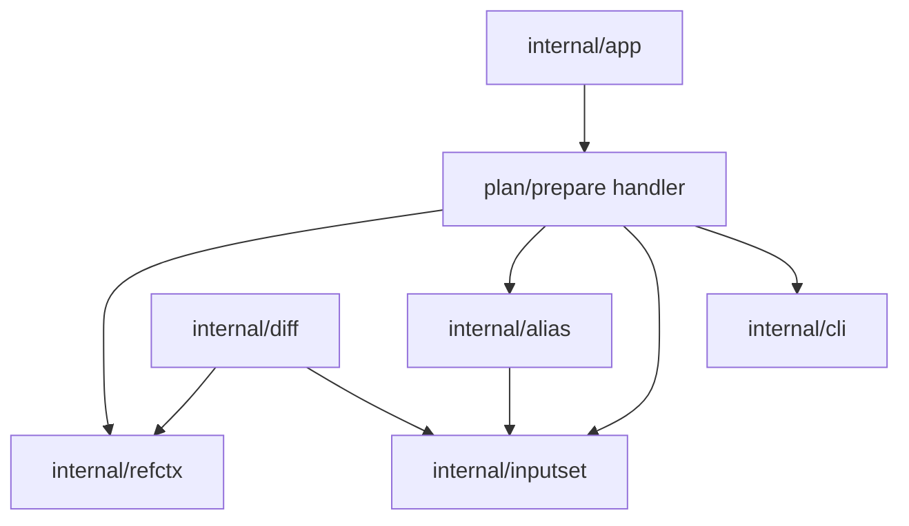

# Ref-Backed Plan/Prepare - Component Structure

This document defines the approved internal component structure for the bounded
local `--ref` slice for `sqlrs plan` and `sqlrs prepare`.

It follows the accepted CLI shape in
[`../user-guides/sqlrs-ref.md`](../user-guides/sqlrs-ref.md) and the accepted
interaction flow in [`ref-flow.md`](ref-flow.md).

## 1. Scope and assumptions

- The slice is **CLI-only** and **local-only**.
- It applies only to **single-stage** `plan` and `prepare`.
- It supports both raw and alias-backed prepare flows.
- It reuses the same `worktree` and `blob` vocabulary already accepted for
  `sqlrs diff`.
- It does not yet add:
  - standalone `run --ref`
  - `prepare ... run ...` with a ref-backed prepare stage
  - provenance or `cache explain`
- The architecture must avoid duplicating detached-worktree lifecycle and
  projected-cwd logic separately in `diff` and in `plan` / `prepare`.

## 2. Approved component split

| Component | Responsibility | Caller |
|-----------|----------------|--------|
| **Plan/prepare command handler** | Parse stage-local `--ref` flags, reject unsupported composite shapes, and orchestrate ref-backed binding before entering the normal plan/prepare flow. | `internal/app` -> existing plan/prepare execution path |
| **Shared ref context resolver** | Resolve repo root, resolve Git ref, project caller cwd into that ref, open either worktree- or blob-backed filesystem context, and expose cleanup. | `plan` / `prepare` handlers and `internal/diff` |
| **Alias binder** | Resolve a prepare alias ref and load its YAML payload against the selected filesystem context, not just the live working tree. | Plan/prepare command handler |
| **Shared inputset kind component** | Parse file-bearing args, bind them against the selected filesystem view, and collect deterministic per-kind input closures. | Plan/prepare command handler via `internal/inputset/*` |
| **Plan/prepare app flow** | Run the existing deterministic plan or prepare flow once the stage is fully bound. | Plan/prepare command handler |
| **Cleanup handler** | Remove temporary worktrees unless the user requested `--ref-keep-worktree`. | Shared ref context resolver consumer |

## 3. New shared owner: `internal/refctx`

The approved structure introduces one shared CLI-side owner for ref-backed
filesystem context:

- repository-root discovery from caller cwd
- local Git-ref resolution
- projected-cwd resolution inside the selected revision
- detached-worktree setup and cleanup
- blob-backed filesystem setup for Git-object reads

This module exists because these behaviors are not specific to `diff`.

Without a shared owner, `plan` / `prepare --ref` would either:

- duplicate detached-worktree and projected-cwd logic already present around
  `diff`, or
- push execution concerns into `internal/diff`, which is the wrong dependency
  direction.

The approved ownership rule is:

- `internal/diff` keeps **diff scope parsing, comparison, and rendering**;
- `internal/refctx` owns **one ref-backed filesystem context**;
- `plan` / `prepare` and `diff` both consume `internal/refctx`.

## 4. Suggested package layout

### `frontend/cli-go/internal/app`

- extend `plan` and `prepare` parsing with:
  - `--ref <git-ref>`
  - `--ref-mode worktree|blob`
  - `--ref-keep-worktree`
- reject unsupported `prepare ... run ...` shapes when the prepare stage carries
  `--ref`
- pass ref options into the command executor

### `frontend/cli-go/internal/refctx`

- `types.go`
  - `Options`, `Context`, `Cleanup`, `Mode`
- `resolve.go`
  - repo-root discovery
  - local ref resolution
  - projected-cwd resolution
- `worktree.go`
  - detached-worktree creation and cleanup
- `blob.go`
  - Git-object-backed filesystem adapter setup

The package owns only ref-backed context creation. It does not parse plan,
prepare, or diff command grammar.

### `frontend/cli-go/internal/alias`

- expose filesystem-aware prepare-alias resolution and loading primitives
- keep suffix rules, YAML parsing, and alias schema validation as the source of
  truth

The package must not assume that alias files always come from the live host
filesystem.

### `frontend/cli-go/internal/inputset`

- continue to own per-kind parse/bind/collect semantics
- accept filesystem views supplied by `internal/refctx` consumers

No new per-kind ref-specific collector should be introduced.

### `frontend/cli-go/internal/diff`

- keep `ParseDiffScope`, comparison, and rendering responsibilities
- stop being the long-term owner of generic ref-backed filesystem setup
- use `internal/refctx` when diff needs one ref-backed side context

### `frontend/cli-go/internal/cli`

- keep human/JSON rendering for `plan` and `prepare`
- no separate renderer package is introduced for `--ref`
- optionally surface selected ref/mode in verbose diagnostics only

## 5. Key types and interfaces

- `refctx.Options`
  - caller cwd, selected ref, ref mode, and keep-worktree policy
- `refctx.Context`
  - repo root, resolved ref, projected cwd, filesystem handle, and mode
- `refctx.Cleanup`
  - optional cleanup function for detached-worktree mode
- `alias.Target`
  - reused logical alias target, but resolved against a supplied filesystem
  context
- `inputset.PathResolver`
  - reused by raw and alias-backed stage binding against either live or
  ref-backed filesystems
- `inputset.CommandSpec`, `inputset.BoundSpec`, `inputset.InputSet`
  - unchanged shared staged model for per-kind file semantics

## 6. Data ownership

- **Raw argv and stage-local flags** are owned by `internal/app` until the
  command stage is selected.
- **Ref context** is ephemeral and owned by `internal/refctx` for one command
  invocation.
- **Temporary worktrees** are owned by `internal/refctx` and cleaned up after
  the command unless explicitly kept.
- **Alias payloads** remain owned by `internal/alias`, even when loaded from a
  ref-backed filesystem.
- **Per-kind bound specs and collected input sets** remain owned by
  `internal/inputset`.
- **Plan results, prepare jobs, and DSN output** remain owned by the existing
  plan/prepare flow and are unchanged in persistence terms.
- **No persistent ref cache** is introduced in this slice.

## 7. Dependency diagram

## 8. Consequences for existing docs

Because `internal/refctx` becomes the shared owner of ref-backed filesystem
contexts:

- `diff-component-structure.md` must stop treating generic ref-context setup as
  a long-term `internal/diff` responsibility;
- `cli-component-structure.md` must list `internal/refctx` alongside
  `internal/diff`, `internal/discover`, and `internal/inputset`;
- `cli-contract.md` must describe `plan` / `prepare --ref` as the accepted next
  bounded slice, while keeping `run --ref` and composite ref semantics out of
  the current approved scope.

## 9. References

- User guide: [`../user-guides/sqlrs-ref.md`](../user-guides/sqlrs-ref.md)
- Interaction flow: [`ref-flow.md`](ref-flow.md)
- CLI contract: [`cli-contract.md`](cli-contract.md)
- CLI component structure: [`cli-component-structure.md`](cli-component-structure.md)
- Diff component structure: [`diff-component-structure.md`](diff-component-structure.md)
- Shared inputset layer: [`inputset-component-structure.md`](inputset-component-structure.md)
- Git-aware passive notes: [`git-aware-passive.md`](git-aware-passive.md)
