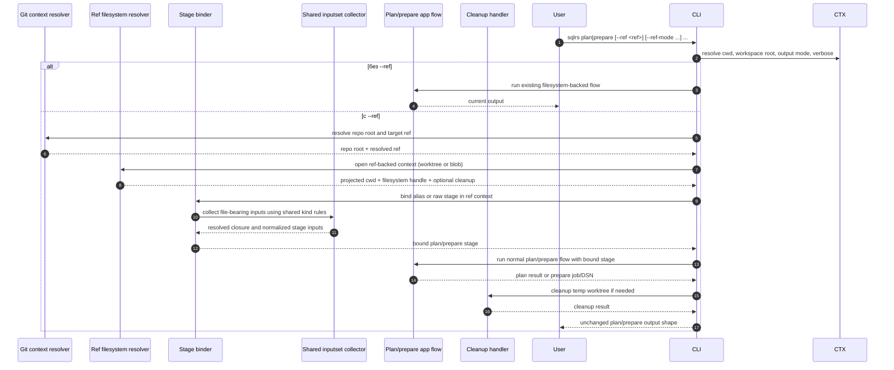

# Поток Ref-Backed Plan/Prepare

Этот документ описывает утвержденный локальный поток взаимодействия для
bounded `--ref` slice после принятия CLI-синтаксиса в
[`../user-guides/sqlrs-ref.md`](../user-guides/sqlrs-ref.md).

Этот slice намеренно узкий:

- он применяется только к single-stage `plan` и `prepare`;
- он поддерживает raw и alias-backed prepare flows;
- ref-backed `prepare` в нем остается только в watch mode;
- он пока не поддерживает standalone `run --ref`;
- он пока не поддерживает composite `prepare ... run ...` с `--ref`.

## 1. Участники

- **Пользователь** - запускает `sqlrs plan` или `sqlrs prepare`.
- **CLI parser** - парсит stage-local флаги `--ref` и обычные аргументы
  команды.
- **Command context** - определяет cwd, workspace root, output mode и verbose
  settings.
- **Git context resolver** - находит корень репозитория и разрешает целевой
  Git ref.
- **Ref filesystem resolver** - проецирует caller cwd в выбранный ref и
  предоставляет либо detached-worktree filesystem, либо Git-object-backed
  filesystem.
- **Stage binder** - привязывает alias-backed или raw `plan` / `prepare`
  аргументы к этому filesystem context.
- **Shared inputset collector** - применяет существующую per-kind
  file-bearing semantics для `psql` и Liquibase.
- **Plan/prepare app flow** - запускает обычный существующий pipeline `plan`
  или `prepare`, когда ref-backed stage уже полностью привязан.
- **Cleanup handler** - удаляет временные worktree, если пользователь не
  попросил их сохранить.
- **Renderer** - выдаёт те же output shapes `plan` / `prepare`, что и сегодня.

## 2. Поток: `sqlrs plan|prepare --ref ...`

## 3. Разбиение на стадии

### 3.1 Парсинг команды

Parser рассматривает `--ref`, `--ref-mode` и `--ref-keep-worktree` как
stage-local options для `plan` и `prepare`.

- Без `--ref` команда полностью сохраняет сегодняшнее поведение.
- `--ref-mode` и `--ref-keep-worktree` недопустимы без `--ref`.
- `--ref-keep-worktree` допустим только с `--ref-mode worktree`.
- `prepare --ref --no-watch` недопустим в этом slice.
- В этом slice отклоняется `prepare ... run ...`, если prepare-stage несёт
  `--ref`.

Так первый ref-backed slice остаётся ограниченным одним revision-sensitive
stage.

### 3.2 Разрешение Git-контекста

Как только присутствует `--ref`, команда разрешает:

1. корень репозитория от текущего рабочего каталога вызывающего процесса;
2. целевой Git ref локально;
3. projected cwd вызывающего процесса внутри выбранной ревизии.

Если любой из этих шагов не удался, команда завершается до стадии binding.

Правило projected cwd специально повторяет текущее поведение ref-context в
`sqlrs diff`, чтобы path-base semantics не расходились между passive
inspection и ref-backed execution.

Правило владения для этого этапа: repo-root discovery, ref resolution,
projected cwd resolution и worktree/blob setup приходят из общего слоя
`internal/refctx`, чтобы у `plan` / `prepare` не появилась вторая копия
diff-adjacent ref logic.

### 3.3 Подготовка ref-backed filesystem

Ref filesystem resolver создаёт один из двух локальных filesystem views.

#### Режим `worktree`

- создать detached temporary worktree на выбранном ref;
- отобразить caller cwd в этот worktree;
- предоставить обычную файловую семантику;
- зарегистрировать cleanup, если не задан `--ref-keep-worktree`.

#### Режим `blob`

- предоставить Git-object-backed filesystem, rooted на выбранном ref;
- логически сохранить ту же модель projected cwd;
- не создавать detached worktree.

`worktree` остаётся режимом по умолчанию, потому что он лучше всего сохраняет
сегодняшнее поведение локального filesystem execution, включая
symlink-sensitive случаи.

### 3.4 Binding stage в ref context

После подготовки ref-backed filesystem sqlrs привязывает stage точно так же,
как и в live working tree, но уже к ref-backed context.

Для alias mode:

- `<prepare-ref>` остаётся cwd-relative logical stem;
- exact-file escape через trailing `.` сохраняется;
- alias file должен существовать в выбранной ревизии;
- file-bearing paths из alias file по-прежнему считаются относительно самого
  alias file.

Alias target resolution по-прежнему принадлежит `internal/alias`; app layer
только выбирает, является ли команда alias-backed или raw, а затем передаёт
выбранный filesystem view в этот общий resolver.

Для raw mode:

- `plan:<kind>` и `prepare:<kind>` сохраняют свою текущую grammar аргументов;
- file-bearing paths резолвятся от projected cwd на выбранном ref;
- kind-specific closure rules по-прежнему приходят из shared inputset layer.

### 3.5 Shared inputset collection

Shared inputset layer остаётся источником истины для revision-sensitive
file semantics.

Ref-backed slice не вводит отдельный per-kind resolver. Вместо этого он
переиспользует те же kind collectors, которые уже обслуживают:

- execution-time validation;
- alias inspection;
- `sqlrs diff`;
- `discover` heuristics там, где нужна kind validation.

Именно здесь из выбранного ref context обнаруживаются include graph,
changelog graph и другие зависимые файлы.

Чтобы не получить второй слой kind drift, любой общий helper для ref-stage
binding может выносить open/bind/cleanup choreography, но per-kind
file-closure rules остаются внутри `internal/inputset`, а per-kind
materialization остаётся рядом с текущими command-kind implementations.

### 3.6 Выполнение plan/prepare

Как только stage полностью привязан, дальше продолжается обычный app flow.

- `plan` сохраняет свой текущий human/JSON output.
- `prepare --ref` остается в watch mode и сохраняет DSN output.
- обычный `prepare` без `--ref` по-прежнему поддерживает `--no-watch` и
  job references.
- В этом slice не добавляется новый top-level output shape для ref metadata.

Verbose logging может упоминать выбранные ref и ref mode, но основной result
payload остаётся согласованным с сегодняшним контрактом команды.

### 3.7 Cleanup

Cleanup зависит от режима.

- У `blob` mode нет cleanup detached-worktree.
- В `worktree` mode временный worktree удаляется после успеха или ошибки,
  если только пользователь не указал `--ref-keep-worktree`.

Ошибки cleanup должны подниматься как command errors, так же как ошибки
cleanup detached worktree уже поднимаются в `sqlrs diff`.

## 4. Обработка ошибок

- Если вызывающий процесс находится вне Git-репозитория, `--ref` даёт ошибку
  команды.
- Если `prepare --ref` комбинируется с `--no-watch`, команда завершается
  ошибкой использования.
- Если ref не разрешается локально, команда падает до input binding.
- Если projected cwd отсутствует на этом ref, команда падает.
- Если alias file или raw file entrypoint отсутствует на этом ref, команда
  падает.
- Если shared inputset collection находит отсутствующие зависимые файлы,
  команда падает через обычный stage-validation path.
- Если создание или cleanup detached worktree не удался, команда сообщает это
  явно.
- Ни один ref-backed stage не меняет live working tree вызывающего процесса.

## 5. Follow-ups вне scope

Этот flow намеренно оставляет на следующие slices:

- `prepare ... run ...` с ref-backed prepare-stage;
- standalone `run --ref`;
- provenance output для ref-backed runs;
- `sqlrs cache explain` поверх ref-backed inputs;
- remote runner или hosted Git semantics.
