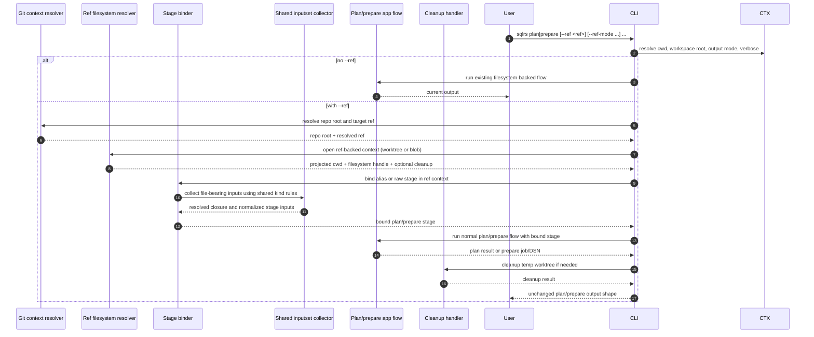

# Ref-Backed Plan/Prepare Flow

This document describes the approved local interaction flow for the bounded
`--ref` slice after the CLI syntax for ref-backed `plan` / `prepare` has been
accepted in [`../user-guides/sqlrs-ref.md`](../user-guides/sqlrs-ref.md).

This slice is intentionally narrow:

- it applies to single-stage `plan` and `prepare`;
- it supports both raw and alias-backed prepare flows;
- it keeps ref-backed `prepare` in watch mode only;
- it does not yet support standalone `run --ref`;
- it does not yet support `prepare ... run ...` composites carrying `--ref`.

## 1. Participants

- **User** - invokes `sqlrs plan` or `sqlrs prepare`.
- **CLI parser** - parses stage-local `--ref` flags and regular command args.
- **Command context** - resolves cwd, workspace root, output mode, and verbose
  settings.
- **Git context resolver** - finds the repository root and resolves the target
  Git ref.
- **Ref filesystem resolver** - projects the caller cwd into the selected ref
  and exposes either a detached-worktree filesystem or a Git-object-backed
  filesystem.
- **Stage binder** - binds alias-backed or raw `plan` / `prepare` arguments
  against that filesystem context.
- **Shared inputset collector** - applies the existing per-kind file-bearing
  semantics for `psql` and Liquibase.
- **Plan/prepare app flow** - runs the normal existing `plan` or `prepare`
  pipeline once the ref-backed stage is fully bound.
- **Cleanup handler** - removes temporary worktrees unless explicitly kept.
- **Renderer** - emits the same `plan` / `prepare` output shapes that exist
  today.

## 2. Flow: `sqlrs plan|prepare --ref ...`

## 3. Stage breakdown

### 3.1 Command parsing

The parser treats `--ref`, `--ref-mode`, and `--ref-keep-worktree` as
stage-local options for `plan` and `prepare`.

- Without `--ref`, the command keeps today's behavior unchanged.
- `--ref-mode` and `--ref-keep-worktree` are invalid unless `--ref` is set.
- `--ref-keep-worktree` is valid only with `--ref-mode worktree`.
- `prepare --ref --no-watch` is invalid in this slice.
- This slice rejects `prepare ... run ...` when the prepare stage carries
  `--ref`.

This keeps the first ref-backed slice bounded to one revision-sensitive stage.

### 3.2 Git context resolution

Once `--ref` is present, the command resolves:

1. repository root from the caller's current working directory;
2. the target Git ref locally;
3. the caller's projected cwd inside that selected revision.

If any of these steps fails, the command terminates before stage binding.

The projected cwd rule intentionally matches the current `sqlrs diff`
ref-context behavior so path-base semantics do not diverge between passive
inspection and ref-backed execution.

Ownership rule for this stage: repo-root discovery, ref resolution, projected
cwd resolution, and worktree/blob setup all come from the shared
`internal/refctx` layer so that `plan` / `prepare` do not grow a second copy of
diff-adjacent ref logic.

### 3.3 Ref filesystem setup

The ref filesystem resolver creates one of two local filesystem views.

#### `worktree` mode

- create a detached temporary worktree at the selected ref;
- map the caller's cwd into that worktree;
- expose ordinary filesystem semantics;
- register cleanup unless `--ref-keep-worktree` was requested.

#### `blob` mode

- expose a Git-object-backed filesystem rooted at the selected ref;
- preserve the same projected-cwd model logically;
- avoid creating a detached worktree.

`worktree` remains the default mode because it preserves the closest behavior to
today's local filesystem execution, including symlink-sensitive cases.

### 3.4 Stage binding in ref context

After the ref-backed filesystem is ready, sqlrs binds the command stage exactly
as it would in the live working tree, but against the ref-backed context.

For alias mode:

- `<prepare-ref>` stays a cwd-relative logical stem;
- exact-file escape via trailing `.` still applies;
- the alias file must exist in the selected revision;
- file-bearing paths from the alias file stay relative to that alias file.

Alias target resolution remains owned by `internal/alias`; the app layer only
chooses whether the command is alias-backed or raw and then passes the selected
filesystem view into that shared resolver.

For raw mode:

- `plan:<kind>` and `prepare:<kind>` keep their existing argument grammar;
- file-bearing paths are resolved from the projected cwd at the selected ref;
- kind-specific closure rules still come from the shared inputset layer.

### 3.5 Shared inputset collection

The shared inputset layer remains the source of truth for revision-sensitive
file semantics.

The ref-backed slice does not introduce a separate per-kind resolver. Instead,
it reuses the same kind collectors that already back:

- execution-time validation;
- alias inspection;
- `sqlrs diff`;
- `discover` heuristics where kind validation is needed.

This is the point where include graphs, changelog graphs, and other dependent
files are discovered from the selected ref context.

To avoid a second layer of kind drift, any shared ref-stage binding helper may
factor out open/bind/cleanup choreography, but per-kind file closure rules stay
inside `internal/inputset` and per-kind materialization stays close to the
existing command-kind implementations.

### 3.6 Plan/prepare execution

Once the stage is fully bound, the existing app flow continues unchanged.

- `plan` keeps its current human/JSON output.
- `prepare --ref` stays in watch mode and keeps DSN output.
- plain `prepare` without `--ref` still supports `--no-watch` and job
  references.
- The command does not add a new top-level output shape for ref metadata in
  this slice.

Verbose logging may mention the selected ref and ref mode, but the main result
payload stays aligned with today's command contract.

### 3.7 Cleanup

Cleanup is mode-dependent.

- `blob` mode has no detached-worktree cleanup.
- `worktree` mode removes the temporary worktree after the command succeeds or
  fails, unless `--ref-keep-worktree` was requested.

Cleanup errors should be surfaced as command errors, just as detached-worktree
cleanup errors are already surfaced in `sqlrs diff`.

## 4. Failure handling

- If the caller is outside a Git repository, `--ref` is a command error.
- If `prepare --ref` is combined with `--no-watch`, the command fails as a
  usage error.
- If the ref does not resolve locally, the command fails before input binding.
- If the projected cwd does not exist at that ref, the command fails.
- If the alias file or raw file entrypoint does not exist at that ref, the
  command fails.
- If shared inputset collection discovers missing dependent files, the command
  fails using the normal stage-validation path.
- If detached-worktree creation or cleanup fails, the command reports that
  explicitly.
- No ref-backed stage mutates the caller's live working tree.

## 5. Out-of-scope follow-ups

This flow intentionally leaves the following to later slices:

- `prepare ... run ...` with a ref-backed prepare stage;
- standalone `run --ref`;
- provenance output for ref-backed runs;
- `sqlrs cache explain` over ref-backed inputs;
- remote runner or hosted Git semantics.
