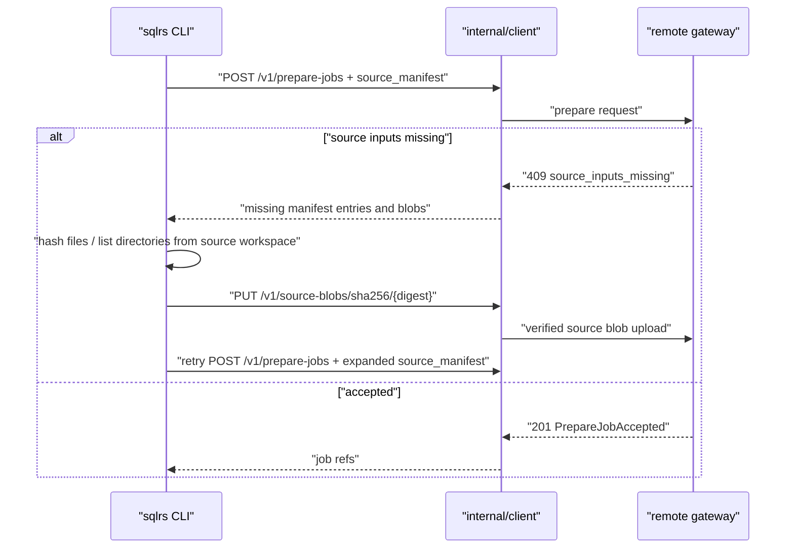
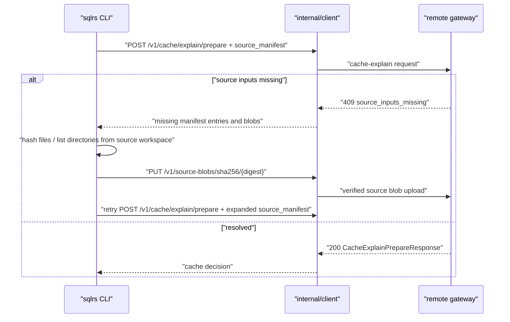

# Flow синхронизации исходников для remote profile

Документ описывает CLI-side взаимодействие компонентов для автоматической
синхронизации исходников в file-bearing `prepare` и `cache explain` запросах к
remote backend.

Связанные документы:

- `docs/user-guides/remote-source-input-sync.md`
- `docs/api-guides/sqlrs-engine.openapi.yaml`
- `docs/architecture/cli-component-structure.RU.md`
- `docs/architecture/inputset-component-structure.RU.md`

## 1. Зафиксированные входные условия

- Remote profiles могут прикладывать `source_manifest` к prepare и
  cache-explain requests.
- Local profiles обходят этот протокол и продолжают читать локальную файловую
  систему напрямую.
- Сервер вычисляет authoritative format-specific source closure.
- Клиент предоставляет hashes, directory listings и blob bytes только по
  запросу сервера.
- Source blob uploads адресуются по SHA-256 через
  `PUT /v1/source-blobs/sha256/{digest}`.
- Recoverable missing-input negotiation использует
  `409 source_inputs_missing`.

## 2. Remote Prepare

Prepare job не существует, пока remote gateway не принял source admission.
После acceptance обычный prepare event stream сообщает progress выполнения.

## 3. Remote Cache Explain

Cache explain остается read-only, кроме загрузки source blobs в remote
source-content cache.

## 4. Progress

Retry loop пишет progress source sync в stderr. Эти сообщения диагностические и
не меняют stdout успешной команды. В них есть round counts, counts расширения
manifest и upload counts, но никогда нет raw source content.

## 5. Границы ошибок

CLI считает recoverable только `409 source_inputs_missing`. Эти случаи являются
terminal client errors:

- requested server-ом local source path отсутствует или не читается;
- path values нельзя нормализовать как workspace-relative source paths;
- локальный SHA-256 content не совпадает с server-requested hash;
- blob upload отклонен;
- retry loop исчерпал лимит.

