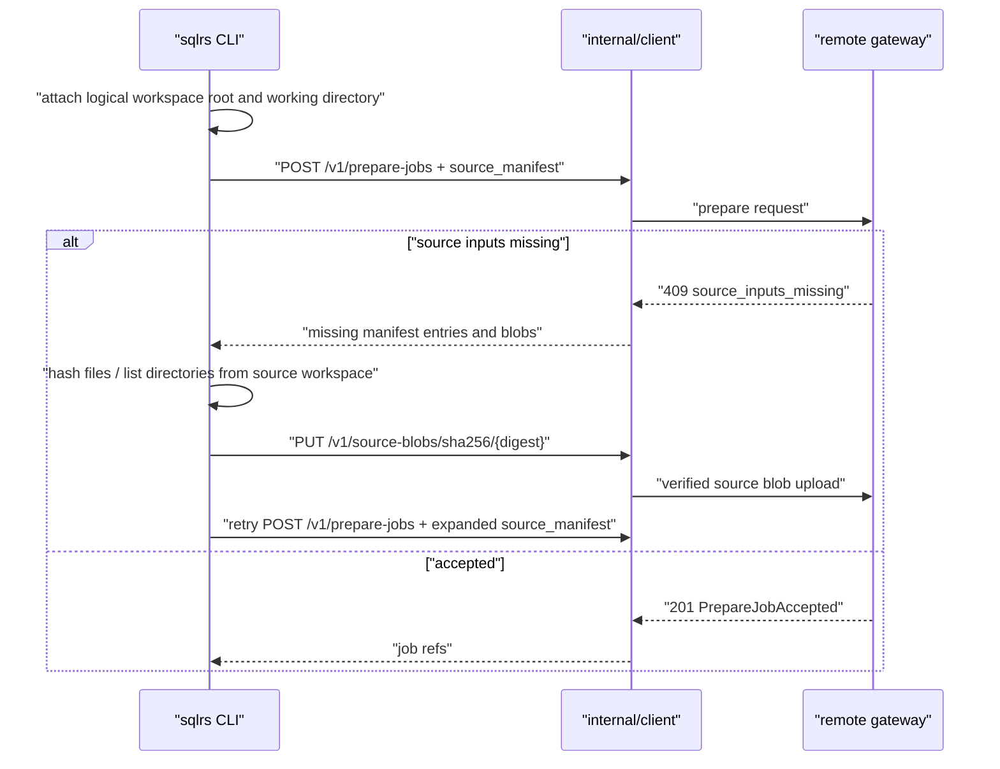
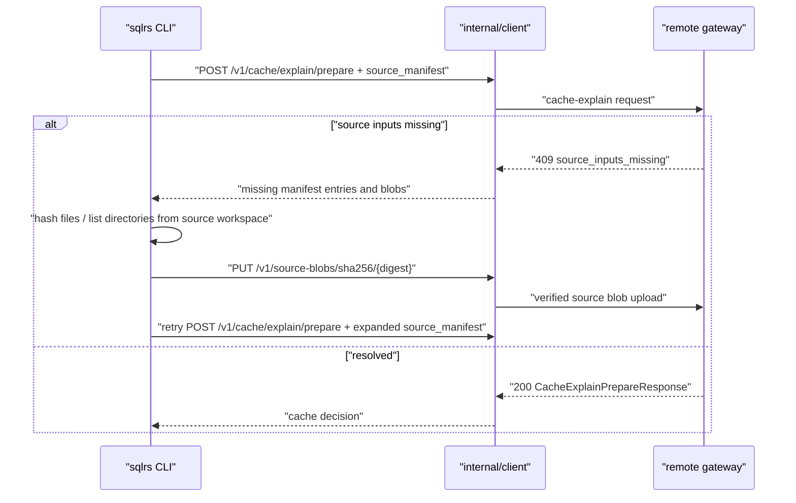

# Flow синхронизации исходников для remote profile

Документ описывает CLI-side взаимодействие компонентов для автоматической
синхронизации исходников в file-bearing `prepare` и `cache explain` запросах к
remote backend.

Связанные документы:

- `docs/user-guides/remote-source-input-sync.md`
- `docs/api-guides/sqlrs-engine.openapi.yaml`
- `docs/architecture/cli-component-structure.RU.md`
- `docs/architecture/inputset-component-structure.RU.md`

## 1. Зафиксированные входные условия

- Remote profiles могут прикладывать `source_manifest` к prepare и
  cache-explain requests.
- Local profiles обходят этот протокол и продолжают читать локальную файловую
  систему напрямую.
- Сервер вычисляет authoritative format-specific source closure.
- Клиент предоставляет hashes, directory listings и blob bytes только по
  запросу сервера.
- Source blob uploads адресуются по SHA-256 через
  `PUT /v1/source-blobs/sha256/{digest}`.
- Recoverable missing-input negotiation использует
  `409 source_inputs_missing`.
- CLI сохраняет absolute native path bindings в аргументах remote request и
  прикладывает logical client workspace root и effective working directory.
  Admission отображает эти координаты в workspace-relative manifest paths;
  remote runner никогда не открывает client paths напрямую.
- Настройка WSL для local engine не должна влиять на remote path binding.
  Преобразование путей в WSL применяется только когда выбранный профиль
  выполняет запрос через local engine, поэтому remote arguments и workspace
  context остаются в единой host-native системе координат.
- Source blob uploads используют отдельный 15-minute transfer timeout; prepare
  control requests сохраняют configured control timeout.

## 2. Remote Prepare

Prepare job не существует, пока remote gateway не принял source admission.
После acceptance обычный prepare event stream сообщает progress выполнения.

## 3. Remote Cache Explain

Cache explain остается read-only, кроме загрузки source blobs в remote
source-content cache.

## 4. Progress

Retry loop испускает typed in-memory progress events и сам не рендерит output.
Events покрывают sync start, каждый request round, requested manifest/blob sets,
завершение каждого hash или directory listing, upload start/byte
checkpoints/completion, retry и final summary. Идентичность file задаётся safe
workspace-relative path и shortened digest. Byte events отражают bytes,
фактически прочитанные upload stream, и создаются на bounded checkpoints, а не
на каждом вызове `Read`. Duplicate digests не порождают duplicate upload events.

`internal/app` владеет presentation и пишет только в stderr:

- verbose mode рендерит каждый event отдельной stable diagnostic line;
- normal interactive mode использует delayed spinner с текущей operation и
  очищает его при completion или error;
- normal non-interactive mode не пишет spinner control sequences и routine
  progress.

Stdout успешной команды не меняется. Progress state execution-local и не
persisted; raw source content и absolute host paths не попадают в events.

## 5. Границы ошибок

CLI считает recoverable только `409 source_inputs_missing`. Эти случаи являются
terminal client errors:

- requested server-ом local source path отсутствует или не читается;
- path values нельзя нормализовать как workspace-relative source paths;
- локальный SHA-256 content не совпадает с server-requested hash;
- blob upload отклонен;
- retry loop исчерпал лимит.

Upload timeout возвращается как source-transfer failure и не создаёт prepare
job. Absolute client paths являются logical resolution coordinates, а не
fallback server filesystem location.
