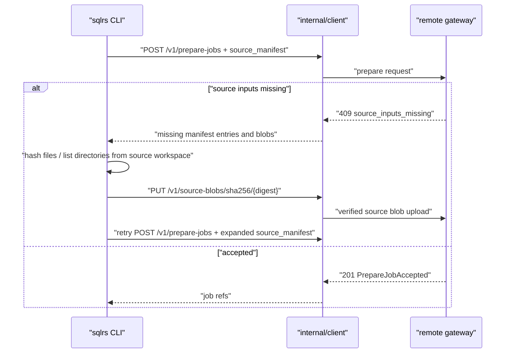
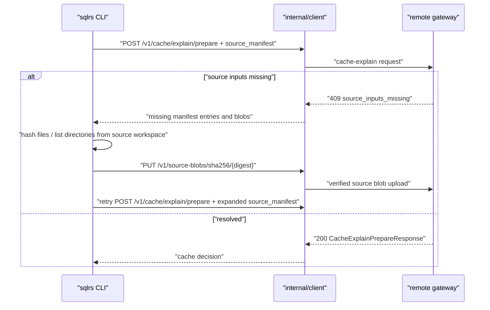

# Remote Source Input Sync Flow

This document defines the CLI-side component interaction flow for automatic
source synchronization on remote file-bearing prepare and cache-explain
requests.

Related documents:

- `docs/user-guides/remote-source-input-sync.md`
- `docs/api-guides/sqlrs-engine.openapi.yaml`
- `docs/architecture/cli-component-structure.md`
- `docs/architecture/inputset-component-structure.md`

## 1. Fixed Inputs

- Remote profiles may attach `source_manifest` to prepare and cache-explain
  requests.
- Local profiles bypass this protocol and keep using the local filesystem.
- The server computes authoritative format-specific source closure.
- The client provides hashes, directory listings, and blob bytes only when the
  server asks for them.
- Source blob uploads are content-addressed by SHA-256 and sent to
  `PUT /v1/source-blobs/sha256/{digest}`.
- Recoverable missing-input negotiation uses `409 source_inputs_missing`.

## 2. Remote Prepare

No prepare job exists until the remote gateway accepts source admission.
After acceptance, the normal prepare event stream reports execution progress.

## 3. Remote Cache Explain

Cache explain remains read-only except for source blob uploads into the remote
source-content cache.

## 4. Progress

The retry loop writes source-sync progress to stderr. The messages are
diagnostic and must not alter successful command stdout. They include round
counts, manifest expansion counts, and upload counts, but never raw source
content.

## 5. Error Boundaries

The CLI treats only `409 source_inputs_missing` as recoverable. These cases are
terminal client errors:

- missing or unreadable local source paths requested by the server;
- path values that cannot be normalized as workspace-relative source paths;
- local content whose SHA-256 does not match the server-requested hash;
- rejected blob uploads;
- retry loop exhaustion.

