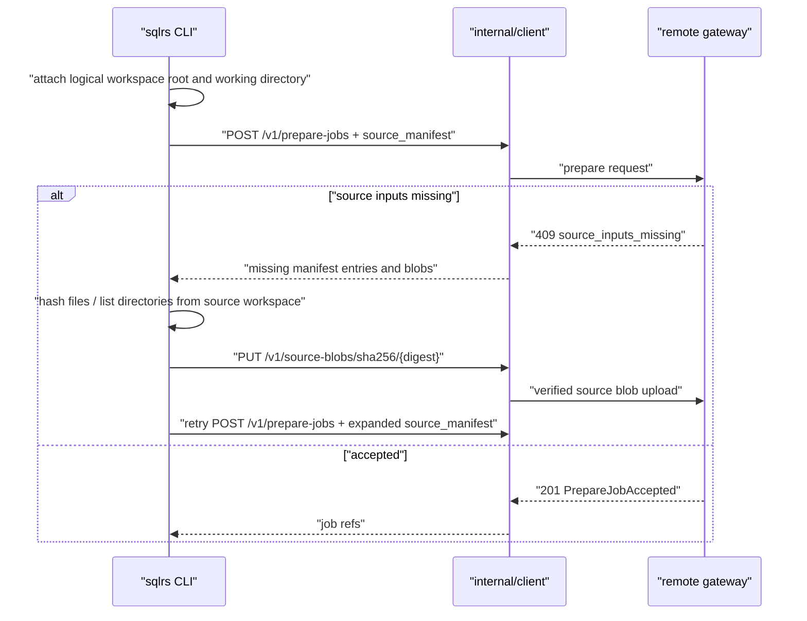
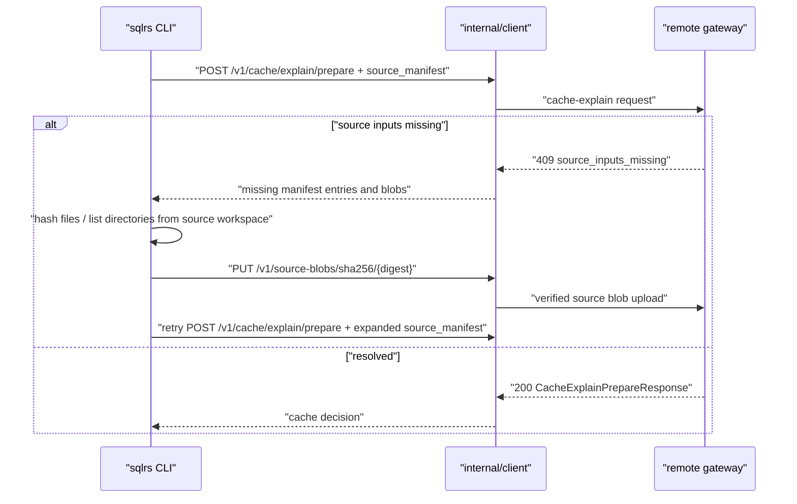

# Remote Source Input Sync Flow

This document defines the CLI-side component interaction flow for automatic
source synchronization on remote file-bearing prepare and cache-explain
requests.

Related documents:

- `docs/user-guides/remote-source-input-sync.md`
- `docs/api-guides/sqlrs-engine.openapi.yaml`
- `docs/architecture/cli-component-structure.md`
- `docs/architecture/inputset-component-structure.md`

## 1. Fixed Inputs

- Remote profiles may attach `source_manifest` to prepare and cache-explain
  requests.
- Local profiles bypass this protocol and keep using the local filesystem.
- The server computes authoritative format-specific source closure.
- The client provides hashes, directory listings, and blob bytes only when the
  server asks for them.
- Source blob uploads are content-addressed by SHA-256 and sent to
  `PUT /v1/source-blobs/sha256/{digest}`.
- Recoverable missing-input negotiation uses `409 source_inputs_missing`.
- The CLI preserves absolute native path bindings in remote request arguments
  and attaches the logical client workspace root and effective working
  directory. Admission maps those coordinates to workspace-relative manifest
  paths; a remote runner never opens the client paths directly.
- Local-engine WSL configuration must not affect remote path binding. WSL path
  conversion is applied only when the selected profile executes against the
  local engine, so remote arguments and workspace context remain in the same
  host-native coordinate system.
- Source blob uploads use a dedicated 15-minute transfer timeout; prepare
  control requests retain the configured control timeout.

## 2. Remote Prepare

No prepare job exists until the remote gateway accepts source admission.
After acceptance, the normal prepare event stream reports execution progress.

## 3. Remote Cache Explain

Cache explain remains read-only except for source blob uploads into the remote
source-content cache.

## 4. Progress

The retry loop emits typed in-memory progress events; it does not render user
output. Events cover sync start, each request round, requested manifest and blob
sets, each hash or directory-listing completion, upload start/byte
checkpoints/completion, retry, and final summary. File identity is a safe
workspace-relative path plus a shortened digest. Byte events report bytes
actually consumed by the upload stream and are emitted at bounded checkpoints,
not on every `Read` call. Duplicate digests do not create duplicate upload
events.

`internal/app` owns presentation and sends it only to stderr:

- verbose mode renders every received event as a stable diagnostic line;
- normal interactive mode uses a delayed spinner showing the current operation
  and clears it on completion or error;
- normal non-interactive mode emits neither spinner control sequences nor
  routine progress.

Successful command stdout remains unchanged. Progress state is execution-local
and is not persisted; raw source content and absolute host paths never appear in
events.

## 5. Error Boundaries

The CLI treats only `409 source_inputs_missing` as recoverable. These cases are
terminal client errors:

- missing or unreadable local source paths requested by the server;
- path values that cannot be normalized as workspace-relative source paths;
- local content whose SHA-256 does not match the server-requested hash;
- rejected blob uploads;
- retry loop exhaustion.

An upload timeout is reported as a source-transfer failure and does not create
a prepare job. Absolute client paths are logical resolution coordinates, never
a fallback server filesystem location.
