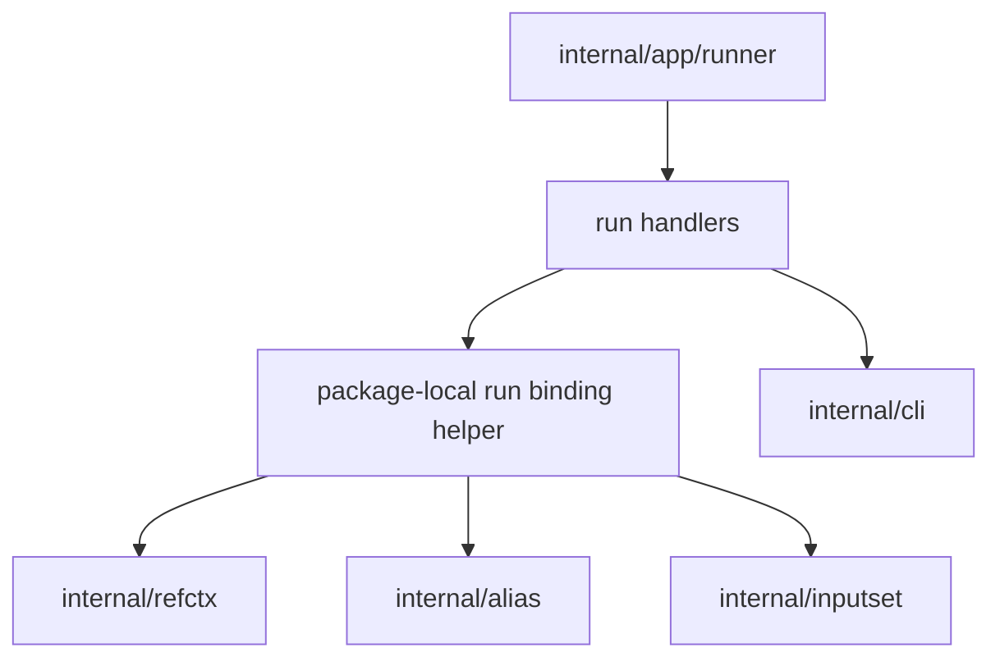

# Ref-Backed Run - Структура Компонентов

Этот документ определяет утвержденную внутреннюю компонентную структуру для
bounded local standalone slice `run --ref`:

- `sqlrs run --ref ...`
- `sqlrs run:psql --ref ...`
- `sqlrs run:pgbench --ref ...`

Он опирается на принятый CLI shape из
[`../user-guides/sqlrs-run-ref.md`](../user-guides/sqlrs-run-ref.md) и на
принятый interaction flow из [`run-ref-flow.RU.md`](run-ref-flow.RU.md).

## 1. Scope и assumptions

- Slice остается CLI-only и local-only.
- Он применяется только к standalone `run`.
- Он поддерживает raw и alias-backed run flow.
- Он переиспользует ту же ref vocabulary `worktree` и `blob`, которая уже
  принята для `diff`, `plan --ref` и `prepare --ref`.
- Он пока не добавляет:
  - `prepare ... run ...` с ref-backed run-stage
  - `prepare --ref ... run ...`
  - run-side provenance
  - `cache explain run ...`
  - новый engine endpoint или server-side Git fetch path
- Архитектура должна избегать:
  - дублирования repo/ref/projected-cwd/worktree логики вне `internal/refctx`
  - второго per-kind run parser вне `internal/inputset`
  - насильственного включения standalone `run` в prepare-oriented stage
    pipeline, когда transport и output behavior остаются другими

## 2. Утвержденное разбиение компонентов

| Компонент | Ответственность | Caller |
|-----------|-----------------|--------|
| **Top-level runner composite gate** | Отклоняет out-of-scope multi-stage shapes, когда run-stage несет `--ref`. | `internal/app/runner` |
| **Run command handlers** | Парсят stage-local флаги `--ref`, `--instance`, alias vs raw grammar и оркестрируют ref-backed binding перед обычным run execution. | `internal/app` |
| **Package-local run binding helper** | Разрешает или принимает готовый ref context, rebases alias file-bearing args при необходимости, materialize-ит `cli.RunOptions` и возвращает cleanup. | Run handlers |
| **Shared ref context resolver** | Разрешает repo root, выбранный ref, projected cwd и `worktree`- или `blob`-filesystem view. | Run binding helper |
| **Run alias resolver** | Разрешает и загружает run alias files внутри выбранного filesystem view. | Run binding helper |
| **Shared inputset kind components** | Применяют run-kind file semantics и строят transport-ready steps/args/stdin для `psql` и `pgbench`. | Run binding helper |
| **Run transport and stream reader** | Выполняют существующий run API call и сохраняют текущее stdout/stderr/exit streaming behavior. | Run handlers через `internal/cli` |
| **Cleanup handler** | Удаляет временные worktree, если не был запрошен `--ref-keep-worktree`. | Consumer run binding helper |

## 3. Общий owner для этого slice: package-local run binding helper в `internal/app`

Утвержденная структура оставляет ref-aware binding для standalone `run`
package-local внутри `internal/app`, а не вводит сразу новый top-level package.

Обоснование:

- slice все еще ограничен standalone local `run`;
- raw и alias-backed `run` уже сходятся в `internal/app` перед существующим
  transport call через `internal/cli`;
- итоговое значение - это все еще существующий payload `cli.RunOptions` плюс
  cleanup, а не новый shared execution domain;
- текущий prepare-oriented stage pipeline намеренно scoped к `plan` /
  `prepare` и не должен поглощать `run` только потому, что оба пути умеют
  читать ref-backed files.

Boundary rules для этого helper:

- он может владеть run-specific usage validation, instance arbitration,
  alias-vs-raw branching и cleanup composition;
- он может вызывать `internal/refctx`, `internal/alias` и `internal/inputset`,
  чтобы собрать один transport-ready run request;
- он не должен переопределять repo-root discovery, ref resolution,
  projected-cwd mapping или worktree lifecycle, которые уже принадлежат
  `internal/refctx`;
- он не должен переопределять alias-target resolution или YAML loading,
  которые уже принадлежат `internal/alias`;
- он не должен переопределять file semantics `psql` или `pgbench`, которые
  уже принадлежат `internal/inputset`;
- он не должен забирать себе stdout/stderr stream rendering, который остается
  в `internal/cli`.

Если более поздние slices расширят provenance, cache explanation или composite
semantics `prepare ... run`, этот helper можно будет поднять в отдельную
абстракцию или унифицировать сильнее. Первому bounded slice `run --ref` это
пока не нужно.

## 4. Предлагаемый package/file layout

### `frontend/cli-go/internal/app`

- расширить parsing raw run следующими флагами:
  - `--ref <git-ref>`
  - `--ref-mode worktree|blob`
  - `--ref-keep-worktree`
- расширить parsing run-alias тем же семейством ref-флагов
- добавить один package-local слой run binding helper, например в одном-двух
  новых файлах, который:
  - валидирует комбинации ref-флагов
  - разрешает ref context для raw runs
  - разрешает run aliases через выбранный filesystem view
  - rebases alias file-bearing args относительно пути alias file
  - вызывает существующие inputset projectors для `psql` / `pgbench` поверх
    выбранного filesystem view
  - возвращает полностью populated `cli.RunOptions` плюс optional cleanup
- сохранить без изменений prepared-instance cleanup behavior для существующих
  composite flows без ref
- отклонять composite `prepare ... run ...` shapes, когда сам run-stage несет
  `--ref`

### `frontend/cli-go/internal/refctx`

- без новых обязанностей
- продолжает владеть:
  - discovery корня репозитория
  - локальным ref resolution
  - projected-cwd resolution
  - созданием и cleanup detached worktree
  - setup blob-backed filesystem

### `frontend/cli-go/internal/alias`

- переиспользовать `ResolveTargetWithFS` и `LoadTargetWithFS` для run aliases
- сохранить suffix rules, exact-file escape, YAML parsing и schema validation
  как source of truth
- продолжать работать либо с live filesystem, либо с ref-backed filesystem,
  который передает caller

### `frontend/cli-go/internal/inputset`

- не вводить новый run-only ref parser
- оставить `psql` и `pgbench` source of truth для:
  - parsing file-bearing arguments
  - binding against supplied resolver
  - materialization в run steps, stdin или normalized args

### `frontend/cli-go/internal/cli`

- без нового run endpoint
- `RunRun` остается owner transport до engine и обработки streamed output
- текущее forwarding behavior stdout/stderr/exit остается без изменений

## 5. Key types и interfaces

Иллюстративные internal shapes:

- `app.runArgs`
  - parsed standalone raw-run flags, включая instance и ref options
- `app.runAliasInvocation`
  - parsed standalone alias-run flags, включая instance и ref options
- `app.runBindingRequest`
  - package-local описание одного raw или alias-backed run invocation:
    kind, command/args, cwd/workspace, optional alias path и ref options
- `app.runBindingResult`
  - package-local bound runtime, содержащий:
    - полностью populated `cli.RunOptions`
    - optional cleanup hook
- `refctx.Context`
  - resolved repo/ref/projected-cwd/filesystem view
- `alias.Target`, `alias.Definition`
  - canonical run-alias resolution и loaded YAML model
- `inputset.PathResolver`, `inputset.FileSystem`
  - общие binding и collection interfaces, которые используют run-kind
    projectors
- `cli.RunOptions`
  - неизмененный transport-facing run payload, отправляемый в engine

Точные имена типов могут отличаться. Важное правило в том, что один
package-local helper владеет ref-aware run binding, а долгосрочный source of
truth для ref contexts, alias loading и per-kind file semantics остается общим.

## 6. Data ownership

- Raw argv и standalone/composite command-shape checks остаются во владении
  `internal/app`.
- Ref context эфемерен и принадлежит `internal/refctx` на время одного
  command invocation.
- Temporary worktrees принадлежат `internal/refctx` и очищаются после команды,
  если пользователь явно их не сохранил.
- Run alias definitions остаются во владении `internal/alias`, даже когда они
  загружаются из ref-backed filesystem.
- Materialized run steps, stdin bodies и normalized args остаются во владении
  shared kind components из `internal/inputset`, пока не будут скопированы в
  `cli.RunOptions`.
- Финальный payload run request принадлежит `internal/app` только до момента,
  когда его передают в `internal/cli`.
- Streamed события stdout/stderr/exit остаются во владении существующего run
  transport flow.
- Никакой persistent ref cache, provenance artifact или новый local metadata
  store в этом slice не вводятся.

## 7. Диаграмма зависимостей

## 8. Consequences для существующих документов

Поскольку standalone `run --ref` теперь получил собственную утвержденную
internal structure:

- `cli-component-structure.RU.md` должен описывать `internal/refctx` как
  shared не только для `plan` / `prepare --ref` и `diff`, но и для standalone
  `run --ref`;
- `cli-component-structure.RU.md` должен упомянуть один package-local
  run-binding helper внутри `internal/app`;
- `ref-component-structure.RU.md` остается scoped к `plan` / `prepare` и не
  должен читаться как owner standalone `run --ref`;
- `cli-contract.RU.md` и `git-aware-passive.RU.md` должны ссылаться на этот
  документ для standalone `run --ref`.

## 9. References

- User guide: [`../user-guides/sqlrs-run-ref.md`](../user-guides/sqlrs-run-ref.md)
- Interaction flow: [`run-ref-flow.RU.md`](run-ref-flow.RU.md)
- CLI contract: [`cli-contract.RU.md`](cli-contract.RU.md)
- CLI component structure: [`cli-component-structure.RU.md`](cli-component-structure.RU.md)
- Inputset layer: [`inputset-component-structure.RU.md`](inputset-component-structure.RU.md)
- Ref-backed plan/prepare structure: [`ref-component-structure.RU.md`](ref-component-structure.RU.md)
- CLI maintainability refactor: [`cli-maintainability-refactor.RU.md`](cli-maintainability-refactor.RU.md)
