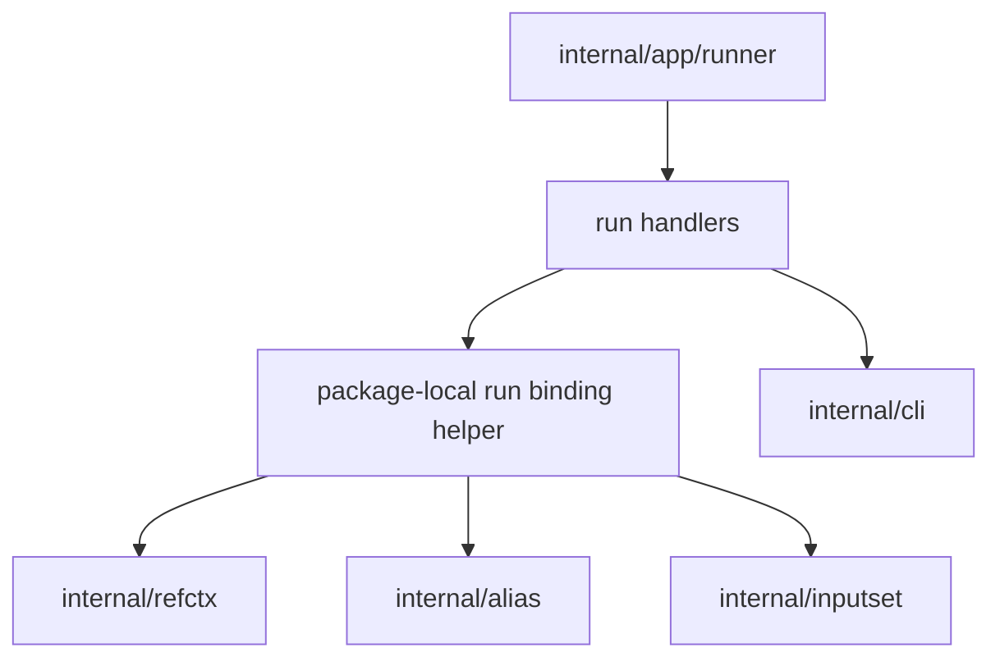

# Ref-Backed Run - Component Structure

This document defines the proposed internal component structure for the bounded
local standalone `run --ref` slice:

- `sqlrs run --ref ...`
- `sqlrs run:psql --ref ...`
- `sqlrs run:pgbench --ref ...`

It follows the accepted CLI shape in
[`../user-guides/sqlrs-run-ref.md`](../user-guides/sqlrs-run-ref.md) and the
accepted interaction flow in [`run-ref-flow.md`](run-ref-flow.md).

## 1. Scope and assumptions

- The slice is CLI-only and local-only.
- It applies only to standalone `run`.
- It supports both raw and alias-backed run flows.
- It reuses the same `worktree` and `blob` ref vocabulary already accepted for
  `diff`, `plan --ref`, and `prepare --ref`.
- It does not yet add:
  - `prepare ... run ...` with a ref-backed run stage
  - `prepare --ref ... run ...`
  - run-side provenance
  - `cache explain run ...`
  - a new engine endpoint or a server-side Git fetch path
- The architecture must avoid:
  - duplicating repo/ref/projected-cwd/worktree logic outside `internal/refctx`
  - creating a second per-kind run parser outside `internal/inputset`
  - forcing standalone `run` into the prepare-oriented stage pipeline when the
    transport and output behavior remain different

## 2. Proposed component split

| Component | Responsibility | Caller |
|-----------|----------------|--------|
| **Top-level runner composite gate** | Reject out-of-scope multi-stage shapes when the `run` stage carries `--ref`. | `internal/app/runner` |
| **Run command handlers** | Parse stage-local `--ref` flags, `--instance`, alias vs raw grammar, and orchestrate ref-backed binding before normal run execution. | `internal/app` |
| **Package-local run binding helper** | Resolve or borrow one ref context, rebase alias file-bearing args when needed, materialize `cli.RunOptions`, and return cleanup. | Run handlers |
| **Shared ref context resolver** | Resolve repo root, selected ref, projected cwd, and a `worktree` or `blob` filesystem view. | Run binding helper |
| **Run alias resolver** | Resolve and load run alias files inside the selected filesystem view. | Run binding helper |
| **Shared inputset kind components** | Apply run-kind file semantics and project transport-ready steps/args/stdin for `psql` and `pgbench`. | Run binding helper |
| **Run transport and stream reader** | Execute the existing run API call and preserve current stdout/stderr/exit streaming behavior. | Run handlers via `internal/cli` |
| **Cleanup handler** | Remove temporary worktrees unless `--ref-keep-worktree` was requested. | Run binding helper consumer |

## 3. Shared owner for this slice: a package-local run binding helper in `internal/app`

The proposed structure keeps ref-aware standalone `run` binding package-local to
`internal/app` instead of introducing a new top-level package immediately.

Rationale:

- the slice is still bounded to standalone local `run`;
- raw and alias-backed `run` already converge in `internal/app` before the
  existing `internal/cli` transport call;
- the produced value is still the existing `cli.RunOptions` payload plus
  cleanup, not a new shared execution domain;
- the current prepare-oriented stage pipeline is intentionally scoped to
  `plan` / `prepare` and should not absorb `run` yet just because both can read
  ref-backed files.

Boundary rules for this helper:

- it may own run-specific usage validation, instance arbitration, alias-vs-raw
  branching, and cleanup composition;
- it may call `internal/refctx`, `internal/alias`, and `internal/inputset` to
  assemble one transport-ready run request;
- it must not redefine repo-root discovery, ref resolution, projected-cwd
  mapping, or worktree lifecycle already owned by `internal/refctx`;
- it must not redefine alias-target resolution or YAML loading already owned by
  `internal/alias`;
- it must not redefine `psql` or `pgbench` file semantics already owned by
  `internal/inputset`;
- it must not absorb stdout/stderr stream rendering, which remains owned by
  `internal/cli`.

If later slices extend provenance, cache explanation, or composite
`prepare ... run` semantics, this helper can be promoted or unified further.
The first bounded `run --ref` slice does not need that broader abstraction yet.

## 4. Suggested package/file layout

### `frontend/cli-go/internal/app`

- extend raw run parsing with:
  - `--ref <git-ref>`
  - `--ref-mode worktree|blob`
  - `--ref-keep-worktree`
- extend run-alias parsing with the same ref flag family
- add one package-local run binding helper layer, for example in one or two
  new files, that:
  - validates ref flag combinations
  - resolves ref context for raw runs
  - resolves run aliases through the selected filesystem view
  - rebases alias file-bearing args against the alias file path
  - calls existing `psql` / `pgbench` inputset projectors with the selected
    filesystem view
  - returns fully populated `cli.RunOptions` plus optional cleanup
- keep prepared-instance cleanup behavior unchanged for existing non-ref
  composite flows
- reject composite `prepare ... run ...` shapes when the `run` stage itself
  carries `--ref`

### `frontend/cli-go/internal/refctx`

- no new responsibilities
- continue to own:
  - repository-root discovery
  - local ref resolution
  - projected-cwd resolution
  - detached-worktree creation and cleanup
  - blob-backed filesystem setup

### `frontend/cli-go/internal/alias`

- reuse `ResolveTargetWithFS` and `LoadTargetWithFS` for run aliases
- keep suffix rules, exact-file escape, YAML parsing, and schema validation as
  the source of truth
- continue to work against either the live filesystem or a ref-backed
  filesystem supplied by the caller

### `frontend/cli-go/internal/inputset`

- no new run-only ref parser
- keep `psql` and `pgbench` as the source of truth for:
  - file-bearing argument parsing
  - binding against a supplied resolver
  - materialization into run steps, stdin, or normalized args

### `frontend/cli-go/internal/cli`

- no new run endpoint
- keep `RunRun` as the owner of engine transport and streamed output handling
- keep current stdout/stderr/exit forwarding behavior unchanged

## 5. Key types and interfaces

Illustrative internal shapes:

- `app.runArgs`
  - parsed standalone raw-run flags including instance and ref options
- `app.runAliasInvocation`
  - parsed standalone alias-run flags including instance and ref options
- `app.runBindingRequest`
  - package-local description of one raw or alias-backed run invocation:
    kind, command/args, cwd/workspace, optional alias path, and ref options
- `app.runBindingResult`
  - package-local bound runtime containing:
    - fully populated `cli.RunOptions`
    - optional cleanup hook
- `refctx.Context`
  - resolved repo/ref/projected-cwd/filesystem view
- `alias.Target`, `alias.Definition`
  - canonical run-alias resolution and loaded YAML model
- `inputset.PathResolver`, `inputset.FileSystem`
  - shared binding and collection interfaces used by run-kind projectors
- `cli.RunOptions`
  - unchanged transport-facing run payload sent to the engine

Exact type names can vary. The important rule is that one package-local helper
owns ref-aware run binding, while the long-term source of truth for ref
contexts, alias loading, and per-kind file semantics remains shared.

## 6. Data ownership

- Raw argv and standalone/composite command-shape checks remain owned by
  `internal/app`.
- Ref context is ephemeral and owned by `internal/refctx` for one command
  invocation.
- Temporary worktrees are owned by `internal/refctx` and cleaned up after the
  command unless explicitly kept.
- Run alias definitions remain owned by `internal/alias`, even when loaded from
  a ref-backed filesystem.
- Materialized run steps, stdin bodies, and normalized args remain owned by the
  shared `internal/inputset` kind components until copied into `cli.RunOptions`.
- The final run request payload is owned by `internal/app` only until it is
  handed to `internal/cli`.
- Streamed stdout/stderr/exit events remain owned by the existing run transport
  flow.
- No persistent ref cache, provenance artifact, or new local metadata store is
  introduced in this slice.

## 7. Dependency diagram

## 8. Consequences for existing docs

If accepted, standalone `run --ref` gains its own internal structure:

- `cli-component-structure.md` must describe `internal/refctx` as shared by
  standalone `run --ref`, not only `plan` / `prepare --ref` and `diff`;
- `cli-component-structure.md` should mention one package-local run-binding
  helper inside `internal/app`;
- `ref-component-structure.md` remains scoped to `plan` / `prepare` and should
  not be read as the owner of standalone `run --ref`;
- `cli-contract.md` and `git-aware-passive.md` should point standalone
  `run --ref` readers to this document once the design is accepted.

## 9. References

- User guide: [`../user-guides/sqlrs-run-ref.md`](../user-guides/sqlrs-run-ref.md)
- Interaction flow: [`run-ref-flow.md`](run-ref-flow.md)
- CLI contract: [`cli-contract.md`](cli-contract.md)
- CLI component structure: [`cli-component-structure.md`](cli-component-structure.md)
- Inputset layer: [`inputset-component-structure.md`](inputset-component-structure.md)
- Ref-backed plan/prepare structure: [`ref-component-structure.md`](ref-component-structure.md)
- CLI maintainability refactor: [`cli-maintainability-refactor.md`](cli-maintainability-refactor.md)
