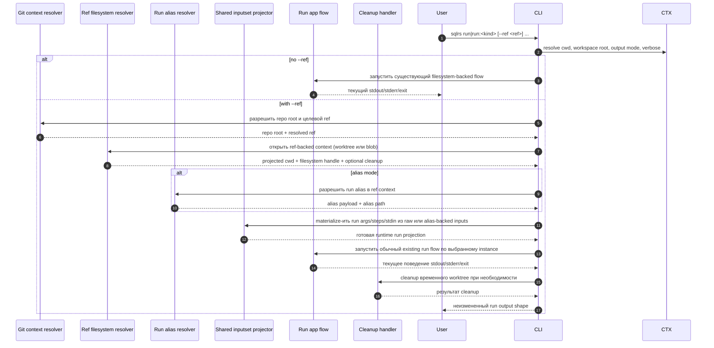

# Поток Ref-Backed Run

Этот документ описывает утвержденный локальный interaction flow для следующего
bounded repository-aware slice после уже реализованных `plan` / `prepare --ref`,
provenance и cache explanation:

- standalone `sqlrs run --ref ...`
- standalone raw `sqlrs run:psql --ref ...` и `sqlrs run:pgbench --ref ...`

Он опирается на принятый CLI shape из
[`../user-guides/sqlrs-run-ref.md`](../user-guides/sqlrs-run-ref.md).

Этот slice намеренно узкий:

- он применяется только к standalone `run`;
- он поддерживает raw и alias-backed run flow;
- он сохраняет существующую ref vocabulary `worktree` и `blob`;
- он остается CLI-only и local-only;
- он пока не поддерживает `prepare ... run ...`, если run-stage несет `--ref`;
- он пока не добавляет run-side provenance или `cache explain`.

## 1. Участники

- **Пользователь** - запускает `sqlrs run` или `sqlrs run:<kind>`.
- **CLI parser** - парсит stage-local флаги `--ref`, `--instance` и run-kind
  args.
- **Command context** - определяет cwd, workspace root, output mode и verbose
  settings.
- **Git context resolver** - находит корень репозитория и разрешает целевой
  Git ref.
- **Ref filesystem resolver** - проецирует caller cwd в выбранный ref и
  предоставляет либо detached-worktree filesystem, либо Git-object-backed
  filesystem.
- **Run alias resolver** - разрешает и загружает run alias file внутри
  выбранного filesystem view.
- **Shared inputset projector** - применяет существующую per-kind
  file-bearing semantics для `psql` и `pgbench` и materialize-ит runtime args,
  steps или stdin bodies.
- **Run app flow** - запускает существующий `run` pipeline по выбранному
  instance после полной materialization ref-backed inputs.
- **Cleanup handler** - удаляет временные worktree, если пользователь не
  оставил их явно.
- **Renderer** - сохраняет то же поведение stdout, stderr и exit status, что и
  у сегодняшнего `run`.

## 2. Flow: `sqlrs run --ref ...`

## 3. Разбиение по стадиям

### 3.1 Парсинг команды

Parser рассматривает `--ref`, `--ref-mode` и `--ref-keep-worktree` как
stage-local опции для standalone `run` и `run:<kind>`.

- Без `--ref` команда сохраняет сегодняшнее поведение без изменений.
- `--ref-mode` и `--ref-keep-worktree` недопустимы без `--ref`.
- `--ref-keep-worktree` допустим только с `--ref-mode worktree`.
- Standalone alias mode под `--ref` по-прежнему требует `--instance`.
- Этот первый slice отклоняет `prepare ... run ...`, если run-stage несет
  `--ref`.

Так первый ref-backed run slice остается ограниченным одной
revision-sensitive run-stage.

### 3.2 Разрешение Git context

Как только присутствует `--ref`, команда разрешает:

1. корень репозитория от текущего рабочего каталога вызывающего процесса;
2. целевой Git ref локально;
3. projected cwd вызывающего процесса внутри выбранной ревизии.

Если любой из этих шагов падает, команда завершается до alias- или raw-input
binding.

Правило projected cwd намеренно совпадает с текущим поведением `sqlrs diff`,
`plan --ref` и `prepare --ref`, чтобы repository-aware path bases оставались
согласованными между passive CLI features.

Правило ownership для этой стадии: repo-root discovery, ref resolution,
projected-cwd resolution и worktree/blob setup полностью принадлежат общему
слою `internal/refctx`.

### 3.3 Подготовка ref-backed filesystem

Ref filesystem resolver создает один из двух local filesystem view.

#### Режим `worktree`

- создать detached temporary worktree на выбранном ref;
- отобразить caller cwd внутрь этого worktree;
- предоставить обычную filesystem semantics;
- зарегистрировать cleanup, если не был запрошен `--ref-keep-worktree`.

#### Режим `blob`

- предоставить Git-object-backed filesystem, укорененный на выбранном ref;
- логически сохранить ту же projected-cwd модель;
- не создавать detached worktree.

`worktree` остается режимом по умолчанию, потому что он лучше всего
сохраняет поведение сегодняшнего local filesystem execution.

### 3.4 Привязка alias и raw-stage

После того как ref-backed filesystem готов, sqlrs bind-ит run-stage ровно так
же, как в live working tree, но поверх выбранной ревизии.

Для alias mode:

- `<run-ref>` остается cwd-relative logical stem;
- exact-file escape через trailing `.` сохраняется;
- alias file должен существовать в выбранной ревизии;
- file-bearing paths из этого alias file по-прежнему считаются относительно
  самого alias file.

Для raw mode:

- `run:psql` и `run:pgbench` сохраняют существующую grammar аргументов;
- relative file-bearing paths резолвятся от projected cwd на выбранном ref;
- non-file-bearing args сохраняют сегодняшнее поведение без изменений.

### 3.5 Shared inputset projection

Shared inputset layer остается source of truth для run-kind file semantics.

Ref-backed slice не вводит run-only parser и не требует нового engine-side Git
input mode. Вместо этого он переиспользует те же kind projectors, которые уже
обслуживают live-filesystem `run`:

- `run:psql` по-прежнему materialize-ит step list и stdin bodies из semantics
  `-c`, `-f` и `-f -`;
- `run:pgbench` по-прежнему materialize-ит runtime input в стиле
  `/dev/stdin` из semantics `-f` / `--file`.

На выходе этой стадии CLI держит тот же transport-ready run request, который он
сформировал бы и для сегодняшнего non-`--ref` flow.

### 3.6 Existing run execution

Как только runtime args, steps и stdin полностью materialized, существующий run
flow продолжается без изменений.

- Instance resolution по-прежнему требует `--instance` для standalone alias или
  raw run.
- Существующая validation conflicting connection args для run kinds не меняется.
- CLI по-прежнему вызывает существующий run API с уже materialized run inputs.
- `run` продолжает просто проксировать stdout, stderr и exit code, как и
  сегодня.

Никакой новый engine endpoint в этом slice не вводится.

### 3.7 Cleanup

Cleanup зависит от режима.

- `blob` mode не требует cleanup detached worktree.
- `worktree` mode удаляет временный worktree после успеха или ошибки команды,
  если только пользователь явно не указал `--ref-keep-worktree`.

Ошибки cleanup должны всплывать как command errors, так же как это уже
происходит у ref-backed `plan` / `prepare`.

## 4. Обработка ошибок

- Если вызывающий процесс вне Git-репозитория, `--ref` дает command error.
- Если standalone alias mode пропускает `--instance`, команда падает как usage
  error.
- Если ref не разрешается локально, команда падает до input projection.
- Если projected cwd не существует на этом ref, команда падает.
- Если run alias file или raw file entrypoint не существуют на этом ref,
  команда падает.
- Если shared inputset projection находит невалидные или missing file-bearing
  inputs, команда падает через обычный run validation path.
- Если создание или cleanup detached worktree падает, команда сообщает об этом
  явно.
- Ни одна ref-backed run-stage не мутирует live working tree вызывающего
  процесса.

## 5. Follow-ups вне scope

Этот flow намеренно оставляет на более поздние slices:

- `prepare ... run ...` с ref-backed run-stage;
- `prepare --ref ... run ...`;
- provenance output для ref-backed runs;
- `sqlrs cache explain run ...`;
- remote runner или hosted Git semantics.
