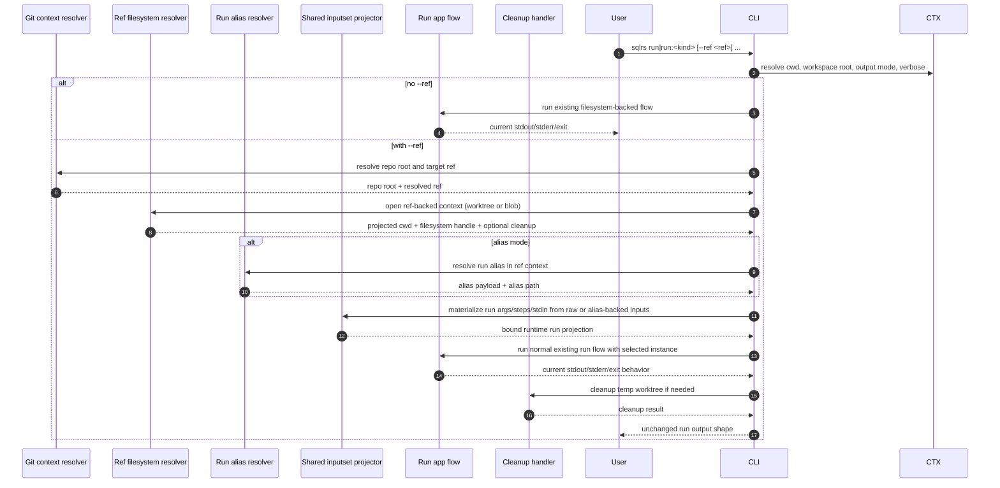

# Ref-Backed Run Flow

This document describes the proposed local interaction flow for the next
bounded repository-aware slice after landed `plan` / `prepare --ref`,
provenance, and cache explanation:

- standalone `sqlrs run --ref ...`
- standalone raw `sqlrs run:psql --ref ...` and `sqlrs run:pgbench --ref ...`

It follows the accepted CLI shape in
[`../user-guides/sqlrs-run-ref.md`](../user-guides/sqlrs-run-ref.md).

This slice is intentionally narrow:

- it applies only to standalone `run`;
- it supports both raw and alias-backed run flows;
- it keeps the existing `worktree` and `blob` ref vocabulary;
- it stays CLI-only and local-only;
- it does not yet support `prepare ... run ...` when the run stage carries
  `--ref`;
- it does not yet add run-side provenance or `cache explain`.

## 1. Participants

- **User** - invokes `sqlrs run` or `sqlrs run:<kind>`.
- **CLI parser** - parses stage-local `--ref` flags, `--instance`, and run-kind
  args.
- **Command context** - resolves cwd, workspace root, output mode, and verbose
  settings.
- **Git context resolver** - finds the repository root and resolves the target
  Git ref.
- **Ref filesystem resolver** - projects the caller cwd into the selected ref
  and exposes either a detached-worktree filesystem or a Git-object-backed
  filesystem.
- **Run alias resolver** - resolves and loads a run alias file inside the
  selected filesystem view.
- **Shared inputset projector** - applies the existing per-kind file-bearing
  semantics for `psql` and `pgbench` and materializes runtime args, steps, or
  stdin bodies.
- **Run app flow** - runs the existing `run` pipeline against the selected
  instance after ref-backed inputs are fully materialized.
- **Cleanup handler** - removes temporary worktrees unless explicitly kept.
- **Renderer** - forwards the same stdout, stderr, and exit status behavior as
  today's `run`.

## 2. Flow: `sqlrs run --ref ...`

## 3. Stage breakdown

### 3.1 Command parsing

The parser treats `--ref`, `--ref-mode`, and `--ref-keep-worktree` as
stage-local options for standalone `run` and `run:<kind>`.

- Without `--ref`, the command keeps today's behavior unchanged.
- `--ref-mode` and `--ref-keep-worktree` are invalid unless `--ref` is set.
- `--ref-keep-worktree` is valid only with `--ref-mode worktree`.
- Standalone alias mode under `--ref` still requires `--instance`.
- This first slice rejects `prepare ... run ...` when the run stage carries
  `--ref`.

This keeps the first ref-backed run slice bounded to one revision-sensitive run
stage.

### 3.2 Git context resolution

Once `--ref` is present, the command resolves:

1. repository root from the caller's current working directory;
2. the target Git ref locally;
3. the caller's projected cwd inside that selected revision.

If any of these steps fails, the command terminates before alias or raw-input
binding.

The projected-cwd rule intentionally matches the current `sqlrs diff`,
`plan --ref`, and `prepare --ref` behavior so repository-aware path bases stay
aligned across passive CLI features.

Ownership rule for this stage: repo-root discovery, ref resolution,
projected-cwd resolution, and worktree/blob setup all come from the shared
`internal/refctx` layer.

### 3.3 Ref filesystem setup

The ref filesystem resolver creates one of two local filesystem views.

#### `worktree` mode

- create a detached temporary worktree at the selected ref;
- map the caller's cwd into that worktree;
- expose ordinary filesystem semantics;
- register cleanup unless `--ref-keep-worktree` was requested.

#### `blob` mode

- expose a Git-object-backed filesystem rooted at the selected ref;
- preserve the same projected-cwd model logically;
- avoid creating a detached worktree.

`worktree` remains the default mode because it preserves the closest behavior to
today's local filesystem execution.

### 3.4 Alias and raw-stage binding

After the ref-backed filesystem is ready, sqlrs binds the run stage exactly as
it would in the live working tree, but against the selected revision.

For alias mode:

- `<run-ref>` stays a cwd-relative logical stem;
- exact-file escape via trailing `.` still applies;
- the alias file must exist in the selected revision;
- file-bearing paths from that alias file stay relative to that alias file.

For raw mode:

- `run:psql` and `run:pgbench` keep their existing argument grammar;
- relative file-bearing paths resolve from the projected cwd at the selected
  ref;
- non-file-bearing args keep today's behavior unchanged.

### 3.5 Shared inputset projection

The shared inputset layer remains the source of truth for run-kind file
semantics.

The ref-backed slice does not introduce a run-only parser or a new engine-side
Git input mode. Instead, it reuses the same kind projectors that already power
live-filesystem `run`:

- `run:psql` still materializes step lists and stdin bodies from `-c`, `-f`,
  and `-f -` semantics;
- `run:pgbench` still materializes `/dev/stdin`-style runtime input from
  `-f` / `--file` semantics.

At the end of this stage, the CLI holds the same transport-ready run request it
would have produced for today's non-`--ref` flow.

### 3.6 Existing run execution

Once runtime args, steps, and stdin are fully materialized, the existing run
flow continues unchanged.

- Instance resolution still requires `--instance` for standalone alias or raw
  runs.
- Existing run-kind connection-arg validation stays unchanged.
- The CLI still calls the existing run API with already materialized run
  inputs.
- `run` keeps forwarding stdout, stderr, and exit code exactly as it does
  today.

No new engine endpoint is introduced in this slice.

### 3.7 Cleanup

Cleanup is mode-dependent.

- `blob` mode has no detached-worktree cleanup.
- `worktree` mode removes the temporary worktree after the command succeeds or
  fails, unless `--ref-keep-worktree` was requested.

Cleanup errors should be surfaced as command errors, just as they are for
ref-backed `plan` / `prepare` today.

## 4. Failure handling

- If the caller is outside a Git repository, `--ref` is a command error.
- If standalone alias mode omits `--instance`, the command fails as a usage
  error.
- If the ref does not resolve locally, the command fails before input
  projection.
- If the projected cwd does not exist at that ref, the command fails.
- If the run alias file or raw file entrypoint does not exist at that ref, the
  command fails.
- If shared inputset projection discovers invalid or missing file-bearing
  inputs, the command fails using the normal run validation path.
- If detached-worktree creation or cleanup fails, the command reports that
  explicitly.
- No ref-backed run stage mutates the caller's live working tree.

## 5. Out-of-scope follow-ups

This flow intentionally leaves the following to later slices:

- `prepare ... run ...` with a ref-backed run stage;
- `prepare --ref ... run ...`;
- provenance output for ref-backed runs;
- `sqlrs cache explain run ...`;
- remote runner or hosted Git semantics.
