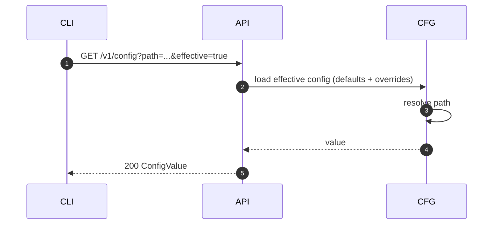
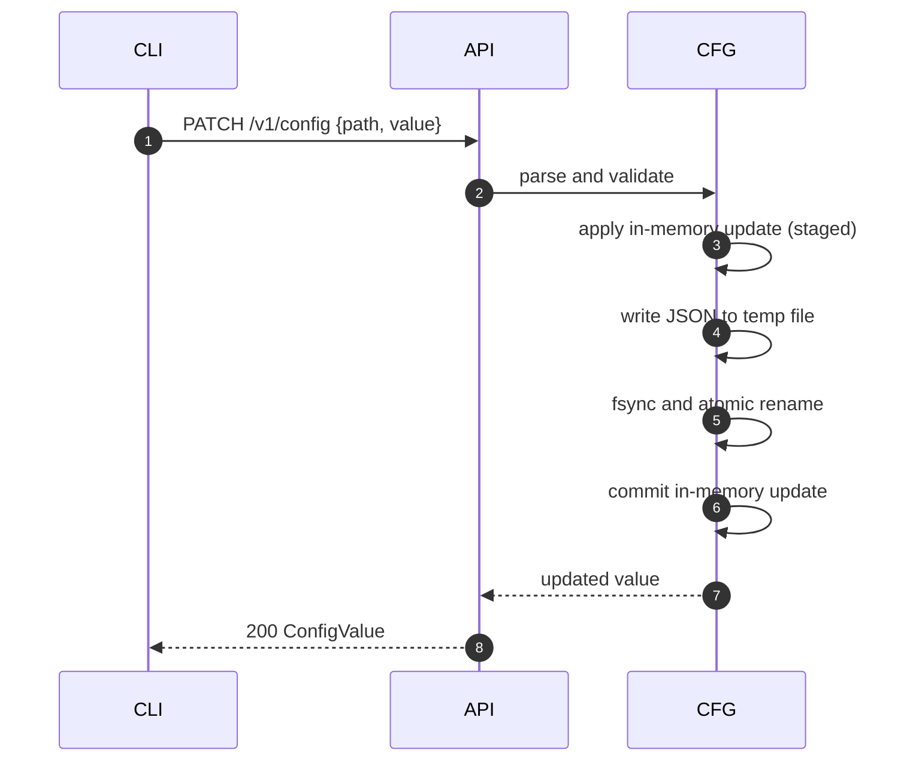
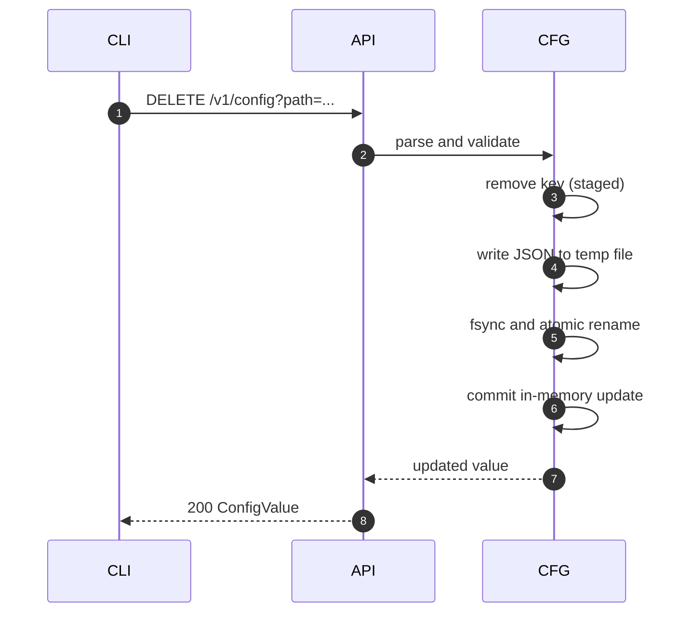

# Взаимодействие с server config

Документ описывает, как `sqlrs config` взаимодействует с движком и как
изменения конфигурации применяются атомарно.

## 1. Эндпойнты

- `GET /v1/config` (опционально `path`, `effective`)
- `PATCH /v1/config` (установка `path` + `value`)
- `DELETE /v1/config` (удаление `path`)
- `GET /v1/config/schema`

## 2. Поток: get effective value

## 3. Поток: set value

## 4. Поток: remove value

## 5. Ошибки

- При ошибке валидации состояние не меняется и API возвращает `400`.
- При ошибке записи на диск или rename in-memory конфиг не фиксируется.
- При старте движка конфиг загружается из JSON файла и мержится с дефолтами.
