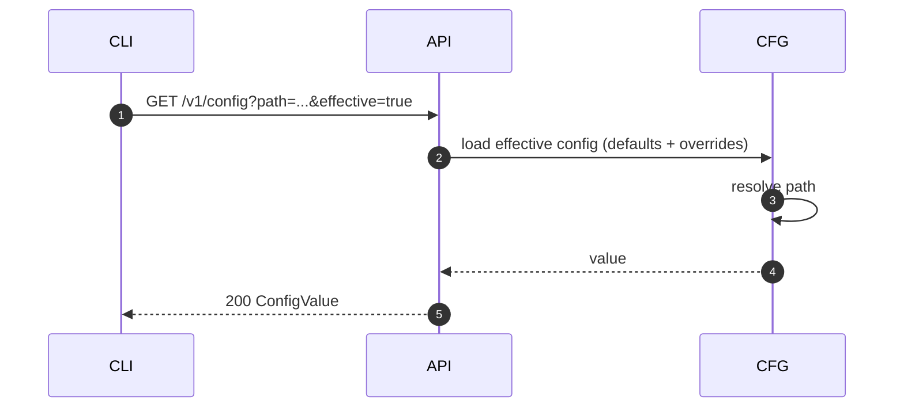
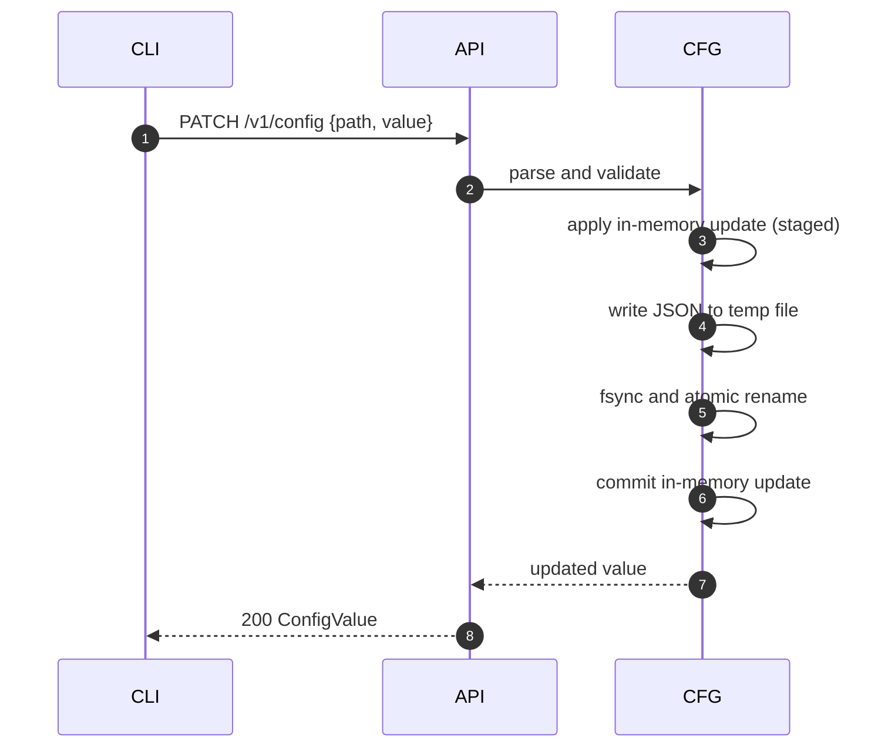
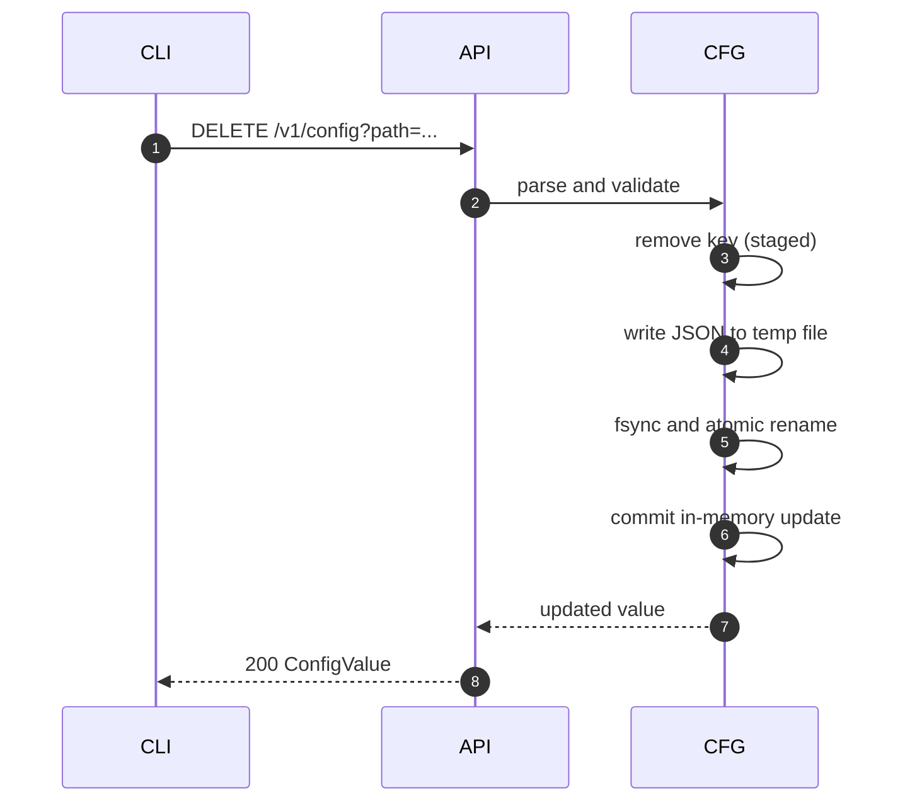

# Server config interaction flow

This document describes how `sqlrs config` interacts with the engine and how
configuration updates are applied atomically.

## 1. Endpoints

- `GET /v1/config` (optional `path`, `effective`)
- `PATCH /v1/config` (set `path` + `value`)
- `DELETE /v1/config` (remove `path`)
- `GET /v1/config/schema`

## 2. Flow: get effective value

## 3. Flow: set value

## 4. Flow: remove value

## 5. Failure handling

- If validation fails, no state is mutated and the API returns `400`.
- If disk write or rename fails, the in-memory config is not committed.
- On engine start, config is loaded from the JSON file and merged with defaults.
