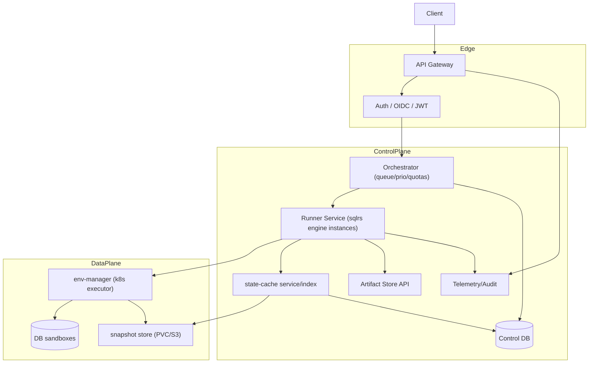

# Архитектура shared-деплоймента (Team / Cloud)

Область: как engine `sqlrs` работает как shared-сервис в Team (A2) и Cloud (B3/C4) развёртываниях. Фокус на том, что меняется относительно локального профиля: процессная модель, ingress/auth, оркестрация, хранилища, масштабирование и изоляция.

## 1. Цели

- Multi-tenant, аутентифицированный доступ к той же логике engine (planner/cache/snapshotter/runner).
- Горизонтальное масштабирование и высокая доступность.
- Сильная изоляция между tenants (namespaces/policies/quotas).
- Общие state/cache и хранилища артефактов с контролем retention.
- Централизованная observability и audit.

## 2. Высокоуровневая топология

## 3. Процесс и поток запросов

- Клиенты (CLI/IDE/UI) вызывают Gateway по аутентифицированному REST/gRPC.
- Gateway проверяет authN/authZ, rate limits, org quotas; форвардит в Orchestrator.
- Orchestrator ставит job в очередь с учетом приоритетов/квот; dispatch в Runner-инстансы.
- Runner (stateless engine) забирает job, делает plan/cache lookup, запрашивает у env-manager sandbox, выполняет, снапшотит, сохраняет артефакты, обновляет статус в Orchestrator.
- Статусы/события стримятся через Gateway (SSE/WS) для watch-mode клиентов.

## 4. Изменения engine по сравнению с локальным режимом

- **Lifecycle**: долгоживущий сервис (Deployment) с HPA; нет процессов, которые спавнит CLI.
- **Ingress**: за Gateway; нет loopback/UDS; нужна auth.
- **State store**: общий store (PVC/S3) + metadata в Control DB или отдельный SQLite на шарде с синком в Control DB; per-tenant разделение через namespaces/prefixes.
- **Cache service**: может быть отдельным сервисом, стоящим за cache client engine.
- **Liquibase**: выполняется в контролируемых runner pods/containers; секреты из K8s Secrets/Vault.
- **Snapshotter**: использует кластерные хранилища (CSI snapshots/PVC + CoW при наличии); резолвинг путей по namespace.
- **Artifacts**: логи/отчеты в artifact store (S3/PVC) с retention tags.

## 5. Изоляция и безопасность

- Auth: OIDC/JWT через Gateway; runner получает principal/org из токена.
- Сеть: Namespace/NetworkPolicy для изоляции песочниц; ограничение egress.
- Хранилища: per-tenant prefixes в snapshot/artifact stores; ACL на уровне сервиса и backend IAM, где применимо.
- Quotas/limits: enforced Orchestrator и env-manager (CPU/RAM/TTL/concurrency).
- Secrets: K8s Secrets или Vault/KMS; монтируются/инжектируются per job; не логируются.

## 6. Масштабирование и доступность

- Runner service: HPA по метрикам очереди/латентности; несколько реплик; readiness/liveness probes.
- env-manager: масштабирует песочницы; может использовать warm pools для быстрого старта.
- Cache builders/GC: масштабируются через autoscaling controller.
- Cluster autoscaler (Cloud): разрешен с guard rails; Team может управляться ops-ами.

## 7. Персистентность и хранилища

- **State cache**: общий store с индексом; eviction политика учитывает org pins/retention.
- **Control DB**: метаданные по jobs, states, artefacts, audit.
- **Artifact store**: S3/PVC; неизменяемые bundle для шаринга.
- **Snapshot store**: CoW-friendly volumes или CSI snapshots; send/receive для удаленных копий, где доступно.

## 8. Observability и audit

- Метрики: длина/возраст очереди, латентность runner, cache hit ratio, латентность bind/start песочницы, размеры/время снапшотов, ошибки.
- Логи: структурированные, централизованные (Loki/ELK); коррелированы по job/run_id/org.
- Audit: runs, snapshots, действия по шарингу, события масштабирования.

## 9. Примечания об эволюции

- Тот же API контракт, что и в локальном `sqlrs` для `/runs` и т.п., но всегда async; watch через stream.
- Можно шардировать cache/store по org или region; runner stateless, кроме per-job sandbox.
- Будущее: pluggable executors помимо k8s; multi-region репликация cache/artifacts.
