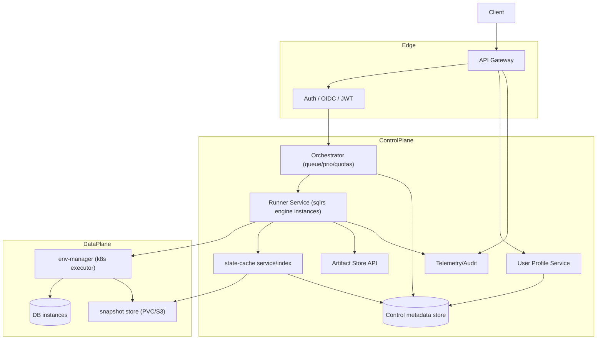

# Архитектура shared-деплоймента (Team / Cloud)

Область: как engine `sqlrs` работает как shared-сервис в Team (A2) и Cloud (B3/C4) развёртываниях. Фокус на том, что меняется относительно локального профиля: процессная модель, ingress/auth, оркестрация, хранилища, масштабирование и изоляция.

## 1. Цели

- Multi-tenant, аутентифицированный доступ к той же логике engine (prepare planner/executor, cache, snapshotter).
- Горизонтальное масштабирование и высокая доступность.
- Сильная изоляция между tenants (namespaces/policies/quotas).
- Общие state/cache и хранилища артефактов с контролем retention.
- Централизованная observability и audit.

## 2. Высокоуровневая топология

```mermaid
flowchart TD
  subgraph Edge
    GW[API Gateway]
    AUTH["Auth / OIDC / JWT"]
  end

  subgraph ControlPlane
    PROFILE["User Profile Service"]
    ORCH["Orchestrator (queue/prio/quotas)"]
    RUN["Runner Service (sqlrs engine instances)"]
    CACHE[state-cache service/index]
    ART[Artifact Store API]
    OBS[Telemetry/Audit]
    META[(Control metadata store)]
  end

  subgraph DataPlane
    ENV["env-manager (k8s executor)"]
    SNAP["snapshot store (PVC/S3)"]
    PG[(DB instances)]
  end

  Client --> GW --> AUTH --> ORCH
  GW --> PROFILE
  PROFILE --> META
  ORCH --> RUN
  RUN --> ENV
  RUN --> CACHE
  RUN --> ART
  RUN --> OBS
  ENV --> PG
  ENV --> SNAP
  CACHE --> SNAP
  CACHE --> META
  ORCH --> META
  GW --> OBS
```

## 3. Процесс и поток запросов

- Клиенты (CLI/IDE/UI) вызывают Gateway по аутентифицированному REST/gRPC для prepare jobs и cache/snapshot операций.
- Gateway проверяет authN/authZ, rate limits, org quotas; prepare и
  cache/snapshot операции форвардит в Orchestrator.
- Gateway форвардит запросы управления пользователями и организациями в
  User Profile Service. Сервис создает и читает профили пользователей, связи с
  external identity, организации и memberships из server-owned user/org state.
- Orchestrator ставит job в очередь с учетом приоритетов/квот; dispatch в Runner-экземпляры.
- Runner (stateless engine) забирает job, делает prepare planning/cache lookup, запрашивает у env-manager instance, выполняет prepare шаги, снапшотит, делает bind/select instance, сохраняет артефакты, обновляет статус в Orchestrator.
- Статусы/события стримятся через Gateway (SSE/WS) для watch-mode клиентов.
- `run` команды выполняются локально через CLI против подготовленного/общего экземпляра; shared сервис не исполняет локальные команды.
- Script sources передаются как server-side project ref или загруженный `source_id` bundle.

## 4. Изменения engine по сравнению с локальным режимом

- **Lifecycle**: долгоживущий сервис (Deployment) с HPA; нет процессов, которые спавнит CLI.
- **Ingress**: за Gateway; нет loopback/UDS; нужна auth.
- **State store**: общий store (PVC/S3) + control metadata store или отдельный SQLite на шарде с синком в control plane; per-tenant разделение через namespaces/prefixes.
- **Cache service**: может быть отдельным сервисом, стоящим за cache client engine.
- **Liquibase**: выполняется как внешний CLI в контролируемых runner pods/containers; секреты из K8s Secrets/Vault. Накладные расходы измеряются и оптимизируются при необходимости.
- **Snapshotter**: использует кластерные хранилища (CSI snapshots/PVC + CoW при наличии); резолвинг путей по namespace.
- **Artifacts**: логи/отчеты в artifact store (S3/PVC) с retention tags.

## 5. Изоляция и безопасность

- Auth: OIDC/JWT через Gateway; runner получает principal/org из токена.
- User Profile Service выводит current-user identity key для
  `PUT /v1/users/me` из проверенных OAuth/OIDC claims, может отклонять
  self-registration при отключенной политике и обеспечивает уникальность
  external identity по `provider + issuer + subject`.
- User Profile Service требует conditional writes для user profiles:
  `If-None-Match: *` для create-only registration/provisioning и
  `If-Match: <etag>` для update-only изменений.
- Сеть: Namespace/NetworkPolicy для изоляции экземпляров; ограничение egress.
- Хранилища: per-tenant prefixes в snapshot/artifact stores; ACL на уровне сервиса и backend IAM, где применимо.
- Quotas/limits: enforced Orchestrator и env-manager (CPU/RAM/TTL/concurrency).
- Secrets: K8s Secrets или Vault/KMS; монтируются/инжектируются per job; не логируются.

## 6. Масштабирование и доступность

- Runner service: HPA по метрикам очереди/латентности; несколько реплик; readiness/liveness probes.
- env-manager: масштабирует экземпляры; может использовать warm pools для быстрого старта.
- Cache builders/GC: масштабируются через autoscaling controller.
- Cluster autoscaler (Cloud): разрешен с guard rails; Team может управляться ops-ами.

## 7. Персистентность и хранилища

- **State cache**: общий store с индексом; eviction политика учитывает org pins/retention.
- **Control metadata store**: метаданные по jobs, states, artefacts, audit.
- **User profile store**: server-owned state за User Profile Service.
  Технология хранения вне текущего client slice; identity links уникальны по
  provider, issuer и subject.
- **Artifact store**: S3/PVC; неизменяемые bundle для шаринга.
- **Snapshot store**: CoW-friendly volumes или CSI snapshots; send/receive для удаленных копий, где доступно.

## 8. Observability и audit

- Метрики: длина/возраст очереди, латентность runner, cache hit ratio, латентность bind/start экземпляра, размеры/время снапшотов, ошибки.
- Логи: структурированные, централизованные (Loki/ELK); коррелированы по job/prepare_id/org.
- Audit: prepare jobs, snapshots, действия по шарингу, события масштабирования.
- Lifecycle-действия пользователей и организаций являются audit events:
  self-registration, administrator-created users, organization creation и
  membership changes.

## 9. Примечания об эволюции

- Тот же API контракт, что и в локальном `sqlrs` для prepare jobs (endpoint-ы уточняются), но всегда async; watch через stream.
- Можно шардировать cache/store по org или region; runner stateless, кроме per-job instance.
- Будущее: pluggable executors помимо k8s; multi-region репликация cache/artifacts.

## 10. Компонентная структура сервисов (jobs/tasks)

### 10.1 Компоненты и ответственность

- **Gateway**
  - Экспортирует `GET /v1/prepare-jobs`, `DELETE /v1/prepare-jobs/{jobId}`,
    `GET /v1/tasks` и remote-only API пользователей/организаций.
  - Проверяет authN/authZ и проксирует в Orchestrator или User Profile Service.
- **User Profile Service**
  - Владеет профилями пользователей, external identity links, организациями и
    memberships.
  - Применяет self-registration policy и administrator authorization для
    ручного provisioning пользователей.
  - Реализует `PUT /v1/users/me` и `PUT /v1/users/by-identity` как
    identity-keyed conditional writes.
  - Обеспечивает уникальность external identity links.
- **Orchestrator**
  - Владеет реестром jobs и представлением очереди tasks.
  - Применяет правила scheduling, quota и deletion.
- **Runner**
  - Выполняет tasks и репортит переходы статусов.
  - Стримит логи/события для observability.
- **Control metadata store**
  - Персистит метаданные jobs/tasks и историю статусов.

### 10.2 Ключевые типы и интерфейсы

- `PrepareJobEntry`, `TaskEntry`
  - Payload списка для job/task запросов.
- `UserProfile`, `ExternalIdentity`, `Organization`,
  `OrganizationMembership`
  - Payload-ы управления пользователями и организациями.
- `TaskStatus`
  - `queued | running | succeeded | failed`.
- `DeleteResult`
  - Единая форма результата удаления для job.

### 10.3 Владение данными

- Control metadata store - источник истины для jobs/tasks в shared деплойменте.
- User Profile Service владеет источником истины для users, external identities,
  organizations и memberships в shared деплойменте. Конкретная технология
  хранения вне текущего client slice.
- Orchestrator держит in-memory состояние очереди, синхронизированное с control
  metadata store.
