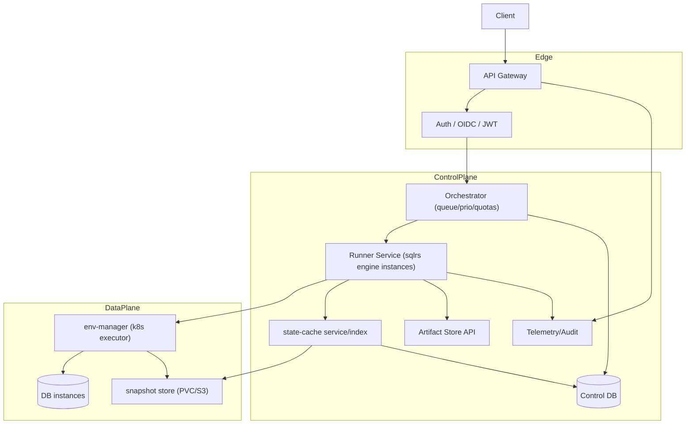

# Shared Deployment Architecture (Team / Cloud)

Scope: how the `sqlrs` engine operates as a shared service in Team (A2) and Cloud (B3/C4) deployments. Focus on what changes from local: process model, ingress/auth, orchestration, storage, scaling, and isolation.

## 1. Goals

- Multi-tenant, authenticated access to the same engine logic (prepare planner/executor, cache, snapshotter).
- Horizontal scalability and high availability.
- Strong isolation between tenants (namespaces/policies/quotas).
- Shared state/cache and artifact storage with retention controls.
- Centralised observability and audit.

## 2. High-Level Topology

## 3. Process and Request Flow

- Clients (CLI/IDE/UI) call Gateway with authenticated REST/gRPC for prepare jobs and cache/snapshot operations.
- Gateway enforces authN/authZ, rate limits, org quotas; forwards to Orchestrator.
- Orchestrator enqueues jobs with priority/quotas; dispatches to Runner instances.
- Runner (stateless engine) pulls job, performs prepare planning/cache lookup, asks env-manager to bind instance, executes prepare steps, snapshots, binds/selects instance, stores artefacts, updates status back to Orchestrator.
- Status/events streamed via Gateway (SSE/WS) for watch-mode clients.
- `run` commands execute locally via CLI against a prepared/shared instance; shared service does not run local commands.
- Script sources can be provided as a server-side project ref or as an uploaded `source_id` bundle.

## 4. Engine Changes vs Local

- **Lifecycle**: long-running service (Deployment) with HPA; no CLI-spawned processes.
- **Ingress**: behind Gateway; no loopback/UDS; auth required.
- **State store**: shared store (PVC/S3) + metadata in Control DB or dedicated SQLite per shard synced to Control DB; per-tenant separation via namespaces/prefixes.
- **Cache service**: may run as separate service backing the engine’s cache client.
- **Liquibase**: runs as an external CLI inside controlled runner pods/containers; secrets from K8s Secrets/Vault. Overhead is measured and optimized if needed.
- **Snapshotter**: uses cluster storage (CSI snapshots/PVC + CoW if available); path resolution per tenant namespace.
- **Artifacts**: logs/reports exported to artifact store (S3/PVC) with retention tags.

## 5. Isolation and Security

- Auth: OIDC/JWT via Gateway; runner receives principal/org in token.
- Network: Namespace/NetworkPolicy to isolate instances; restrict egress.
- Storage: per-tenant prefixes in snapshot/artifact stores; ACLs enforced by service and backend IAM where applicable.
- Quotas/limits: enforced by Orchestrator and env-manager (CPU/RAM/TTL/concurrency).
- Secrets: managed by K8s Secrets or Vault/KMS; mounted/injected per job; never logged.

## 6. Scaling and Availability

- Runner service: HPA on queue backlog/latency metrics; multiple replicas; readiness/liveness probes.
- env-manager: scales instances; may use warm pools for fast start.
- Cache builders/GC: scale via autoscaling controller.
- Cluster autoscaler (Cloud): allowed with guard rails; Team may be ops-managed.

## 7. Persistence and Stores

- **State cache**: shared store with index; eviction policy respects org pins/retention.
- **Control DB**: metadata for jobs, states, artefacts, audit.
- **Artifact store**: S3/PVC; immutable bundles for sharing.
- **Snapshot store**: CoW-friendly volumes or CSI snapshots; send/receive for remote copies when available.

## 8. Observability and Audit

- Metrics: queue length/age, runner latency, cache hit ratio, instance bind/start latency, snapshot sizes/time, errors.
- Logs: structured, centralised (Loki/ELK); correlated by job/prepare_id/org.
- Audit: prepare jobs, snapshots, sharing actions, scale events.

## 9. Evolution Notes

- Same API contract as local `sqlrs` for prepare jobs (endpoint names TBD), but always async; watch via stream.
- Can shard cache/store by org or region; runner instances stateless except per-job instance.
- Future: pluggable executors beyond k8s; multi-region replication of cache/artifacts.

## 10. Service Component Structure (Jobs/Tasks)

### 10.1 Components and responsibilities

- **Gateway**
  - Exposes `GET /v1/prepare-jobs`, `DELETE /v1/prepare-jobs/{jobId}`, and `GET /v1/tasks`.
  - Enforces authN/authZ and forwards to Orchestrator.
- **Orchestrator**
  - Owns the job registry and task queue view.
  - Applies scheduling, quota, and deletion rules.
- **Runner**
  - Executes tasks and reports status transitions.
  - Streams logs/events for observability.
- **Control DB**
  - Persists jobs/tasks metadata and status history.

### 10.2 Key types and interfaces

- `PrepareJobEntry`, `TaskEntry`
  - List payloads for job/task queries.
- `TaskStatus`
  - `queued | running | succeeded | failed | cancelled`.
- `DeleteResult`
  - Common deletion outcome shape for job removal.

### 10.3 Data ownership

- Control DB is the source of truth for jobs/tasks in shared deployments.
- Orchestrator maintains in-memory queue state derived from Control DB for fast scheduling.
