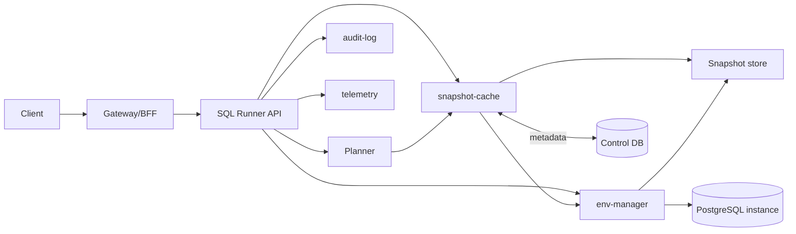
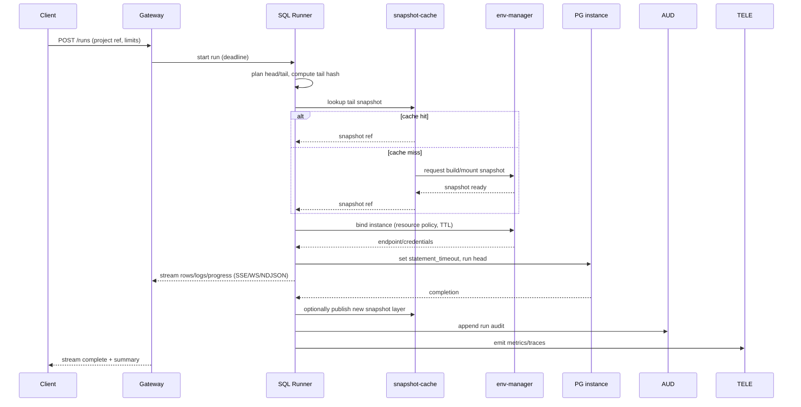

# SQL Runner API (внутри Engine)

Область: ключевой сервис, который детерминированно выполняет SQL-проекты, с cache-aware планированием, таймаутами, отменой и стримингом результатов/логов. Это часть Taidon Engine и общий компонент для local, team и cloud профилей.

## 1. Ответственности

- Парсить layout проекта (init/seed/test/bench) и вычислять разделение tail/head с детерминированными хешами.
- Делать запросы в snapshot-cache за переиспользуемым состоянием; инициировать build при cache miss.
- Биндиться к экземпляру через env-manager и соблюдать ресурсные/TTL политики.
- Выполнять head-фрагмент с DB-уровневыми защитами (statement timeout, лимитеры).
- Стримить результаты/логи клиентам; сохранять финальные артефакты/метаданные.
- Экспортировать отмену и enforcement дедлайнов; эмитить audit/telemetry события.

## 2. Поверхность API (логически)

Gateway/BFF фронтит эти вызовы; форма стабильна для REST/gRPC. Идентификаторы — непрозрачные UUID.

- `POST /runs` - старт run. Тело: ref проекта (repo/path+rev) или `source_id`, entry script(s), параметры, лимиты (timeout, row limit, byte limit), cache hints. Ответ: `run_id`, статус URL, stream URL.
- `GET /runs/{run_id}/stream` - server-sent events / WebSocket для строк, прогресса, логов, смены состояния. NDJSON поддерживается через `Accept: application/x-ndjson` (один JSON-объект на строку).
- `POST /runs/{run_id}/cancel` - best-effort cancel; гарантирует отсутствие дальнейших записей в экземпляр.
- `GET /runs/{run_id}` - статус, тайминги, cache hit/miss, tail hash, instance binding, summary artefacts.

Таймауты многоуровневые:

- Request deadline (Gateway) -> отменяет соединение и транслирует в runner.
- Runner deadline -> выставляет DB `statement_timeout` и внутренний wall-clock guard.
- Instance TTL (env-manager) -> гасит idle/долго живущие экземпляры.

## 3. Контекст компонентов

## 4. Поток выполнения (со стримингом)

Стриминговый канал несет небольшие структурированные сообщения (прогресс, наборы строк чанками, stderr/логи, смены состояний). Backpressure обрабатывается bounded channel + drop/close на медленном потребителе с явным кодом. NDJSON - line-delimited JSON представление тех же событий.

## 5. Отмена и таймауты

- **Отмена клиента**: `POST /runs/{id}/cancel` заставляет runner выполнить `pg_cancel_backend` и закрыть стрим; run завершается со статусом `cancelled`.
- **Дедлайн**: runner ограничивает wall-clock; также выставляет DB `statement_timeout` на head-фрагменты и общий бюджет.
- **Instance TTL**: enforced env-manager; idle экземпляры могут быть убраны, что требует нового bind на следующий run.

Все завершения (success/fail/cancel/timeout) записывают terminal status, длительность, cache hit флаг и опциональные ссылки на артефакты.

## 6. Observability и безопасность

- Метрики: cache hit ratio, planning latency, instance bind latency, head execution latency, rows/bytes streamed, cancellations, timeouts.
- Логи: структурированные по run_id; включают cache decision, env binding, errors.
- Audit: кто, какой проект/ref запускал, результат, потребленные ресурсы.
- Лимиты: лимиты на число строк и размер payload; reject oversized result sets; redaction секретов в логах/стримах.

## 7. Профили деплоймента и эволюция

### 7.1 Local (MVP)

- **Процесс**: engine работает локально (эфемерный), REST по loopback; CLI может watch или detach.
- **Runtime**: Docker executor; single-node pool экземпляров; per-user state store на диске.
- **Cache**: локальный snapshot store + SQLite index; нет shared cache сервиса.
- **Auth**: loopback-only плюс auth token из `engine.json` для endpoint-ов, кроме health.
- **Scaling**: ограниченный параллелизм на рабочей станции; нет autoscaling.

### 7.2 Team / Cloud

- **Процесс**: stateless runner service за Gateway/Orchestrator; multi-replica с HPA.
- **Runtime**: env-manager (k8s executor), namespace isolation, quotas/TTL policies.
- **Cache**: shared cache service и snapshot store (PVC/S3) с метаданными в Control DB.
- **Auth**: OIDC/JWT через Gateway; per-org доступ и rate limits.
- **Scaling**: autoscaling для runner и cache builders; warm pools для экземпляров.

API surface и модель run сохраняются стабильными между профилями, чтобы CLI мог одинаково работать с local и shared deployment без поведенческого дрейфа.

## 8. Интеграция с Liquibase и fallback

Runner должен давать ценность и при наличии, и при отсутствии Liquibase.

### 8.1 Liquibase-aware режим (предпочтителен)

- Planner запрашивает pending changeset и checksums у Liquibase.
- Cache keys строятся по хешам changeset; предиктивные cache hits до apply.
- Runner выполняет changeset пошагово и снимает snapshot после каждого шага.

### 8.2 Общий SQL-режим (без Liquibase)

- CLI передает явный план выполнения (упорядоченный список скриптов и границы).
- Runner хеширует содержимое скриптов и параметры для ключей кэша.
- Снапшоты снимаются после каждого скрипта/границы; cache reuse работает внутри и между проектами при совпадении хешей.
- Стриминг, таймауты, отмена и захват артефактов идентичны Liquibase режиму.

Это обеспечивает ускорение повторных запусков и детерминированное выполнение даже без установленного Liquibase.

## 9. Доставка контента и источники проектов

Удаленное выполнение требует двух режимов поставки SQL источников:

### 9.1 Server-side sources (zero deployment)

- SQL проект живет на стороне сервиса (workspace, shared repo mirror или импортированный артефакт).
- `POST /runs` ссылается на `project_ref` (repo/path+rev) или server-side project ID.
- Runner читает контент из service store; в запросе запуска нет больших payload.

### 9.2 Client-side sources (локальные файлы, удаленный runner)

- CLI загружает источники как content-addressed bundle и запускает run по `source_id`.
- Большие скрипты режутся на чанки на стороне CLI, а не runner, чтобы избежать таймаутов на одном большом теле запроса.

Предлагаемая форма API (логически):

- `POST /sources` - создать upload session, возвращает `source_id` и размер чанка.
- `PUT /sources/{source_id}/chunks/{n}` - загрузить чанк (resume).
- `POST /sources/{source_id}/finalize` - зафиксировать manifest (список файлов + хеши) и сделать source готовым.
- `POST /runs` - ссылаться на `source_id` вместо `project_ref`.

Chunking и синхронизация:

- CLI режет файлы на фиксированные чанки, считает хеши и загружает только отсутствующие чанки.
- Manifest сопоставляет пути файлов и хеши чанков; это дает rsync-style delta обновления.
- Сервис хранит чанки в artifact store; runner получает контент через `source_id`.

Rationale:

- Избегает очень больших тел в `POST /runs`.
- Поддерживает resume/retry и дедуп между проектами.
- Позволяет сервису хранить локальную копию для cache reuse и воспроизводимости.
