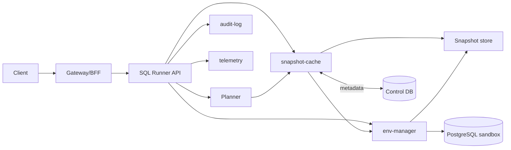
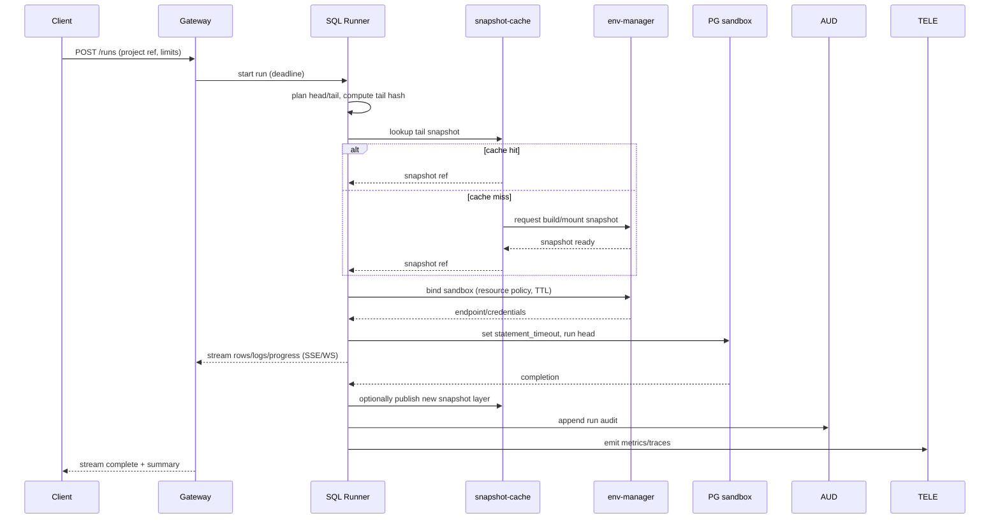

# SQL Runner API (Engine Internals)

Scope: core service that executes SQL projects deterministically, with cache-aware planning, timeouts, cancellation, and streaming of results/logs. This is part of Taidon Engine and is shared across local, team, and cloud profiles.

## 1. Responsibilities

- Parse project layout (init/seed/test/bench) and compute tail/head split with deterministic hashes.
- Query snapshot-cache for a reusable state; request build on cache miss.
- Bind to a sandbox via env-manager and enforce resource/TTL policies.
- Execute head fragment with DB-level protections (statement timeout, limiters).
- Stream results/logs to clients; persist final artefacts/metadata.
- Expose cancellation and deadline enforcement; emit audit/telemetry events.

## 2. API Surface (logical)

The Gateway/BFF fronts these calls; shape is stable across REST/gRPC. Identifiers are opaque UUIDs.

- `POST /runs` — start run. Body: project ref (repo/path+rev), entry script(s), parameters, limits (timeout, row limit, byte limit), cache hints. Response: `run_id`, status URL, stream URL.
- `GET /runs/{run_id}/stream` — server-sent events / WebSocket for rows, progress, logs, state changes.
- `POST /runs/{run_id}/cancel` — best-effort cancel; guarantees no further writes to the sandbox.
- `GET /runs/{run_id}` — status, timings, cache hit/miss, tail hash, sandbox binding, summary artefacts.

Timeouts are multi-layer:

- Request deadline (Gateway) -> cancels connection and propagates to runner.
- Runner deadline -> sets DB `statement_timeout` and internal wall-clock guard.
- Sandbox TTL (env-manager) -> tears down idle/long-lived sandboxes.

## 3. Component Context

## 4. Execution Flow (with streaming)

Streaming channel carries small structured messages (progress, result sets in chunks, stderr/log lines, state changes). Backpressure handled by bounded channel + drop/close on slow consumer with explicit code.

## 5. Cancellation and Timeouts

- **Client cancel**: `POST /runs/{id}/cancel` triggers runner to send `pg_cancel_backend` and close the stream; run ends in `cancelled`.
- **Deadline**: runner enforces wall-clock deadline; also sets DB `statement_timeout` per head fragment and aggregate budget.
- **Sandbox TTL**: enforced by env-manager; idle sandboxes may be reaped, forcing fresh binding on next run.

All exits (success/fail/cancel/timeout) write a terminal status, duration, cache hit flag, and optional artefact pointers.

## 6. Observability and Safety

- Metrics: cache hit ratio, planning latency, sandbox bind latency, head execution latency, rows/bytes streamed, cancellations, timeouts.
- Logs: structured per run_id; include cache decision, env binding, errors.
- Audit: who ran what project/ref, outcome, resources consumed.
- Limits: row count and payload size caps; reject oversized result sets; redact secrets in logs/streams.
