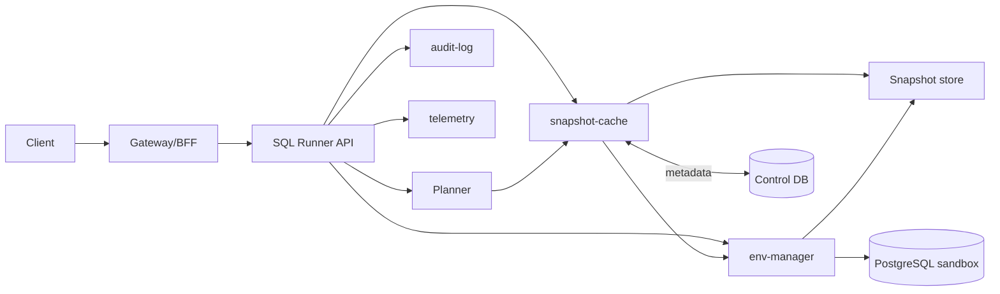
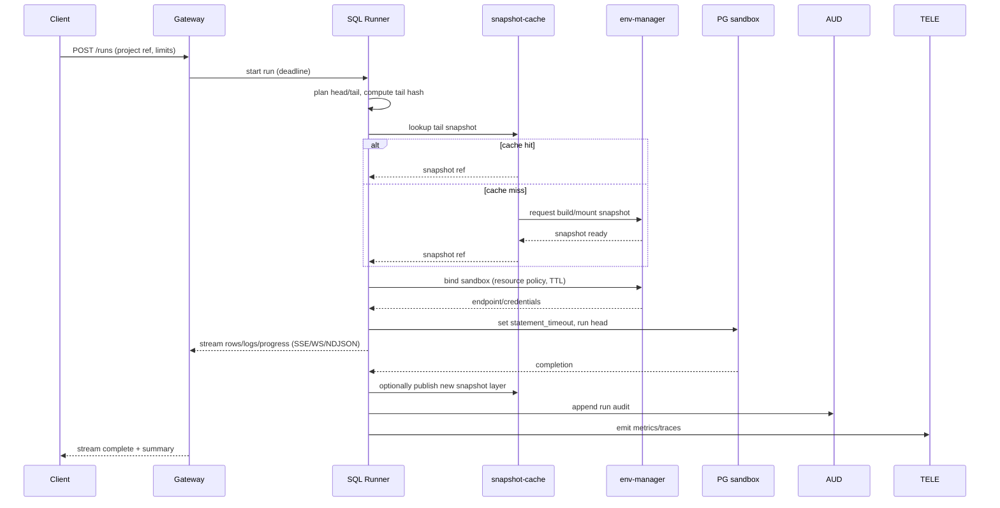

# SQL Runner API (Engine Internals)

Scope: core service that executes SQL projects deterministically, with cache-aware planning, timeouts, cancellation, and streaming of results/logs. This is part of Taidon Engine and is shared across local, team, and cloud profiles.

## 1. Responsibilities

- Parse project layout (init/seed/test/bench) and compute tail/head split with deterministic hashes.
- Query snapshot-cache for a reusable state; request build on cache miss.
- Bind to a sandbox via env-manager and enforce resource/TTL policies.
- Execute head fragment with DB-level protections (statement timeout, limiters).
- Stream results/logs to clients; persist final artefacts/metadata.
- Expose cancellation and deadline enforcement; emit audit/telemetry events.

## 2. API Surface (logical)

The Gateway/BFF fronts these calls; shape is stable across REST/gRPC. Identifiers are opaque UUIDs.

- `POST /runs` - start run. Body: project ref (repo/path+rev) or `source_id`, entry script(s), parameters, limits (timeout, row limit, byte limit), cache hints. Response: `run_id`, status URL, stream URL.
- `GET /runs/{run_id}/stream` - server-sent events / WebSocket for rows, progress, logs, state changes. NDJSON is supported via `Accept: application/x-ndjson` (one JSON object per line).
- `POST /runs/{run_id}/cancel` - best-effort cancel; guarantees no further writes to the sandbox.
- `GET /runs/{run_id}` - status, timings, cache hit/miss, tail hash, sandbox binding, summary artefacts.

Timeouts are multi-layer:

- Request deadline (Gateway) -> cancels connection and propagates to runner.
- Runner deadline -> sets DB `statement_timeout` and internal wall-clock guard.
- Sandbox TTL (env-manager) -> tears down idle/long-lived sandboxes.

## 3. Component Context

## 4. Execution Flow (with streaming)

Streaming channel carries small structured messages (progress, result sets in chunks, stderr/log lines, state changes). Backpressure handled by bounded channel + drop/close on slow consumer with explicit code. NDJSON is a line-delimited JSON encoding of the same events.

## 5. Cancellation and Timeouts

- **Client cancel**: `POST /runs/{id}/cancel` triggers runner to send `pg_cancel_backend` and close the stream; run ends in `cancelled`.
- **Deadline**: runner enforces wall-clock deadline; also sets DB `statement_timeout` per head fragment and aggregate budget.
- **Sandbox TTL**: enforced by env-manager; idle sandboxes may be reaped, forcing fresh binding on next run.

All exits (success/fail/cancel/timeout) write a terminal status, duration, cache hit flag, and optional artefact pointers.

## 6. Observability and Safety

- Metrics: cache hit ratio, planning latency, sandbox bind latency, head execution latency, rows/bytes streamed, cancellations, timeouts.
- Logs: structured per run_id; include cache decision, env binding, errors.
- Audit: who ran what project/ref, outcome, resources consumed.
- Limits: row count and payload size caps; reject oversized result sets; redact secrets in logs/streams.

## 7. Deployment Profiles and Evolution

### 7.1 Local (MVP)

- **Process**: engine runs locally (ephemeral), REST over loopback; CLI can watch or detach.
- **Runtime**: Docker executor; single-node sandbox pool; per-user state store on disk.
- **Cache**: local snapshot store + SQLite index; no shared cache service.
- **Auth**: loopback-only plus auth token from `engine.json` for non-health endpoints.
- **Scaling**: limited parallelism on the workstation; no autoscaling.

### 7.2 Team / Cloud

- **Process**: stateless runner service behind Gateway/Orchestrator; multi-replica with HPA.
- **Runtime**: env-manager (k8s executor), namespace isolation, quotas/TTL policies.
- **Cache**: shared cache service and snapshot store (PVC/S3) with Control DB metadata.
- **Auth**: OIDC/JWT via Gateway; per-org access and rate limits.
- **Scaling**: autoscaling for runners and cache builders; warm pools for sandboxes.

The API surface and run model are kept stable across profiles to allow the CLI to target local or shared deployments without behavioral drift.

## 8. Liquibase Integration and Fallback

The runner must provide value with and without Liquibase.

### 8.1 Liquibase-aware mode (preferred)

- Planner queries Liquibase for pending changesets and checksums.
- Cache keys are derived from changeset hashes; predictive cache hits before apply.
- Runner executes changesets step-by-step and snapshots after each step.

### 8.2 Generic SQL mode (no Liquibase)

- CLI provides an explicit execution plan (ordered script list and boundaries).
- Runner hashes script contents and parameters to form cache keys.
- Snapshots are taken after each script/step boundary; cache reuse still works within and across projects when hashes match.
- Streaming, timeouts, cancellation, and artifact capture are identical to Liquibase mode.

This ensures the runner still accelerates repeated runs and enforces deterministic execution even when Liquibase is not installed.

## 9. Content Delivery and Project Sources

Remote execution needs two modes of supplying SQL sources:

### 9.1 Server-side sources (zero deployment)

- SQL project lives on the service (workspace, shared repo mirror, or imported artifact).
- `POST /runs` references `project_ref` (repo/path+rev) or a server-side project ID.
- Runner fetches content from the service store; no large payloads in the run request.

### 9.2 Client-side sources (local files, remote runner)

- CLI uploads sources as a content-addressed bundle and then starts a run by `source_id`.
- Large scripts are chunked on the CLI, not on the runner, to avoid timeouts on a single request body.

Suggested API shape (logical):

- `POST /sources` - create upload session, returns `source_id` and chunk size.
- `PUT /sources/{source_id}/chunks/{n}` - upload chunk (resumable).
- `POST /sources/{source_id}/finalize` - commit manifest (file list + hashes) and make source ready.
- `POST /runs` - reference `source_id` instead of `project_ref`.

Chunking and sync:

- CLI splits files into fixed-size chunks, computes hashes, and uploads only missing chunks.
- A manifest maps file paths to chunk hashes; this enables rsync-style delta updates.
- The service stores chunks in the artifact store; runner accesses content via `source_id`.

Rationale:

- Avoids very large request bodies on `POST /runs`.
- Supports resume/retry and dedup across projects.
- Allows the service to keep a local copy for cache reuse and reproducibility.
