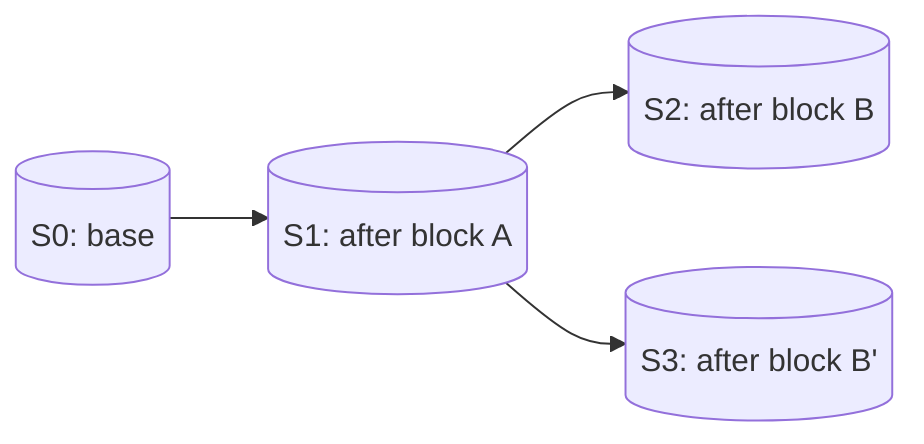
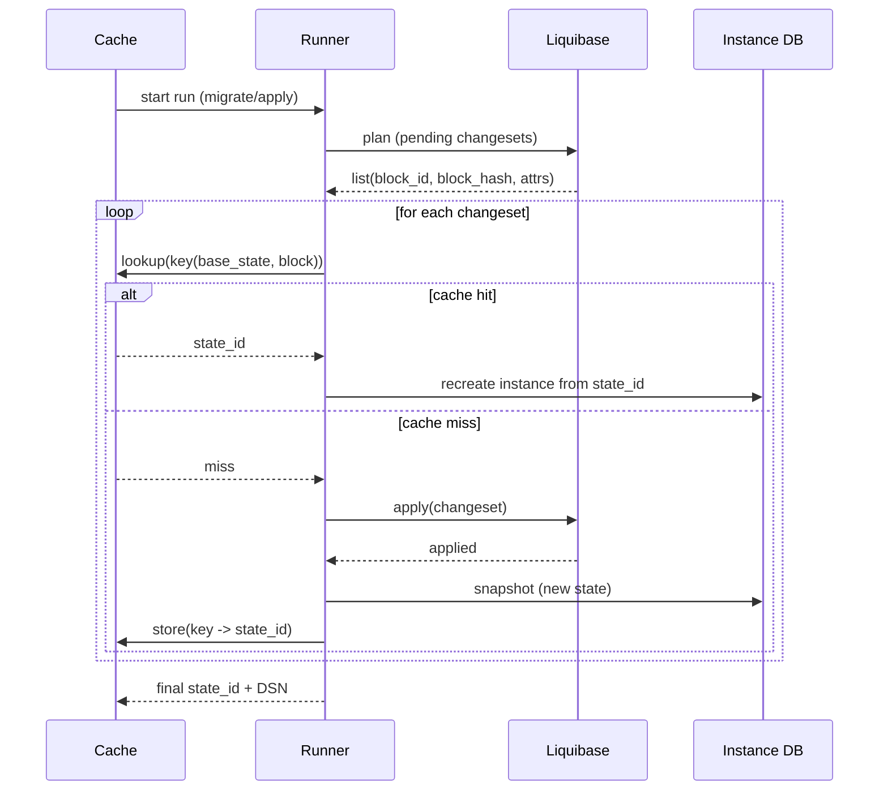

# Дизайн кэша состояний Taidon

Этот документ описывает, как Taidon создает, идентифицирует, переиспользует и эвиктит snapshot-ы состояния БД ("states") в локальных, team и cloud деплойментах.

---

## Содержание

- [1. Цели](#1-цели)
- [2. Не-цели](#2-не-цели)
- [3. Определения](#3-определения)
- [4. Правила snapshotability](#4-правила-snapshotability)
- [5. Триггеры snapshot](#5-триггеры-snapshot)
- [6. Идентичность состояния и cache keys](#6-идентичность-состояния-и-cache-keys)
- [7. Пользовательские контролы: теги, pins, retention](#7-пользовательские-контролы-теги-pins-retention)
- [8. Политика эвикшна](#8-политика-эвикшна)
- [9. Интеграция Liquibase для предиктивных cache hits](#9-интеграция-liquibase-для-предиктивных-cache-hits)
- [10. Семантика ошибок](#10-семантика-ошибок)
- [11. Модель данных](#11-модель-данных)
- [12. Локальный layout и область кэша](#12-локальный-layout-и-область-кэша)
- [13. Observability](#13-observability)

---

## 1. Цели

- Делать snapshot как можно чаще, не нарушая семантику БД.
- Максимизировать cache hit rate для типичных миграций и тестов.
- Поддерживать предиктивное переиспользование (lookup _до_ применения блока).
- Дать пользователю контроль над обнаружением и retention (теги, имена, pinning).
- Сохранить совместимость с несколькими DBMS и профилями деплоймента.
- Предпочитать делегирование парсинга/фильтрации/планирования Liquibase при наличии; fallback на generic SQL, если Liquibase нет.

---

## 2. Не-цели

- Восстановление и продолжение _открытой_ транзакции (snapshot/restore в середине транзакции).
- Реконструкция состояния сессии БД (locks, temporary objects, connection context).
- Реализация парсинга/фильтрации changelog Liquibase (XML/YAML/JSON/SQL) внутри Taidon.

---

## 3. Определения

- **State**: неизменяемое состояние БД, полученное детерминированным процессом prepare.
- **Snapshot**: акт создания State.
- **Instance**: изменяемая копия State; все модификации БД происходят здесь.
- **Snapshotable point**: момент, когда Taidon может безопасно создать State.
- **Change block**: ограниченная единица планируемого изменения, которую Taidon может хешировать и искать в кэше.
- **Ref**: пользовательская ссылка на State (имя, теги, pin, retention).

---

## 4. Правила snapshotability

### 4.1 Базовое правило

Snapshotable point должен удовлетворять всем условиям:

- Нет _открытой_ транзакции, которую Taidon ожидается продолжать.
- БД в состоянии, наблюдаемом новой сессией без зависимости от контекста предыдущей.
- DBMS не снапшотится так, что требуется восстанавливать память процесса.

### 4.2 Что Taidon не снапшотит

Taidon не поддерживает создание snapshot "в середине" транзакции и продолжение этой же транзакции.

Пример (не поддерживается):

```sql
BEGIN;
CREATE TABLE users(id int, name varchar(100));
-- snapshot here and later continue the same transaction
INSERT INTO users(id, name) VALUES (10, 'Bob');
COMMIT;
```

Причина: транзакционный контекст (XID, MVCC snapshot, locks, session state) нельзя портируемо восстановить.

---

## 5. Триггеры snapshot

Taidon стремится делать snapshot "как можно чаще" на безопасных границах.

### 5.1 Дефолтные триггеры

- После каждого коммита, когда Taidon контролирует или надежно наблюдает границы коммита.
- После каждого успешного Liquibase changeset (см. [9. Интеграция Liquibase](#9-интеграция-liquibase-для-предиктивных-cache-hits)).
- После setup/seed шагов, выполненных как отдельные единицы.

### 5.2 Источники триггеров

| Source                        | Trigger granularity | Notes                       |
| ----------------------------- | ------------------- | --------------------------- |
| Liquibase (master or wrapper) | Changeset boundary  | Best for predictive caching |
| Runner (generic SQL plan)     | Step boundary       | User-provided steps         |
| Drop-in DB proxy              | Commit boundary     | Predictive caching limited  |

---

## 6. Идентичность состояния и cache keys

### 6.1 Идентичность состояния

State уникально определяется:

- DBMS engine и версия (например, `postgres:17`)
- Base image/build identifier (по возможности резолвится в дайджест)
- Parent State (опционально, для layered snapshots)
- Change block hash (когда получено из применения известного блока)
- Execution параметры, влияющие на семантику (collation, extensions, locale, seed inputs и т.п.)

### 6.2 Структура cache key

Канонический ключ (MVP):

```code
key = H(
  engine_id,
  engine_version,
  base_state_id,
  block_hash,
  execution_params
)
```

Примечания:

- `block_hash` — основной идентификатор блока (см. [9](#9-интеграция-liquibase-для-предиктивных-cache-hits)).
- Идентичность changeset (author/id/path) используется для трекинга и диагностики, но не требуется в cache key при наличии `base_state_id` и `block_hash`.
- `execution_params` должны включать входы, меняющие результат.

### 6.3 Модель слоев

States могут быть организованы в DAG, где каждый derived State ссылается на parent.



---

## 7. Пользовательские контролы: теги, pins, retention

Taidon предоставляет пользовательские контролы, не раскрывая низкоуровневые DB internals.

### 7.1 Refs

**Ref** — пользовательская ссылка, указывающая на State.

- **Name**: человеко-читаемый идентификатор
- **Tags**: произвольные метки
- **Pin**: предотвращает эвикшн при обычной политике
- **Retention / TTL**: минимальное время хранения

### 7.2 Семантика тегов

Теги прикрепляются к существующему State, обычно к последнему snapshotable point.

- `tag --nearest`: тег на последнее завершенное snapshotable State
- `tag --on-next-boundary`: поставить маркер; тег прикрепится к следующему snapshotable point

Теги никогда не подразумевают snapshot в середине транзакции.

---

## 8. Политика эвикшна

Taidon делает snapshot часто; объем контролируется эвикшном.

### 8.1 Сигналы

State имеет **value score**, который рассчитывается из:

- **Recency**: время последнего использования (LRU компонент)
- **Frequency**: количество использований как база (LFU компонент)
- **Replay cost**: сколько блоков придется переигрывать без этого State
- **Size**: стоимость хранения

### 8.2 Контур политики

- States с pinned Refs не эвиктятся в обычном режиме.
- Не-референсные States допускаются к эвикшну.
- Предпочтительно эвиктить большие, старые, редко используемые States с низкой стоимостью replay.
- Аварийный эвикшн может переопределять pin только по строгой операторской политике.

---

## 9. Интеграция Liquibase для предиктивных cache hits

Предиктивное кэширование требует знания _планируемых_ блоков до выполнения.

### 9.1 Рекомендуемый режим интеграции

Taidon должен поддерживать Liquibase-aware режим, где он может:

- перечислять pending changesets (планируемые блоки)
- получать стабильные идентификаторы и checksums
- применять changesets пошагово
- делать snapshot после каждого шага

Это проще всего, когда Taidon вызывает Liquibase сам ("Liquibase master") или предоставляет wrapper вокруг Liquibase CLI.

Примечание: та же модель кэша используется в local и shared деплойментах. Отличается только _где_ живет Runner (локальный процесс engine или shared сервис). См. [`docs/architecture/sql-runner-api.RU.md`](docs/architecture/sql-runner-api.RU.md).

### 9.2 Определение change block

- **Block**: один Liquibase changeset (предпочтительно)
- **Block hash**: Liquibase checksum для changeset (предпочтительно)
- **Block identity**: changeset identity (author + id + path). Используется для observability и репортинга ошибок, но не требуется для cache keys.

### 9.3 `runInTransaction=false`

- `runInTransaction=false` означает, что Liquibase не оборачивает changeset в явную транзакцию.
- Statement-ы могут коммититься самостоятельно (DBMS/driver autocommit semantics).
- Граница changeset все равно является snapshotable point, потому что Liquibase не держит открытую транзакцию через нее.

Taidon должен сохранить метаданные результата:

- `block_id`, `block_hash`
- `run_in_transaction: true|false`
- `status: success|failed`

### 9.4 Планирование и алгоритм применения (Liquibase-aware)



Примечания:

- Cache hits могут требовать переключения экземпляров: пересоздать из кэшированного State и продолжить.
- Пользователь получает логически непрерывный процесс миграции.

### 9.5 Общий SQL-режим (без Liquibase)

Когда Liquibase недоступен, Runner использует явный step plan:

- Клиент передает упорядоченный список скриптов и границы.
- Runner хеширует содержимое скриптов + параметры в `block_hash`.
- Snapshotting и cache lookup выполняются на границах шагов.

Это сохраняет cache reuse и детерминизм без Liquibase.

---

## 10. Семантика ошибок

### 10.1 Режимы совместимости для current base

Taidon может работать в двух режимах, когда Liquibase падает:

- **Conservative (last-success)**: установить `current_base_id` на последний _успешный_ State и продолжить оттуда, считая, что неудачные нетранзакционные шаги не были сохранены.
- **Investigative (failed-base)**: установить `current_base_id` на диагностический failed State и позволить пользователям воспроизводить и пытаться исправлять ошибку.

Дефолт для автоматизации (CI/CD) — **Conservative**.

### 10.2 Failed changeset

Если changeset упал:

- Liquibase мог частично применить изменения при `runInTransaction=false`.
- Taidon может опционально сделать snapshot failed state для диагностики.
- Такой State должен быть помечен `status=failed` и не используется как обычная cache base, если только на него явно не ссылаются.

### 10.3 Детерминизм и воспроизводимость

Чтобы ключи оставались значимыми:

- фиксировать версии DB engine
- фиксировать base images
- включать execution параметры в ключи
- считать environment-dependent SQL недетерминированным (документированное ограничение)

---

## 11. Модель данных

### 11.1 State

- `state_id` (UUID)
- `engine_id` (например, `postgres`)
- `engine_version` (например, `17`)
- `parent_state_id` (nullable)
- `created_at`
- `size_bytes`
- `restore_time_ms_est`
- `last_used_at`
- `use_count`
- `source` (`liquibase`, `cli`, `proxy`)
- `block_id` (nullable)
- `block_hash` (nullable)
- `run_in_transaction` (nullable)
- `status` (`success`, `failed`)

### 11.2 Ref

- `ref_name` (unique within project/workspace)
- `state_id`
- `tags[]`
- `pinned` (bool)
- `min_retention_until` (timestamp, nullable)
- `visibility` (`private`, `team`, `public-readonly`)

### 11.3 Cache index

- `key_hash` -> `state_id`
- `created_at`
- `hit_count`

---

## 12. Локальный layout и область кэша

### 12.1 Область (где живет кэш)

- **По умолчанию**: на уровне пользователя, общий для всех workspace на машине (переиспользует states между проектами). Локация переопределяется через `SQLRS_STATE_STORE`.
- **Только workspace (opt-in)**: задать `SQLRS_STATE_STORE` в путь workspace, чтобы изолировать кэш для экспериментов/CI.
- **Системный**: не используется; избегает проблем с правами и multi-user контенцией.

### 12.2 Топология хранения

- **Метаданные**: SQLite DB (`state.db`) в корне state store.
- **Данные**: файловое дерево states/base snapshots (тот же layout, что и runtime snapshotting: `engines/<engine>/<version>/base|states/<uuid>`), CoW-friendly когда возможно.

### 12.3 Платформенные особенности

- **Linux/macOS (local engine)**: `<StateDir>/state-store`, нативная ФС; OverlayFS при наличии, иначе fallback на копирование.
- **Windows (local engine)**: `<StateDir>/state-store`, fallback на копирование; WSL backend добавим позже.

### 12.4 Доступ и блокировки

- Single-writer (engine process) с SQLite WAL; concurrent readers разрешены.
- Per-store lock file для предотвращения одновременной модификации одним store двумя engine daemon.
- Инициализация base использует lock + marker на каталог base (`base/.init.lock`, `base/.init.ok`), чтобы только один job выполнял `initdb` для одного образа. Конкурирующие job ждут появления marker или освобождения lock.
- Снапшот state использует lock + marker (`states/<state_id>/.build.lock`, `states/<state_id>/.build.ok`), чтобы только один job строил данный state. Остальные job ждут появления marker или освобождения lock.

---

## 13. Observability

### 12.1 Структурированные логи (MVP)

Для MVP Taidon должен считать Liquibase источником истины и опираться на **структурированные логи**, чтобы наблюдать:

- start шага
- step applied
- step failed
- checksum и связанный metadata, когда доступно

Это избегает прямой инспекции БД Taidon-ом, оставаясь устойчивым.

### 12.2 События

Taidon должен эмитить:

- события создания snapshot (state_id, size, time)
- события cache lookup (hit/miss, key, latency)
- события эвикшна (state_id, reason, freed bytes)
- события Liquibase шагов (changeset start/applied/failed)

Рекомендуемый механизм стрима для клиента: SSE или WebSocket через API gateway.
