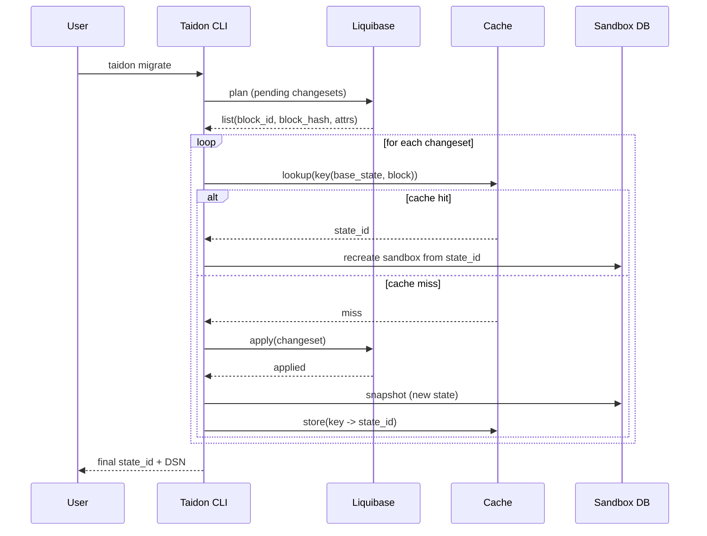

# Taidon State Cache Design

This document specifies how Taidon creates, identifies, reuses, and evicts database state snapshots ("states") across local, team, and cloud deployments.

---

## Table of Contents

- [1. Goals](#1-goals)
- [2. Non-Goals](#2-non-goals)
- [3. Definitions](#3-definitions)
- [4. Snapshotability Rules](#4-snapshotability-rules)
- [5. Snapshot Triggers](#5-snapshot-triggers)
- [6. State Identity and Cache Keys](#6-state-identity-and-cache-keys)
- [7. User Controls: Tags, Pins, Retention](#7-user-controls-tags-pins-retention)
- [8. Eviction Policy](#8-eviction-policy)
- [9. Liquibase Integration for Predictive Cache Hits](#9-liquibase-integration-for-predictive-cache-hits)
- [10. Failure Semantics](#10-failure-semantics)
- [11. Data Model](#11-data-model)
- [12. Local Deployment Layout and Scope](#12-local-deployment-layout-and-scope)
- [13. Observability](#13-observability)

---

## 1. Goals

- Create snapshots as frequently as possible without breaking database semantics.
- Maximise cache hit rate for common migration and test workflows.
- Support predictive reuse (cache lookup _before_ applying a planned change block).
- Provide user controls for discoverability and retention (tags, names, pinning).
- Keep the design compatible with multiple DBMS backends and deployment profiles.
- Prefer delegating changelog parsing, filtering, and planning to Liquibase (MVP).

---

## 2. Non-Goals

- Restoring and continuing an _open_ transaction (mid-transaction snapshot/restore).
- Reconstructing DB session state (locks, temporary objects, connection context).
- Re-implementing Liquibase changelog parsing/filtering (XML/YAML/JSON/SQL) in Taidon.

---

## 3. Definitions

- **State**: A materialised database instance image that can be used as a base for new sandboxes.
- **Snapshot**: The act of producing a State.
- **Sandbox**: An isolated runtime database instance created from a State.
- **Snapshotable point**: A time when Taidon can safely create a State.
- **Change block**: A bounded unit of planned change that Taidon can hash and look up in cache.
- **Ref**: A user-visible reference to a State (name, tags, pin, retention).

---

## 4. Snapshotability Rules

### 4.1 Fundamental rule

A snapshotable point must satisfy all of the following:

- There is no _open_ transaction that Taidon is expected to continue.
- The database is in a state observable by a new session without relying on prior session context.
- The DBMS is not being snapshotted in a way that would require restoring process memory.

### 4.2 What Taidon does not snapshot

Taidon does not support creating a snapshot "in the middle" of a transaction and later continuing that transaction.

Example (not supported):

```sql
BEGIN;
CREATE TABLE users(id int, name varchar(100));
-- snapshot here and later continue the same transaction
INSERT INTO users(id, name) VALUES (10, 'Bob');
COMMIT;
```

Reason: the transactional context (XID, MVCC visibility snapshot, locks, session state) cannot be reconstructed portably.

---

## 5. Snapshot Triggers

Taidon aims to snapshot "as often as possible" at safe boundaries.

### 5.1 Default triggers

- After each committed transaction when Taidon controls or can reliably observe commit boundaries.
- After each successful Liquibase changeset (see [9. Liquibase Integration](#9-liquibase-integration-for-predictive-cache-hits)).
- After setup/seed steps executed as distinct units.

### 5.2 Trigger sources

| Source                        | Trigger granularity | Notes                       |
| ----------------------------- | ------------------- | --------------------------- |
| Liquibase (master or wrapper) | Changeset boundary  | Best for predictive caching |
| Taidon CLI script runner      | Step boundary       | User-provided steps         |
| Drop-in DB proxy              | Commit boundary     | Predictive caching limited  |

---

## 6. State Identity and Cache Keys

### 6.1 State identity

A State is uniquely identified by:

- DBMS engine and version (e.g., `postgres:17`)
- Base image/build identifier
- Parent State (optional, for layered snapshots)
- Change block hash (when derived from applying a known block)
- Execution parameters affecting semantics (collation, extensions, locale, seed inputs, etc.)

### 6.2 Cache key structure

Canonical key (MVP):

```code
key = H(
  engine_id,
  engine_version,
  base_state_id,
  block_hash,
  execution_params
)
```

Notes:

- `block_hash` is the primary identifier of the change block (see [9](#9-liquibase-integration-for-predictive-cache-hits)).
- Changeset _identity_ (author/id/path) is used for tracking and diagnostics, but is not required for the cache key if `base_state_id` and `block_hash` are present.
- `execution_params` must include inputs that change the outcome.

### 6.3 Layering model

States may be organised as a DAG where each derived State references a parent.


---

## 7. User Controls: Tags, Pins, Retention

Taidon provides user controls without exposing low-level DB internals.

### 7.1 Refs

A **Ref** is a user-visible handle pointing to a State.

- **Name**: human-friendly identifier
- **Tags**: free-form labels
- **Pin**: prevents eviction under normal policy
- **Retention / TTL**: minimum time to keep

### 7.2 Tagging semantics

Tags are attached to an existing State, typically the latest snapshotable point.

- `tag --nearest`: tag the latest completed snapshotable State
- `tag --on-next-boundary`: place a marker; the tag is attached to the next snapshotable point

Tags never imply snapshotting mid-transaction.

---

## 8. Eviction Policy

Taidon snapshots frequently; storage is controlled by eviction.

### 8.1 Signals

A State has a **value score** computed from:

- **Recency**: last used time (LRU component)
- **Frequency**: usage count as base (LFU component)
- **Replay cost**: how many blocks must be re-applied without this State
- **Size**: storage cost

### 8.2 Policy outline

- States with pinned Refs are not evicted under normal operation.
- Unreferenced States are eligible for eviction.
- Prefer evicting large, old, rarely used States with low replay-cost impact.
- Emergency eviction may override pins only under strict operator policy.

---

## 9. Liquibase Integration for Predictive Cache Hits

Predictive caching requires knowing the _planned_ change blocks before execution.

### 9.1 Recommended integration mode

Taidon should support a Liquibase-aware mode where it can:

- enumerate pending changesets (planned blocks)
- obtain stable identifiers and checksums
- apply changesets step-by-step
- snapshot after each step

This is easiest when Taidon acts as the caller of Liquibase ("Liquibase master") or provides a wrapper around Liquibase CLI.

### 9.2 Change block definition

- **Block**: one Liquibase changeset (preferred)
- **Block hash**: Liquibase checksum for the changeset (preferred)
- **Block identity**: changeset identity (author + id + path). Used for observability and error reporting, but not required for cache keys.

### 9.3 `runInTransaction=false`

- `runInTransaction=false` means Liquibase does not wrap the changeset in an explicit transaction.
- Statements may commit independently (DBMS/driver autocommit semantics).
- The changeset boundary is still a valid snapshotable point because Liquibase does not hold an open transaction across it.

Taidon must record metadata on the resulting State:

- `block_id`, `block_hash`
- `run_in_transaction: true|false`
- `status: success|failed`

### 9.4 Planning and apply algorithm



Notes:

- Cache hits may require switching sandboxes: recreate from the cached State and continue.
- The user experiences a logically continuous migration run.

---

## 10. Failure Semantics

### 10.1 Compatibility modes for current base

Taidon can operate in two compatibility modes when Liquibase fails:

- **Conservative (last-success)**: set `current_base_id` to the most recent _successful_ State and continue from there, treating failed non-transactional steps as if they did not persist.
- **Investigative (failed-base)**: set `current_base_id` to a diagnostic failed State and allow users to reproduce and attempt repair from the failed condition.

The default for automation (CI/CD) should be **Conservative**.

### 10.2 Failed changeset

If a changeset fails:

- Liquibase may have partially applied changes when `runInTransaction=false`.
- Taidon may optionally snapshot the failed state for diagnostics.
- Such a State must be marked `status=failed` and is not eligible as a normal cache base unless explicitly referenced.

### 10.3 Determinism and reproducibility

To keep keys meaningful:

- pin DB engine versions
- pin base images
- include execution parameters in keys
- treat environment-dependent SQL as non-deterministic (documented limitation)

---

## 11. Data Model

### 11.1 State

- `state_id` (UUID)
- `engine_id` (e.g., `postgres`)
- `engine_version` (e.g., `17`)
- `parent_state_id` (nullable)
- `created_at`
- `size_bytes`
- `restore_time_ms_est`
- `last_used_at`
- `use_count`
- `source` (`liquibase`, `cli`, `proxy`)
- `block_id` (nullable)
- `block_hash` (nullable)
- `run_in_transaction` (nullable)
- `status` (`success`, `failed`)

### 11.2 Ref

- `ref_name` (unique within project/workspace)
- `state_id`
- `tags[]`
- `pinned` (bool)
- `min_retention_until` (timestamp, nullable)
- `visibility` (`private`, `team`, `public-readonly`)

### 11.3 Cache index

- `key_hash` -> `state_id`
- `created_at`
- `hit_count`

---

## 12. Local Deployment Layout and Scope

### 12.1 Scope (where cache lives)

- **Default**: per-user, shared across all workspaces on the machine (reuses states between projects). Location can be overridden via `SQLRS_STATE_STORE`.
- **Workspace-only (opt-in)**: set `SQLRS_STATE_STORE` to a workspace path to isolate cache for experiments/CI.
- **System-wide**: not used; avoids permissions and multi-user contention.

### 12.2 Storage topology

- **Metadata**: SQLite DB (`state.db`) under the state store root.
- **Data**: filesystem tree of states/base snapshots (same layout as runtime snapshotting: `engines/<engine>/<version>/base|states/<uuid>`), CoW-friendly when available.

### 12.3 Platform specifics

- **Linux/macOS**: `~/.cache/sqlrs/state-store` (or `$XDG_CACHE_HOME/sqlrs/state-store`), using native filesystem; btrfs/zfs if present, otherwise copy/rsync fallback. macOS uses the same path for consistency with XDG; acceptable to add a symlink from `~/Library/Caches/sqlrs` if needed.
- **Windows (WSL2)**: state store inside the WSL filesystem (`$HOME/.cache/sqlrs/state-store`) to keep POSIX perms and CoW performance; host Windows path only holds a pointer/config. If WSL kernel lacks btrfs, fall back to VHDX + copy/link-dest as per runtime snapshotting.

### 12.4 Access and locking

- Single-writer (engine process) with SQLite WAL; concurrent readers allowed.
- Per-store lock file to prevent multiple engine daemons from mutating the same store concurrently.

---

## 13. Observability

### 12.1 Structured logs (MVP)

For MVP, Taidon should treat Liquibase as the source of truth and rely on **structured logs** to observe:

- step start
- step applied
- step failed
- checksum and related metadata when available

This avoids direct DB inspection by Taidon while remaining robust.

### 12.2 Events

Taidon should emit:

- snapshot creation events (state_id, size, time)
- cache lookup events (hit/miss, key, latency)
- eviction events (state_id, reason, freed bytes)
- Liquibase step events (changeset start/applied/failed)

Suggested client streaming mechanism: SSE or WebSocket from the API gateway.
