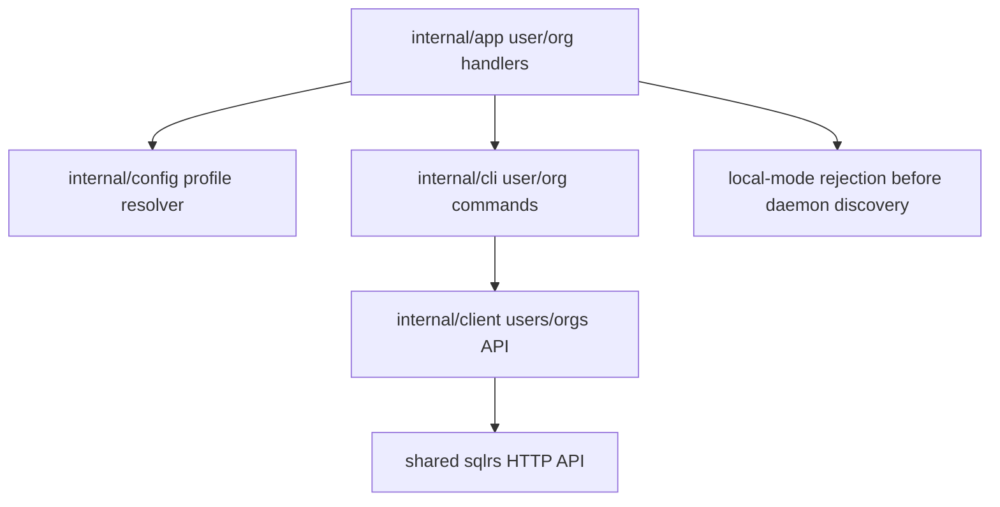
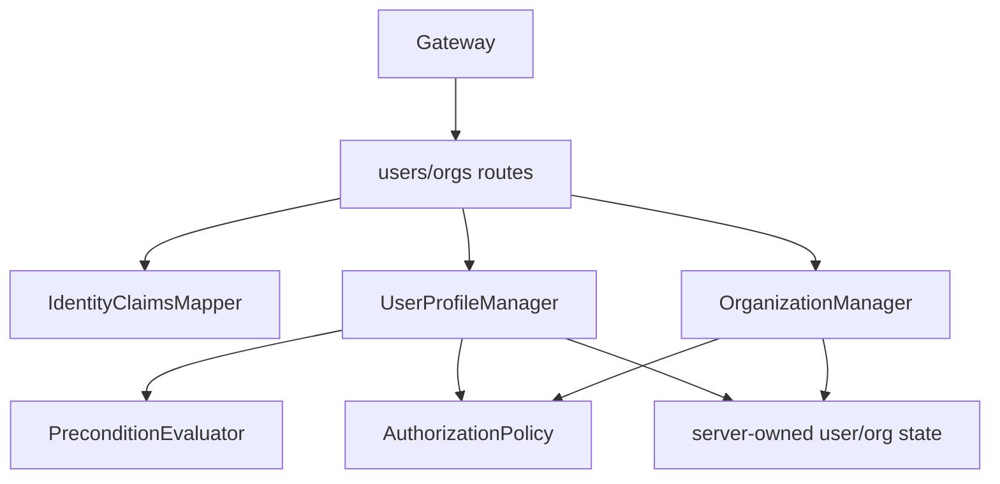

# Компонентная структура управления пользователями и организациями

Этот документ определяет внутреннюю компонентную структуру первого remote-only
среза users/organizations.

Он следует:

- CLI guide: [`../user-guides/sqlrs-users-orgs.md`](../user-guides/sqlrs-users-orgs.md)
- OpenAPI contract:
  [`../api-guides/sqlrs-engine.openapi.yaml`](../api-guides/sqlrs-engine.openapi.yaml)
- Interaction flow: [`user-org-flow.RU.md`](user-org-flow.RU.md)

## 1. Scope и предпосылки

- Срез покрывает:
  - `sqlrs user me`
  - `sqlrs user register`
  - `sqlrs user create`
  - `sqlrs org create`
  - `sqlrs org ls`
  - `sqlrs org get`
- CLI команды являются командами remote/shared deployment. Local mode
  отклоняет их до discovery или autostart локального engine.
- Записи user profile используют conditional `PUT`:
  - `PUT /v1/users/me` для self-registration и current-user updates.
  - `PUT /v1/users/by-identity` для administrator provisioning и updates по
    явной external identity.
- Первый CLI-срез экспортирует только create-команды. API резервирует
  `If-Match: <etag>` update semantics для будущих update-команд.
- Локальный engine не экспортирует `/v1/users*` или `/v1/organizations*`.
- DB schema changes не входят в текущий client slice. Remote API provider
  владеет persistence, а технология хранения здесь намеренно не выбирается.

## 2. Deployment units

### CLI (`frontend/cli-go`)

CLI владеет command parsing, проверками profile mode, сборкой conditional
requests, error mapping и rendering.

| Модуль | Ответственность |
| --- | --- |
| `internal/app` | Dispatch command groups `user` и `org`; парсить command arguments; резолвить выбранный profile; отклонять local mode до daemon discovery/autostart; маппить usage и transport failures в exit codes. |
| `internal/cli` | Оркестрировать выполнение user/org команд и рендерить human/JSON output. Реализовать command-level поведение вроде follow-up `GET /v1/users/me` после `412` у `user register`. |
| `internal/client` | Владеть typed HTTP methods, request/response structs, обработкой ETag/Location, conditional headers и decoding remote errors для user/org endpoints. |
| `internal/config` | Предоставлять данные выбранного remote profile: base URL, bearer token и profile mode. Не владеет user/org records. |
| `internal/daemon` | Не используется этими командами; local-mode rejection должен происходить до вызова этого package. |

### Local engine (`backend/local-engine-go`)

Новые компоненты локального engine не добавляются.

`internal/httpapi` не должен route-ить `/v1/users*` или `/v1/organizations*` в
local deployments. Существующие local auth, registry, prepare, run, deletion и
config components сохраняют текущие обязанности без изменений.

### Shared services

Текущая цель реализации - CLI client. Shared service items ниже описывают
поведение remote API provider, на которое опираются client и OpenAPI contract;
этот slice не добавляет server package или storage schema.

| Component | Responsibility |
| --- | --- |
| **Gateway** | Экспортирует remote-only user/org API routes; проверяет bearer token-ы; выводит actor claims; отклоняет missing/invalid auth через `401`; форвардит authorized requests в User Profile Service. |
| **User Profile Service** | Владеет lifecycle rules для user profiles, external identities, organizations и memberships; применяет self-registration policy; применяет administrator authorization для `by-identity`; обеспечивает conditional write semantics. |
| **Server-owned user/org state** | Хранит user profiles, external identity links, organizations, memberships и ETag-и за API. Enforce-ит identity и slug uniqueness. Технология хранения вне этого slice. |

## 3. Предлагаемый CLI package/file layout

### `frontend/cli-go/internal/app`

- `user_command.go`
  - Определяет `sqlrs user`.
  - Маршрутизирует `me`, `register` и `create`.
  - Запрещает identity flags на `register`.
  - Требует identity issuer/subject на `create`.
  - Отклоняет все `user` subcommands в local mode до local engine discovery.
- `org_command.go`
  - Определяет `sqlrs org`.
  - Маршрутизирует `create`, `ls` и `get`.
  - Парсит `<slug>`, `<org-ref>` и `--name`.
  - Отклоняет все `org` subcommands в local mode до local engine discovery.

### `frontend/cli-go/internal/cli`

- `commands_user.go`
  - `RunUserMe`
  - `RunUserRegister`
  - `RunUserCreate`
  - Human/JSON rendering helpers для `UserProfileResult`.
- `commands_org.go`
  - `RunOrgCreate`
  - `RunOrgList`
  - `RunOrgGet`
  - Human/JSON rendering helpers для `OrganizationMembershipView`.
- `user_org_errors.go`
  - Stable command-facing error mapping для `401`, `403`, `404`, `409`,
    `412` и `428`.

### `frontend/cli-go/internal/client`

- `users.go`
  - `GetCurrentUser(ctx)`
  - `PutCurrentUserCreateOnly(ctx, UserProfileWriteRequest)`
  - `PutCurrentUserUpdateOnly(ctx, etag, UserProfileWriteRequest)`
  - `GetUserByIdentity(ctx, IdentityKey)`
  - `PutUserByIdentityCreateOnly(ctx, IdentityKey, UserProfileWriteRequest)`
  - `PutUserByIdentityUpdateOnly(ctx, IdentityKey, etag, UserProfileWriteRequest)`
- `organizations.go`
  - `CreateOrganization(ctx, OrganizationCreateRequest)`
  - `ListOrganizations(ctx)`
  - `GetOrganization(ctx, orgRef)`
- `user_org_types.go`
  - Remote API request/response structs и ETag-aware result wrappers.

Первая реализация может оставить update-only client methods неиспользуемыми со
стороны CLI-команд, но их request/response semantics принадлежат
`internal/client`, потому что OpenAPI surface уже их определяет.

## 4. Граница remote API provider

Точный server layout вне scope текущего client slice, но client предполагает,
что remote API provider соблюдает следующие границы.

### Gateway

- `users_routes`
  - Route `GET/PUT /v1/users/me`.
  - Route `GET/PUT /v1/users/by-identity`.
  - Требует authentication до forwarding.
  - Передает validated actor claims и raw HTTP precondition headers.
- `organizations_routes`
  - Route `GET/POST /v1/organizations`.
  - Route `GET /v1/organizations/{orgRef}`.
  - Требует authentication до forwarding.

Gateway проверяет token-ы и выводит actor claims, но не создает и не мутирует
user/org records напрямую.

### User Profile Service

- `IdentityClaimsMapper`
  - Преобразует validated OAuth/OIDC claims в `IdentityKey`.
  - Владеет правилом, что `/v1/users/me` никогда не доверяет
    client-supplied target identity fields.
- `PreconditionEvaluator`
  - Требует ровно один из `If-None-Match` или `If-Match`.
  - Возвращает `428` для missing preconditions, `400` для conflicting
    preconditions и `412` для failed create-only или update-only checks.
- `UserProfileManager`
  - Реализует `GetCurrentUser`.
  - Реализует `PutCurrentUser` с actor identity key.
  - Реализует `GetUserByIdentity`.
  - Реализует `PutUserByIdentity` после administrator authorization.
  - Enforce-ит self-registration policy для current-user create-only writes.
- `OrganizationManager`
  - Реализует listing и lookup видимых organizations.
  - Реализует organization creation и first admin membership атомарно.
  - Enforce-ит first-slice one-membership-per-user creation policy.
- `AuthorizationPolicy`
  - Решает, может ли current actor provision/update другого user.
- `ServerState`
  - Хранит и возвращает API-observable user/org state.
  - Enforce-ит uniqueness по `provider + issuer + subject`.
  - Enforce-ит unique organization slugs.
  - Выполняет organization creation и first admin membership атомарно с точки
    зрения API consumer.

## 5. Ключевые типы и interfaces

- `IdentityKey`
  - `provider`, `issuer` и `subject`.
- `ActorContext`
  - Authenticated principal data, derived current `IdentityKey` и
    authorization attributes.
- `WritePrecondition`
  - `create_only` для `If-None-Match: *` или `update_only` с конкретным ETag
    для `If-Match`.
- `EntityTag`
  - Opaque version token, возвращаемый user profile reads и writes.
- `UserProfileWriteRequest`
  - Optional `display_name` и `email`.
- `UserProfileResult`
  - User profile, linked identities, memberships, optional `status`.
- `OrganizationCreateRequest`
  - Slug и optional display name.
- `OrganizationMembershipView`
  - Organization плюс membership текущего user.
- `UserProfileManager`
  - Service-facing interface для user reads и conditional writes.
- `OrganizationManager`
  - Service-facing interface для organization reads и creation.
- `AuthorizationPolicy`
  - Interface для self-registration и administrator-provisioning decisions.

## 6. Владение данными

- **CLI profile config** является file-based и принадлежит `internal/config`.
- **CLI command options, HTTP requests и ETag-и** являются in-memory data одного
  invocation. CLI не кеширует user profiles, organizations, memberships или
  ETag-и persistent-но.
- **Bearer tokens** выбираются из remote profile и отправляются в shared API.
  User/org commands не вводят login или token-refresh component в этом срезе.
- **Gateway actor claims** являются transient request context.
- **User profiles, external identity links, organizations, memberships, ETag-и
  и uniqueness guarantees** принадлежат remote API provider. Client наблюдает
  их только через HTTP responses и error codes.
- **Local engine state** не владеет user/org данными и не читается/пишется
  этими командами.

## 7. Dependency diagrams

### CLI

### Shared services

## 8. Ссылки

- User guide: [`../user-guides/sqlrs-users-orgs.md`](../user-guides/sqlrs-users-orgs.md)
- API contract:
  [`../api-guides/sqlrs-engine.openapi.yaml`](../api-guides/sqlrs-engine.openapi.yaml)
- Interaction flow: [`user-org-flow.RU.md`](user-org-flow.RU.md)
- CLI contract: [`cli-contract.RU.md`](cli-contract.RU.md)
- CLI component structure: [`cli-component-structure.RU.md`](cli-component-structure.RU.md)
- Local deployment architecture:
  [`local-deployment-architecture.RU.md`](local-deployment-architecture.RU.md)
- Shared deployment architecture:
  [`shared-deployment-architecture.RU.md`](shared-deployment-architecture.RU.md)
