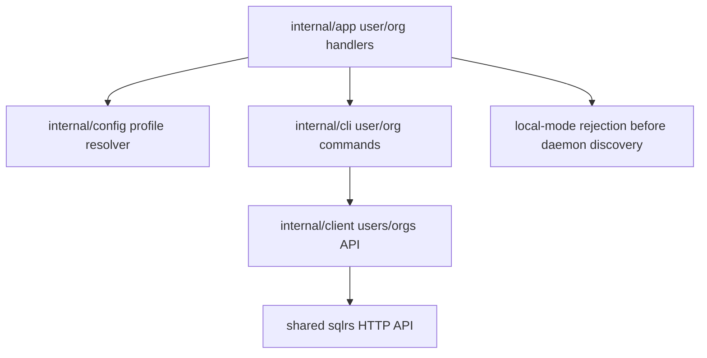
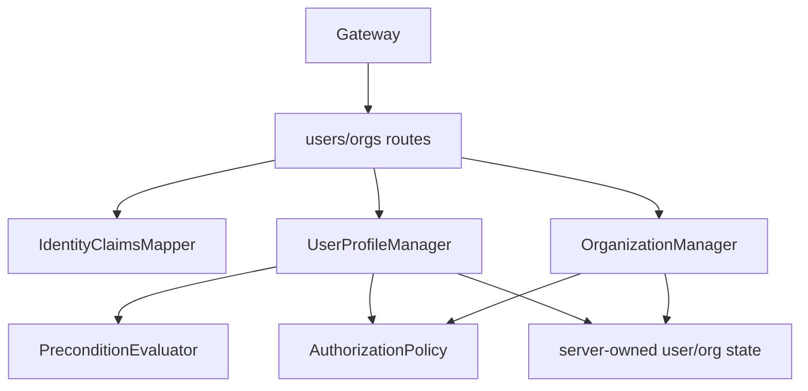

# User and Organization Management Component Structure

This document defines the internal component structure for the first
remote-only users/organizations slice.

It follows:

- CLI guide: [`../user-guides/sqlrs-users-orgs.md`](../user-guides/sqlrs-users-orgs.md)
- OpenAPI contract:
  [`../api-guides/sqlrs-engine.openapi.yaml`](../api-guides/sqlrs-engine.openapi.yaml)
- Interaction flow: [`user-org-flow.md`](user-org-flow.md)

## 1. Scope and assumptions

- The slice covers:
  - `sqlrs user me`
  - `sqlrs user register`
  - `sqlrs user create`
  - `sqlrs org create`
  - `sqlrs org ls`
  - `sqlrs org get`
- The CLI commands are remote/shared deployment commands. Local mode rejects
  them before local engine discovery or autostart.
- User profile writes use conditional `PUT`:
  - `PUT /v1/users/me` for self-registration and current-user updates.
  - `PUT /v1/users/by-identity` for administrator provisioning and updates by
    explicit external identity.
- The first CLI slice exposes create commands only. The API reserves
  `If-Match: <etag>` update semantics for later update commands.
- The local engine does not expose `/v1/users*` or `/v1/organizations*`.
- No database schema changes are part of this client slice. The remote API
  provider owns persistence, and its storage technology is intentionally
  unspecified here.

## 2. Deployment units

### CLI (`frontend/cli-go`)

The CLI owns command parsing, profile-mode checks, conditional request setup,
error mapping, and rendering.

| Module | Responsibility |
| --- | --- |
| `internal/app` | Dispatch `user` and `org` command groups; parse command arguments; resolve the selected profile; reject local mode before daemon discovery/autostart; map usage and transport failures to exit codes. |
| `internal/cli` | Orchestrate user/org command execution and render human/JSON output. Implement command-level behavior such as `user register` following `412` with `GET /v1/users/me`. |
| `internal/client` | Own typed HTTP methods, request/response structs, ETag/Location handling, conditional headers, and remote error decoding for user/org endpoints. |
| `internal/config` | Provide selected remote profile data: base URL, non-secret auth settings, and profile mode. It does not own user/org records or OIDC credentials. |
| `internal/daemon` | Not used by these commands; local-mode rejection must happen before this package is called. |

### Local engine (`backend/local-engine-go`)

No new local engine components are introduced.

`internal/httpapi` must not route `/v1/users*` or `/v1/organizations*` in local
deployments. Existing local auth, registry, prepare, run, deletion, and config
components keep their current responsibilities unchanged.

### Shared services

The current implementation target is the CLI client. The shared service items
below describe the remote API provider behavior assumed by the client and
OpenAPI contract; this slice does not add a server package or storage schema.

| Component | Responsibility |
| --- | --- |
| **Gateway** | Expose remote-only user/org API routes; validate bearer tokens; derive actor claims; reject missing/invalid auth with `401`; forward authorized requests to User Profile Service. |
| **User Profile Service** | Own user profile, external identity, organization, and membership lifecycle rules; apply self-registration policy; apply administrator authorization for `by-identity`; enforce conditional write semantics. |
| **Server-owned user/org state** | Store user profiles, external identity links, organizations, memberships, and ETags behind the API. Enforce identity and slug uniqueness. The storage technology is outside this slice. |

## 3. Suggested CLI package/file layout

### `frontend/cli-go/internal/app`

- `user_command.go`
  - Detect `sqlrs user`.
  - Route `me`, `register`, and `create`.
  - Reject identity flags on `register`.
  - Require identity issuer/subject on `create`.
  - Reject all `user` subcommands in local mode before local engine discovery.
- `org_command.go`
  - Detect `sqlrs org`.
  - Route `create`, `ls`, and `get`.
  - Parse `<slug>`, `<org-ref>`, and `--name`.
  - Reject all `org` subcommands in local mode before local engine discovery.

### `frontend/cli-go/internal/cli`

- `commands_user.go`
  - `RunUserMe`
  - `RunUserRegister`
  - `RunUserCreate`
  - Human/JSON rendering helpers for `UserProfileResult`.
- `commands_org.go`
  - `RunOrgCreate`
  - `RunOrgList`
  - `RunOrgGet`
  - Human/JSON rendering helpers for `OrganizationMembershipView`.
- `user_org_errors.go`
  - Stable command-facing error mapping for `401`, `403`, `404`, `409`,
    `412`, and `428`.

### `frontend/cli-go/internal/client`

- `users.go`
  - `GetCurrentUser(ctx)`
  - `PutCurrentUserCreateOnly(ctx, UserProfileWriteRequest)`
  - `PutCurrentUserUpdateOnly(ctx, etag, UserProfileWriteRequest)`
  - `GetUserByIdentity(ctx, IdentityKey)`
  - `PutUserByIdentityCreateOnly(ctx, IdentityKey, UserProfileWriteRequest)`
  - `PutUserByIdentityUpdateOnly(ctx, IdentityKey, etag, UserProfileWriteRequest)`
- `organizations.go`
  - `CreateOrganization(ctx, OrganizationCreateRequest)`
  - `ListOrganizations(ctx)`
  - `GetOrganization(ctx, orgRef)`
- `user_org_types.go`
  - Remote API request/response structs and ETag-aware result wrappers.

The first implementation can leave update-only client methods unused by CLI
commands, but their request/response semantics belong in `internal/client`
because the OpenAPI surface already defines them.

## 4. Remote API provider boundary

The exact server layout is outside this client slice, but the client assumes
the remote API provider observes the following boundaries.

### Gateway

- `users_routes`
  - Route `GET/PUT /v1/users/me`.
  - Route `GET/PUT /v1/users/by-identity`.
  - Require authentication before forwarding.
  - Forward validated actor claims and raw HTTP precondition headers.
- `organizations_routes`
  - Route `GET/POST /v1/organizations`.
  - Route `GET /v1/organizations/{orgRef}`.
  - Require authentication before forwarding.

Gateway validates tokens and derives actor claims, but it does not create or
mutate user/org records directly.

### User Profile Service

- `IdentityClaimsMapper`
  - Convert validated OAuth/OIDC claims into `IdentityKey`.
  - Own the rule that `/v1/users/me` never trusts client-supplied target
    identity fields.
- `PreconditionEvaluator`
  - Require exactly one of `If-None-Match` or `If-Match`.
  - Return `428` for missing preconditions, `400` for conflicting
    preconditions, and `412` for failed create-only or update-only checks.
- `UserProfileManager`
  - Implement `GetCurrentUser`.
  - Implement `PutCurrentUser` using the actor identity key.
  - Implement `GetUserByIdentity`.
  - Implement `PutUserByIdentity` after administrator authorization.
  - Enforce self-registration policy for current-user create-only writes.
- `OrganizationManager`
  - Implement visible organization listing and lookup.
  - Implement organization creation and first admin membership atomically.
  - Enforce the first-slice one-membership-per-user creation policy.
- `AuthorizationPolicy`
  - Decide whether the current actor can provision or update another user.
- `ServerState`
  - Stores and returns the API-observable user/org state.
  - Enforces uniqueness over `provider + issuer + subject`.
  - Enforces unique organization slugs.
  - Performs organization creation and first admin membership atomically from
    the API consumer's perspective.

## 5. Key types and interfaces

- `IdentityKey`
  - `provider`, `issuer`, and `subject`.
- `ActorContext`
  - Authenticated principal data, derived current `IdentityKey`, and
    authorization attributes.
- `WritePrecondition`
  - `create_only` for `If-None-Match: *` or `update_only` with a concrete ETag
    for `If-Match`.
- `EntityTag`
  - Opaque version token returned with user profile reads and writes.
- `UserProfileWriteRequest`
  - Optional `display_name` and `email`.
- `UserProfileResult`
  - User profile, linked identities, memberships, optional `status`.
- `OrganizationCreateRequest`
  - Slug and optional display name.
- `OrganizationMembershipView`
  - Organization plus the current user's membership.
- `UserProfileManager`
  - Service-facing interface for user reads and conditional writes.
- `OrganizationManager`
  - Service-facing interface for organization reads and creation.
- `AuthorizationPolicy`
  - Interface for self-registration and administrator-provisioning decisions.

## 6. Data ownership

- **CLI profile config** is file-based and belongs to `internal/config`.
- **CLI command options, HTTP requests, and ETags** are in-memory data for one
  invocation. The CLI does not cache user profiles, organizations, memberships,
  or ETags persistently.
- **Bearer tokens** are resolved by the auth session layer before protected
  remote API calls and sent to the shared API. User/org commands do not own
  login, refresh-token storage, or token refresh; they consume the effective
  bearer token selected for the remote profile.
- **Gateway actor claims** are transient request context.
- **User profiles, external identity links, organizations, memberships, ETags,
  and uniqueness guarantees** are owned by the remote API provider. The client
  observes them only through HTTP responses and error codes.
- **Local engine state** has no user/org ownership and is not read or written
  by these commands.

## 7. Dependency diagrams

### CLI

### Shared services

## 8. References

- User guide: [`../user-guides/sqlrs-users-orgs.md`](../user-guides/sqlrs-users-orgs.md)
- API contract:
  [`../api-guides/sqlrs-engine.openapi.yaml`](../api-guides/sqlrs-engine.openapi.yaml)
- Interaction flow: [`user-org-flow.md`](user-org-flow.md)
- CLI contract: [`cli-contract.md`](cli-contract.md)
- CLI auth flow: [`cli-auth-flow.md`](cli-auth-flow.md)
- CLI component structure: [`cli-component-structure.md`](cli-component-structure.md)
- Local deployment architecture:
  [`local-deployment-architecture.md`](local-deployment-architecture.md)
- Shared deployment architecture:
  [`shared-deployment-architecture.md`](shared-deployment-architecture.md)
