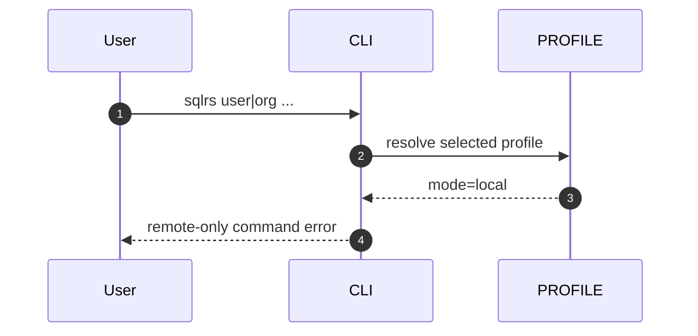
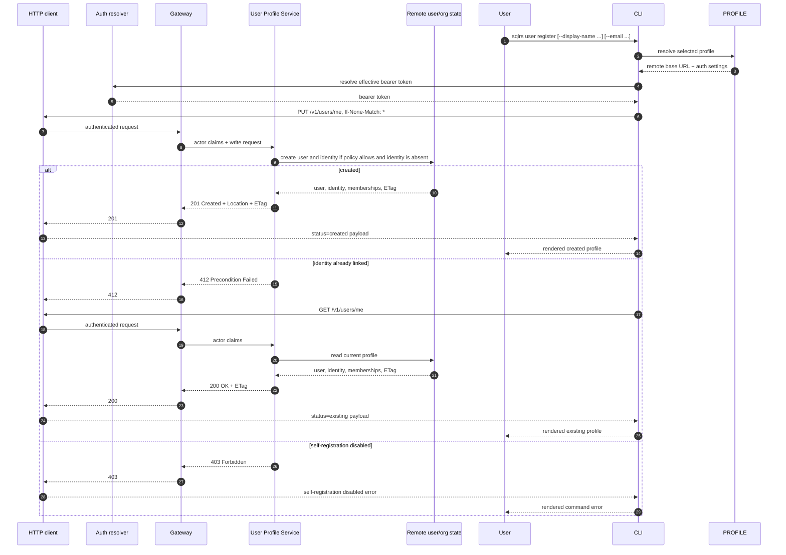
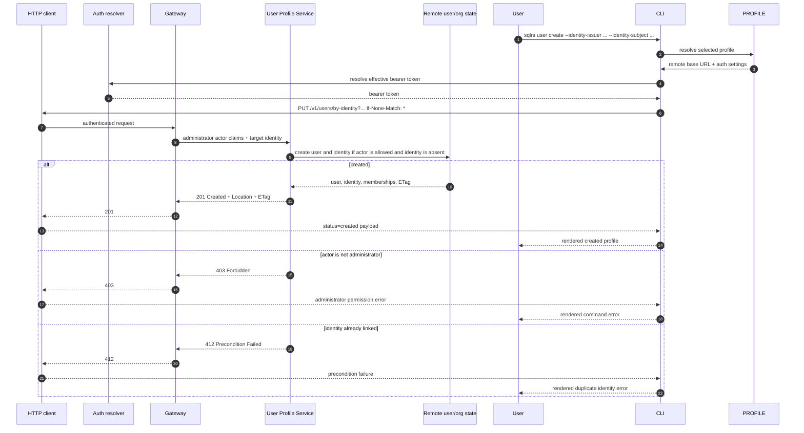
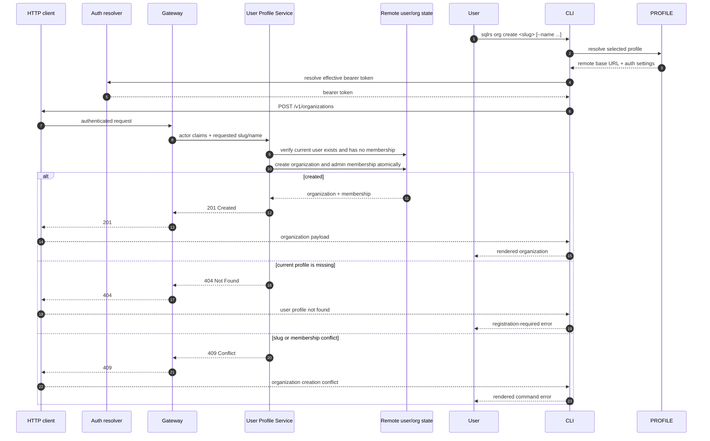
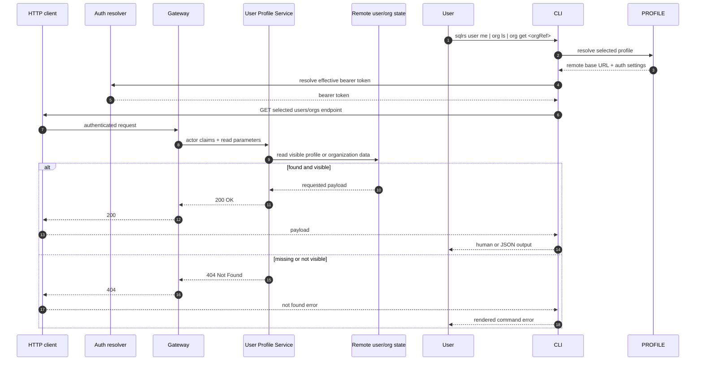

# Поток управления пользователями и организациями

Этот документ описывает remote-only interaction flow для первого среза
users/organizations.

Он следует принятой форме CLI из
[`../user-guides/sqlrs-users-orgs.md`](../user-guides/sqlrs-users-orgs.md) и
API контракту в
[`../api-guides/sqlrs-engine.openapi.yaml`](../api-guides/sqlrs-engine.openapi.yaml).

Локальный engine не реализует этот срез. CLI отклоняет команды `sqlrs user` и
`sqlrs org` в local mode до discovery или autostart локального engine.

## 1. Участники

- **User** - вызывает `sqlrs user` или `sqlrs org`.
- **CLI parser** - разбирает аргументы команды и output mode.
- **Profile resolver** - загружает выбранный профиль и определяет, является ли
  он local или remote/shared.
- **Auth resolver** - разрешает effective bearer token для выбранного remote
  profile, включая `SQLRS_TOKEN` override и refresh stored OIDC session.
- **HTTP client** - отправляет аутентифицированные `/v1/*` запросы и маппит
  HTTP ошибки в command errors.
- **Gateway** - проверяет bearer token-ы, выводит actor claims, применяет
  coarse authN/authZ и форвардит запросы.
- **User Profile Service** - владеет user profiles, external identity links,
  organizations и memberships.
- **Remote user/org state** - server-owned state за API. Технология хранения
  находится вне scope текущего client slice.
- **Renderer** - печатает human или JSON результаты.

## 2. Маппинг endpoint-ов

| CLI command | API operation | Notes |
| --- | --- | --- |
| `sqlrs user me` | `GET /v1/users/me` | Читает текущий зарегистрированный profile. |
| `sqlrs user register` | `PUT /v1/users/me` with `If-None-Match: *` | Создает текущий profile из bearer-token identity claims. |
| `sqlrs user create` | `PUT /v1/users/by-identity?...` with `If-None-Match: *` | Administrator create-only provisioning другой external identity. |
| `sqlrs org create` | `POST /v1/organizations` | Создает organization и первую admin membership для текущего user. |
| `sqlrs org ls` | `GET /v1/organizations` | Выводит organizations, видимые текущему user. |
| `sqlrs org get` | `GET /v1/organizations/{orgRef}` | Читает одну видимую organization по id или slug. |

Первый CLI-срез экспортирует только create-команды. API уже резервирует
`If-Match: <etag>` на user `PUT` endpoint-ах для update-only изменений
profile, чтобы clients могли различать create, retry и update intent через
стандартные HTTP preconditions.

## 3. Поток: отклонение local mode

Команда должна остановиться до daemon lookup, чтения `engine.json` или autostart
локального engine. Local deployments не экспортируют `/v1/users*` или
`/v1/organizations*`.

## 4. Поток: `sqlrs user register`

В этом потоке сервер, а не CLI, выводит identity key из проверенных
bearer-token claims. CLI не должен принимать явные identity flags для
`user register`.

## 5. Поток: `sqlrs user create`

`user create` не скрывает duplicate create attempts как успешный CLI output:
повторный create-only запрос для уже linked identity показывается как
precondition failure, чтобы administrator мог вручную проверить существующий
profile. При этом HTTP метод остается безопасным для retry после сетевой
неопределенности, потому что identity tuple является естественным resource key.

## 6. Поток: `sqlrs org create`

Первый срез намеренно допускает одну organization membership на пользователя
на момент создания. Более поздние срезы membership и invitations смогут
ослабить эту политику без изменения формы команды.

## 7. Поток: чтение

Чтение организаций выполняется в области видимости текущего user. Non-member
получает `404`, чтобы не раскрывать видимость organization.

## 8. Обработка ошибок

- `401` означает, что сервер отклонил effective bearer token.
- Missing, expired, revoked или unavailable local OIDC session обрабатывается
  auth resolver до user/org API request и должна подсказывать пользователю
  выполнить `sqlrs auth login google`.
- `403` на `user register` означает, что self-registration отключена для
  unlinked current identity.
- `403` на `user create` означает, что требуется administrator permission.
- `404` на `user me`, `org ls` или `org get` означает, что current user profile
  или visible organization не существует.
- `412` на create-only user `PUT` означает, что target identity уже linked; вторая
  user entity не создается.
- `428` на user `PUT` означает client bug: пропущен обязательный HTTP
  precondition.
- `409` на `org create` означает, что organization slug занят или политика
  первого среза отклонила еще одну organization для текущего user.

## 9. Follow-ups вне scope

- Поддержка user или organization endpoint-ов в local engine.
- Email invitations, membership changes, роли кроме `admin`, удаление
  organization или user.
- Изменения CLI login/session management; user/org команды потребляют
  effective bearer token, выбранный auth slice.
- Organization-scoped authorization changes для prepare/run workflows.
