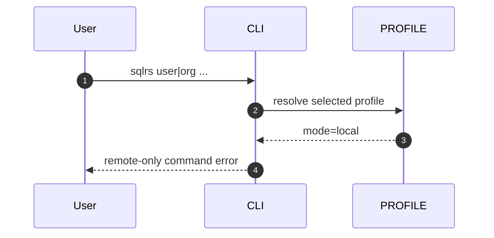
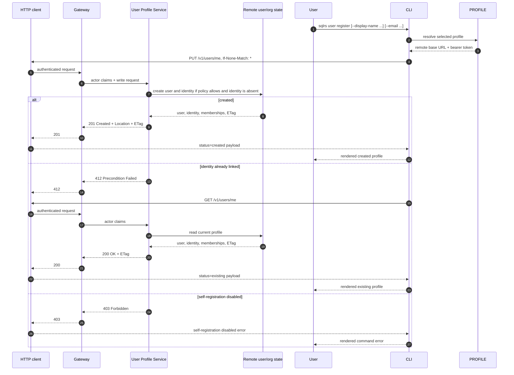
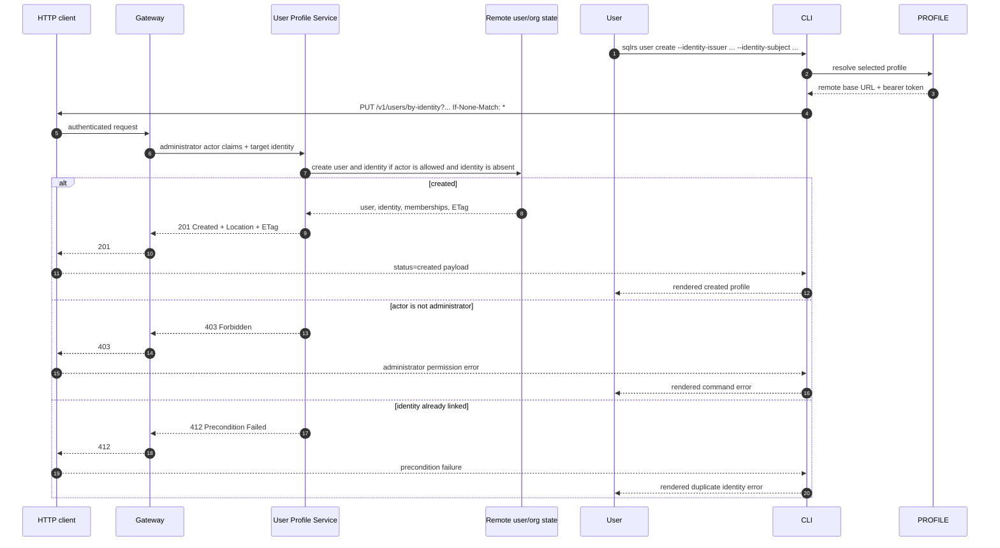
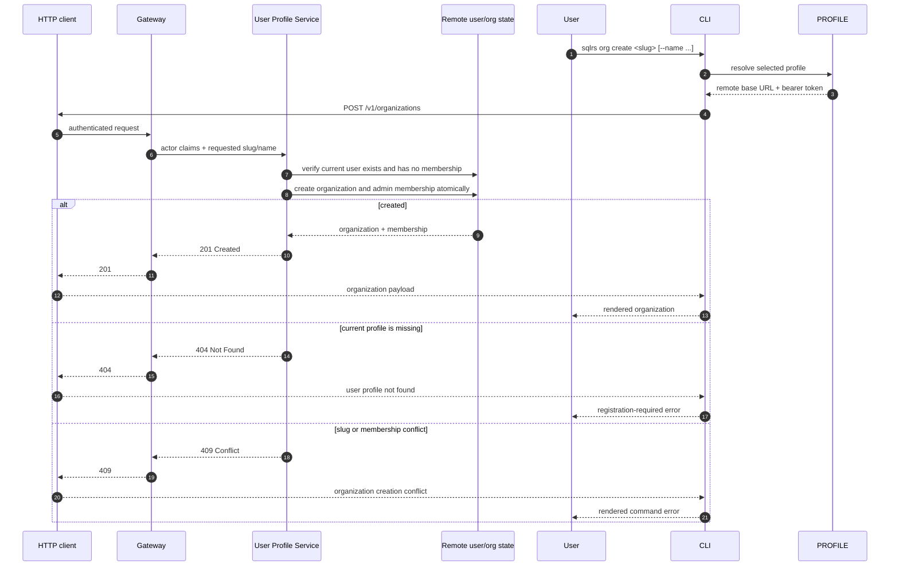
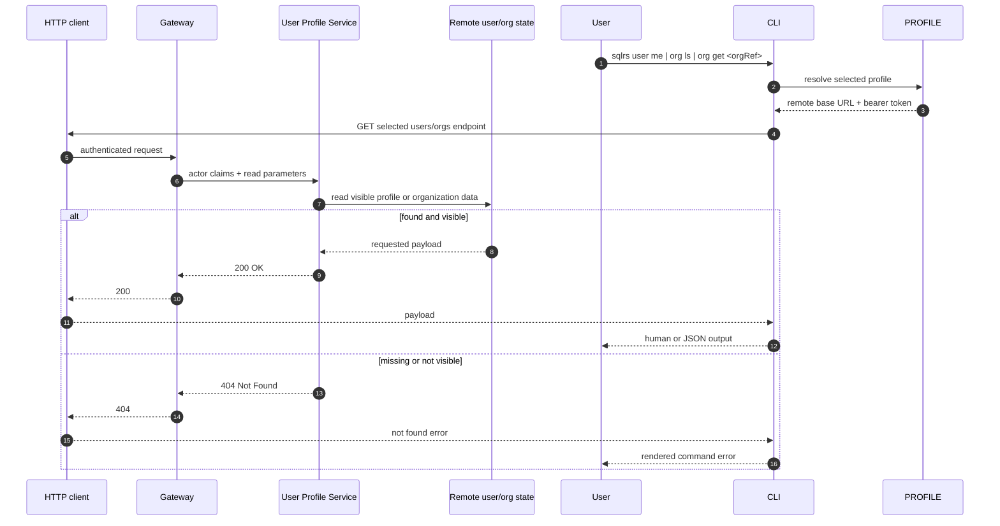

# User and Organization Management Flow

This document describes the remote-only interaction flow for the first
users/organizations slice.

It follows the accepted CLI shape in
[`../user-guides/sqlrs-users-orgs.md`](../user-guides/sqlrs-users-orgs.md) and
the API contract in
[`../api-guides/sqlrs-engine.openapi.yaml`](../api-guides/sqlrs-engine.openapi.yaml).

The local engine does not implement this slice. The CLI rejects `sqlrs user`
and `sqlrs org` commands in local mode before local engine discovery or
autostart.

## 1. Participants

- **User** - invokes `sqlrs user` or `sqlrs org`.
- **CLI parser** - parses command arguments and output mode.
- **Profile resolver** - loads the selected profile and determines whether it
  is local or remote/shared.
- **HTTP client** - sends authenticated `/v1/*` requests and maps HTTP errors
  into command errors.
- **Gateway** - validates bearer tokens, derives actor claims, applies coarse
  authN/authZ, and forwards requests.
- **User Profile Service** - owns user profiles, external identity links,
  organizations, and memberships.
- **Remote user/org state** - server-owned state behind the API. Its storage
  technology is outside this client slice.
- **Renderer** - prints human or JSON results.

## 2. Endpoint Mapping

| CLI command | API operation | Notes |
| --- | --- | --- |
| `sqlrs user me` | `GET /v1/users/me` | Reads the current registered profile. |
| `sqlrs user register` | `PUT /v1/users/me` with `If-None-Match: *` | Creates the current profile from bearer-token identity claims. |
| `sqlrs user create` | `PUT /v1/users/by-identity?...` with `If-None-Match: *` | Administrator create-only provisioning for another external identity. |
| `sqlrs org create` | `POST /v1/organizations` | Creates an organization and first admin membership for the current user. |
| `sqlrs org ls` | `GET /v1/organizations` | Lists organizations visible to the current user. |
| `sqlrs org get` | `GET /v1/organizations/{orgRef}` | Reads one visible organization by id or slug. |

The first CLI slice exposes create commands only. The API already reserves
`If-Match: <etag>` on user `PUT` endpoints for update-only profile changes so
clients can distinguish create, retry, and update intent with standard HTTP
preconditions.

## 3. Flow: Local-Mode Rejection

The command must stop before daemon lookup, `engine.json` reads, or local
engine autostart. Local deployments do not expose `/v1/users*` or
`/v1/organizations*`.

## 4. Flow: `sqlrs user register`

The server, not the CLI, derives the identity key for this flow from validated
bearer-token claims. The CLI must not accept explicit identity flags on
`user register`.

## 5. Flow: `sqlrs user create`

`user create` does not hide duplicate create attempts as successful CLI output:
a repeated create-only request for an already linked identity is surfaced as a
precondition failure so an administrator can inspect the existing profile before
taking manual action. The underlying HTTP method remains safe to retry after
network ambiguity because the identity tuple is the natural resource key.

## 6. Flow: `sqlrs org create`

The first slice intentionally allows one organization membership per user at
creation time. Later membership and invitation slices can relax that policy
without changing the command shape.

## 7. Flow: Reads

Organization reads are scoped to the current user. A non-member receives `404`
instead of a visibility leak.

## 8. Failure Handling

- `401` means the selected remote profile has no valid bearer token or the
  server rejected it.
- `403` on `user register` means self-registration is disabled for an unlinked
  current identity.
- `403` on `user create` means administrator permission is required.
- `404` on `user me`, `org ls`, or `org get` means the current user profile or
  visible organization does not exist.
- `412` on create-only user `PUT` means the target identity is already linked;
  no second user entity is created.
- `428` on user `PUT` means a client bug omitted the required HTTP
  precondition.
- `409` on `org create` means the organization slug is taken or the first-slice
  membership policy rejected another organization for the current user.

## 9. Out-of-Scope Follow-Ups

- Local engine support for user or organization endpoints.
- Email invitations, membership changes, roles beyond `admin`, organization
  deletion, or user deletion.
- First-class CLI login.
- Organization-scoped authorization changes for prepare/run workflows.
