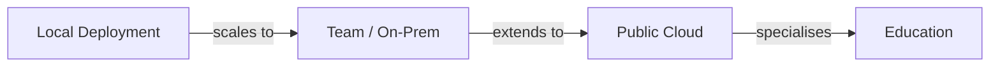
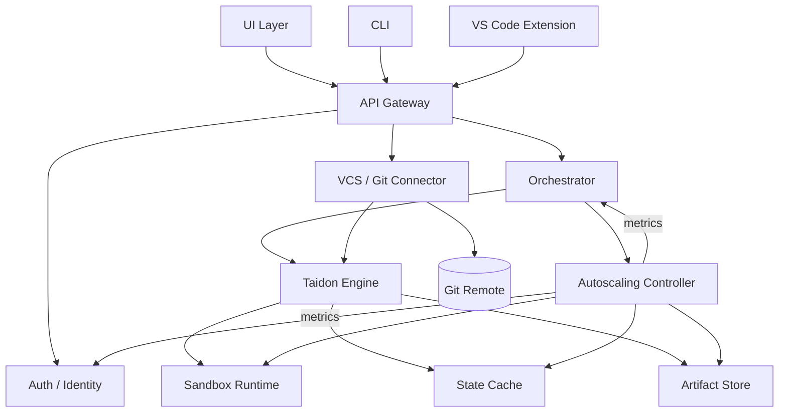

# Taidon: требования и архитектура

> Артефакты дизайна проекта, полученные из обзора сценариев и позиционирования.

---

## Содержание

- [1. Требования](#1-требования)
  - [1.1 Персоны](#11-персоны)
  - [1.2 Сценарии использования](#12-сценарии-использования)
  - [1.3 Use cases](#13-use-cases)
- [2. Архитектура](#2-архитектура)
  - [2.1 Модели деплоймента и соответствие сценариям](#21-модели-деплоймента-и-соответствие-сценариям)
  - [2.2 Модель компонентов](#22-модель-компонентов)

---

## 1. Требования

### 1.1 Персоны

#### P1. Корпоративный разработчик

- Работает над продуктом с реляционной БД
- Использует Liquibase (или raw SQL миграции)
- Нужны быстрые, воспроизводимые окружения БД для тестов и экспериментов
- Работает локально и/или внутри корпоративной инфраструктуры

#### P2. Team / Platform инженер

- Поддерживает общую инфраструктуру разработки
- Интегрирует окружения БД в CI/CD пайплайны
- Вводит квоты, контроль доступа и лимиты стоимости

#### P3. Независимый разработчик / исследователь

- Хочет быстро проверить гипотезу
- Не хочет устанавливать или поддерживать локальную инфраструктуру
- Нужно публично делиться результатами с коллегами

#### P4. Преподаватель

- Готовит задания на основе БД
- Нужны контролируемые, воспроизводимые окружения для студентов
- Требуется видимость результатов студентов

#### P5. Студент

- Выполняет эксперименты с БД в рамках курса
- Сдает результаты на проверку
- Может опционально публиковать результаты

---

### 1.2 Сценарии использования

#### A. Корпоративные сценарии

##### A1. Локальная разработка

- Taidon работает локально в минимальной конфигурации
- Выступает как drop-in замена локальному Postgres/MySQL
- Оптимизирован для быстрой итерации и переиспользования состояний БД

##### A2. Team / Department инфраструктура

- Taidon разворачивается on-prem или в приватном облаке
- Разделяется между командой или департаментом
- Интегрируется с CI/CD и корпоративной аутентификацией

#### B. Персональный / публичный cloud сценарий

##### B3. Эксперименты в публичном облаке

- Пользователь получает доступ к Taidon как к hosted-сервису
- Запускает изолированные эксперименты
- Делится результатами через публичные ссылки

#### C. Образовательные сценарии

##### C4a. Подготовка заданий

- Преподаватель готовит базовые БД и задания
- Деплоймент может быть cloud или on-prem (университет)

##### C4b. Выполнение заданий

- Студенты выполняют эксперименты и отправляют результаты
- Преподаватель проверяет сдачи

---

### 1.3 Use cases

| ID   | Use case                              | Акторы         |
| ---- | ------------------------------------- | -------------- |
| UC-1 | Поднять изолированную песочницу БД     | P1, P2, P3, P5 |
| UC-2 | Применить миграции (Liquibase / SQL)   | P1, P2, P4     |
| UC-3 | Запустить тесты / запросы / скрипты    | P1, P3, P5     |
| UC-4 | Кэшировать и переиспользовать состояния| P1, P2         |
| UC-5 | Интегрировать с CI/CD                  | P2             |
| UC-6 | Делить результаты экспериментов        | P3, P5         |
| UC-7 | Готовить задания                       | P4             |
| UC-8 | Сдавать и проверять результаты         | P4, P5         |

---

## 2. Архитектура

### 2.1 Модели деплоймента и соответствие сценариям

#### Профили деплоймента

| Профиль | Описание                          | Сценарии |
| ------- | --------------------------------- | -------- |
| Local   | Single-node, minimal footprint    | A1       |
| Team    | Shared, authenticated, quota-based| A2       |
| Cloud   | Multi-tenant, public access       | B3       |
| Edu     | Cloud или on-prem с курсом        | C4a, C4b |

---

### 2.2 Модель компонентов

#### Высокоуровневая диаграмма компонентов

---

#### Описания компонентов

##### UI Layer

- Web UI (cloud и on-prem)
- Публичные read-only страницы для общих экспериментов

##### CLI

- Основной интерфейс автоматизации и CI
- Используется в локальных и team деплойментах

##### VS Code Extension

- Опциональный слой продуктивности
- Управление песочницами и просмотр результатов

##### API Gateway

- Единый API для всех клиентов
- Один и тот же интерфейс в локальном и cloud режиме

##### Auth / Identity

- Опционален в локальном режиме
- OIDC / SSO / RBAC в team и cloud режимах

##### Orchestrator

- Планирует операции жизненного цикла песочниц
- Применяет квоты и TTL политики

##### Taidon Engine

- Базовая логика жизненного цикла песочниц
- Исполнение миграций и экспериментальных запусков

##### VCS / Git Connector (optional, cloud-first)

- Подключение и синхронизация Git-репозиториев с SQL-проектами
- Доступ к приватным репозиториям через токены/SSO (в облаке)
- Триггеры запуска/обновления песочниц по веткам/коммитам

##### Autoscaling Controller (team/cloud)

- Управляет пулами песочниц и воркеров кэша (HPA/VPA/Cluster Autoscaler)
- Основан на метриках: очередь оркестрации, активные песочницы, CPU/IO узлов хранилища, cache hit/latency
- Теплый пул для снижения cold-start; graceful drain при scale-in

##### Sandbox Runtime

- Изоляция БД (containers, pods, instances)
- Поддерживает несколько DB engine

##### State Cache

- Хранит переиспользуемые состояния БД
- Ключи по engine + migration hash + seed

##### Artifact Store

- Логи, отчеты, дампы, снапшоты
- На файловой системе или object storage

---

## Примечания

- UI компоненты опциональны и зависят от деплоймента
- Core Engine и API неизменны во всех сценариях
- Архитектура намеренно отделяет логику engine от платформенных функций
