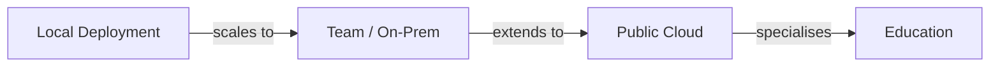
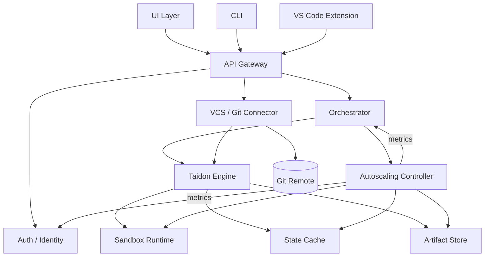

# Taidon: Requirements and Architecture

> Project design artefacts derived from scenario and positioning review.

---

## Table of Contents

- [1. Requirements](#1-requirements)
  - [1.1 Personas](#11-personas)
  - [1.2 Usage Scenarios](#12-usage-scenarios)
  - [1.3 Use Cases](#13-use-cases)
- [2. Architecture](#2-architecture)
  - [2.1 Deployment Models and Scenario Mapping](#21-deployment-models-and-scenario-mapping)
  - [2.2 Component Model](#22-component-model)

---

## 1. Requirements

### 1.1 Personas

#### P1. Corporate Developer

- Works on a product with a relational database
- Uses Liquibase (or raw SQL migrations)
- Needs fast, reproducible database environments for tests and experiments
- Operates locally and/or within corporate infrastructure

#### P2. Team / Platform Engineer

- Maintains shared development infrastructure
- Integrates database environments into CI/CD pipelines
- Enforces quotas, access control, and cost limits

#### P3. Independent Developer / Researcher

- Wants to quickly validate a hypothesis
- Does not want to install or maintain local infrastructure
- Needs to share results publicly with peers

#### P4. Instructor

- Prepares database-based assignments
- Needs controlled, reproducible environments for students
- Requires visibility into student results

#### P5. Student

- Executes database experiments as part of coursework
- Submits results for review
- May optionally publish results

---

### 1.2 Usage Scenarios

#### A. Corporate Scenarios

##### A1. Local Development

- Taidon runs locally in minimal configuration
- Acts as a drop-in replacement for local Postgres/MySQL
- Optimised for fast iteration and reuse of database states

##### A2. Team / Department Infrastructure

- Taidon deployed on-prem or in private cloud
- Shared across a team or department
- Integrated with CI/CD and corporate authentication

#### B. Personal / Public Cloud Scenario

##### B3. Public Cloud Experimentation

- User accesses Taidon as a hosted service
- Runs isolated experiments
- Shares results via public links

#### C. Educational Scenarios

##### C4a. Assignment Preparation

- Instructor prepares base databases and tasks
- Deployment may be cloud-based or on-prem (university)

##### C4b. Assignment Execution

- Students run experiments and submit results
- Instructor reviews submissions

---

### 1.3 Use Cases

| ID   | Use Case                            | Actors         |
| ---- | ----------------------------------- | -------------- |
| UC-1 | Provision isolated database sandbox | P1, P2, P3, P5 |
| UC-2 | Apply migrations (Liquibase / SQL)  | P1, P2, P4     |
| UC-3 | Run tests / queries / scripts       | P1, P3, P5     |
| UC-4 | Cache and reuse database states     | P1, P2         |
| UC-5 | Integrate with CI/CD                | P2             |
| UC-6 | Share experiment results            | P3, P5         |
| UC-7 | Prepare assignments                 | P4             |
| UC-8 | Submit and review results           | P4, P5         |

---

## 2. Architecture

### 2.1 Deployment Models and Scenario Mapping

#### Deployment Profiles

| Profile | Description                        | Scenarios |
| ------- | ---------------------------------- | --------- |
| Local   | Single-node, minimal footprint     | A1        |
| Team    | Shared, authenticated, quota-based | A2        |
| Cloud   | Multi-tenant, public access        | B3        |
| Edu     | Cloud or on-prem with course model | C4a, C4b  |

---

### 2.2 Component Model

#### High-Level Component Diagram

---

#### Component Descriptions

##### UI Layer

- Web UI (cloud and on-prem)
- Public read-only pages for shared experiments

##### CLI

- Primary automation and CI interface
- Used in local and team deployments

##### VS Code Extension

- Optional productivity layer
- Sandbox management and result inspection

##### API Gateway

- Unified API for all clients
- Same interface in local and cloud modes

##### Auth / Identity

- Optional in local mode
- OIDC / SSO / RBAC in team and cloud modes

##### Orchestrator

- Schedules sandbox lifecycle operations
- Enforces quotas and TTL policies

##### Taidon Engine

- Core sandbox lifecycle logic
- Migration execution and experiment runs

##### VCS / Git Connector (optional, cloud-first)

- Connect and sync Git repositories with SQL projects
- Access to private repositories via tokens/SSO (cloud)
- Triggers to start/refresh sandboxes by branch/commit

##### Autoscaling Controller (team/cloud)

- Manages pools of sandboxes and cache workers (HPA/VPA/Cluster Autoscaler)
- Based on metrics: orchestration queue, active sandboxes, storage node CPU/IO, cache hit/latency
- Warm pool to reduce cold-start; graceful drain on scale-in

##### Sandbox Runtime

- Database isolation (containers, pods, instances)
- Supports multiple database engines

##### State Cache

- Stores reusable database states
- Keyed by engine + migration hash + seed

##### Artifact Store

- Logs, reports, dumps, snapshots
- Backed by filesystem or object storage

---

## Notes

- UI components are optional and deployment-dependent
- Core Engine and API remain invariant across all scenarios
- Architecture intentionally separates engine logic from platform features
