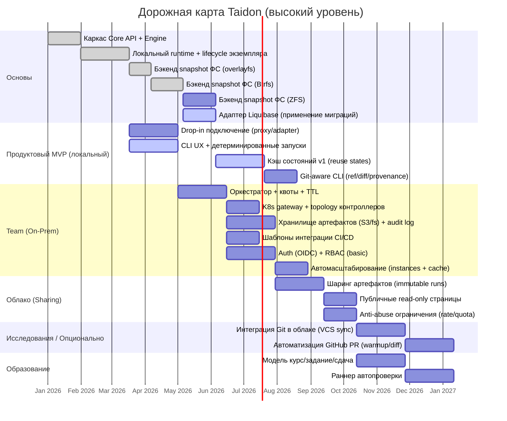

# Roadmap Taidon

Этот roadmap приоритизирует сценарии, use cases и компоненты, чтобы дать раннюю продуктовую ценность при сохранении четкого пути к team (on-prem) и cloud/education предложениям.

---

## Цели и не-цели

### Цели

- Дать быстрый, воспроизводимый database instance для разработчиков (local-first)
- Обеспечить единое инвариантное ядро (Engine + API) для всех профилей деплоймента
- Дать CI/CD интеграцию для team adoption
- Сохранить чистый путь апгрейда к public cloud sharing и образовательным сценариям

### Не-цели (на старте)

- Полный multi-tenant биллинг и платежи
- Поддержка множества DB engines одновременно
- Полный browser-based IDE hosting (VS Code-in-browser)

---

## Обзор дорожной карты

> Даты — placeholder-ы для визуализации порядка. Roadmap построен вокруг milestones.

---

## Статус (на 2026-02-12)

- **Сделано**: локальная поверхность API (health, config, names, instances, runs, states, prepare jobs, tasks), локальный runtime и lifecycle, end-to-end pipeline init/prepare/run, хранение job/task и события, абстракция StateFS, базовая часть state cache и ретеншн, локальная CLI-поверхность (`sqlrs init`, `sqlrs config`, `sqlrs ls`, `sqlrs status`, `sqlrs plan:psql`, `sqlrs plan:lb`, `sqlrs prepare:psql`, `sqlrs prepare:lb`, `sqlrs run:psql`, `sqlrs run:pgbench`, `sqlrs rm`), WSL init flow (включая установку nsenter), логирование instance-delete.
- **Сделано (ФС)**: заглушка snapshot на overlayfs (copy) и бэкенд снимков на Btrfs.
- **В работе**: UX CLI и детерминизм выполнения (`prepare:lb` и `plan:lb` уже реализованы; оставшиеся пробелы parity — алиасы команд и более богатый UX для логов).
- **Запланировано**: drop-in подключение, git-aware CLI, team on-prem оркестрация, облачный sharing, образование.

---

## Milestones

### M0. Архитектурный baseline

**Результат**: стабильные концепты и контракты до тяжелой реализации.

- Зафиксировать канонические сущности: project, instance, run, artefact, share
- Зафиксировать core API surface (create/apply/run/destroy + status/events)
- Принять подход к runtime изоляции для MVP (локальные контейнеры vs альтернативы)

**Статус**: сделано (архитектура закреплена ADR и локальным OpenAPI для engine).

**Ключевые документы, которые нужно подготовить дальше**:

- [`api-contract.md`](api-contract.md)
- [`instance-lifecycle.md`](instance-lifecycle.md)
- [`state-cache-design.md`](architecture/state-cache-design.RU.md)

---

### M1. Local MVP (сценарий A1)

**Основной сценарий**: A1 локальная разработка с Liquibase.

**Целевые use cases**:

- UC-1 Поднять изолированный экземпляр БД
- UC-2 Применить миграции (Liquibase / SQL)
- UC-3 Запустить тесты / запросы / скрипты
- UC-4 Кэшировать и переиспользовать состояния БД

**Deliverables**:

- Taidon Engine + API (локальный режим) — **сделано** (локальный OpenAPI spec)
- Локальный runtime (контейнеры) с lifecycle экземпляра — **сделано**
- CLI (локальный): `sqlrs init`, `sqlrs config`, `sqlrs ls`, `sqlrs status`, `sqlrs plan:psql`, `sqlrs plan:lb`, `sqlrs prepare:psql`, `sqlrs prepare:lb`, `sqlrs run:psql`, `sqlrs run:pgbench`, `sqlrs rm` — **сделано**
- Cache v1 (prepare jobs + reuse state + retention) — **сделано (ядро)**
- Бэкенды snapshot ФС — **сделано** (заглушка overlayfs copy, Btrfs), **в планах** (ZFS)
- Liquibase адаптер (apply changelog) — **в работе** (базовый локальный поток через `prepare:lb`/`plan:lb` уже реализован)
- CLI parity с исходным MVP списком (`apply/status/logs/destroy`) — **в работе** (`status` и эквивалент `destroy` через `rm` уже есть; parity на уровне алиасов и команда `logs` ещё в работе)

**Опционально (nice-to-have)**:

- VS Code extension v0:
  - list instances
  - apply migrations
  - show logs and run results

**Exit criteria**:

- Cold start создает рабочий экземпляр
- Warm start переиспользует кэшированное состояние и значительно быстрее
- Миграции детерминированы и воспроизводимы

**Статус**: в работе (локальный runtime и CLI есть; базовый Liquibase-поток уже реализован; parity и hardening ещё впереди).

---

### M2. Drop-in Replacement (Developer Experience)

**Цель**: сделать adoption почти без трения.

**Целевые use cases**:

- UC-1, UC-2, UC-3 (с минимальной конфигурацией)

**Deliverables**:

- Drop-in стратегия подключения (выбрать одну для MVP):
  - локальный proxy, который поднимает `localhost:<port>` как Postgres/MySQL, или
  - driver/URL адаптер (для выбранных стеков)
- Конвенции конфигурации:
  - обнаружение миграций по layout репозитория
  - профили (dev/test) и обработка секретов
- Git-aware CLI (passive):
  - `--ref` (blob/worktree), `diff`, provenance, cache explain
- VS Code extension v1 (optional):
  - one-click copy DSN
  - открыть SQL редактор (через существующие DB инструменты VS Code)

**Exit criteria**:

- Разработчик может запускать тесты с одним изменением env var (или одной строкой конфига)

---

### M3. Team On-Prem (сценарий A2)

**Основной сценарий**: общий Taidon для команды/департамента.

**Целевые use cases**:

- UC-5 Интеграция с CI/CD
- UC-4 Кэширование и переиспользование состояний БД (shared)
- UC-1..UC-3 в масштабе

**Deliverables**:

- Orchestrator service:
  - job queue
  - quotas
  - TTL политики
- K8s shared deployment baseline:
  - единый entrypoint Gateway (TCP)
  - controller-managed DB runner pods
- Artifact store:
  - логи, отчеты, экспорты
  - retention политики
- Auth и RBAC (basic):
  - OIDC login
  - organisation/team scopes
- CI шаблоны:
  - GitHub Actions / GitLab CI примеры
- Autoscaling controller (instances + cache workers):
  - HPA/VPA профили по backlog/cache метрикам
  - warm pool для быстрого старта; graceful drain на scale-in

**Exit criteria**:

- Несколько разработчиков могут параллельно запускать изолированные экземпляры
- Квоты предотвращают истощение ресурсов
- CI пайплайны стабильно поднимают и уничтожают экземпляры

---

### M4. Public Cloud Sharing (сценарий B3)

**Основной сценарий**: быстрые эксперименты и публичный шаринг.

**Целевые use cases**:

- UC-6 Делиться результатами экспериментов

**Deliverables**:

- Immutable run snapshots:
  - shareable bundles артефактов
  - redaction секретов
- Public read-only pages:
  - просмотр результатов
  - кнопка reproduce (clone в workspace пользователя)
- Anti-abuse controls:
  - rate limiting
  - лимиты экземпляров
  - enforcement TTL

**Exit criteria**:

- Пользователь может поделиться run ссылкой
- Другой пользователь может воспроизвести это в контролируемом окружении

---

### R1. Cloud Git Integration (Optional / Research)

**Цель**: связать облачный экземпляр с Git-репозиториями.

**Deliverables**:

- VCS/Git connector (API) с поддержкой private repo
- Привязка проекта к ветке/коммиту; запуск экземпляра из выбранной ревизии
- One-time tokens/SSO для Git (секреты хранятся в облаке)
- Опциональный auto-sync/pull для обновления состояния экземпляра

**Exit criteria**:

- Пользователь может привязать Git репозиторий и запустить экземпляр из выбранной ветки/коммита
- Обновления репозитория доступны в экземпляре без ручного ре-импорта

---

### R2. GitHub PR Automation (Optional / Research)

**Цель**: автоматизировать warmup и diff вокруг PR без утечки секретов.

**Deliverables**:

- GitHub App / webhook receiver
- PR slash commands:
  - `/taidon warmup --prepare <path>`
  - `/taidon diff --from-ref base --to-ref head --prepare <path>`
  - `/taidon compare --from-ref base --from-prepare <path> --to-ref head --to-prepare <path> --run "..."`
- Check Runs:
  - статус warmup
  - Taidon-aware summary diff
- Warmup через `sqlrs run` в prepare-only режиме (без DSN в PR)
- Eviction hints из Git событий (merge/tag/PR closed)

**Exit criteria**:

- PR label или slash command запускает warmup в контролируемом runner
- Check Run показывает summary diff/warmup без раскрытия секретов

---

### M5. Education (сценарии C4a/C4b)

**Основной сценарий**: задания, сдачи и оценивание.

**Целевые use cases**:

- UC-7 Подготовка заданий
- UC-8 Сдача и проверка результатов

**Deliverables**:

- Модель course/assignment/submission
- Autograding runner:
  - instructor-defined checks (SQL/tests)
  - структурированный отчет по оценке
- Instructor dashboard:
  - список сдач
  - сравнение результатов

**Exit criteria**:

- Преподаватель может опубликовать шаблон задания
- Студенты отправляют runs
- Преподаватель может оценивать консистентно

---

## Обоснование приоритизации

1. Local MVP (A1) дает немедленную продуктовую ценность и проверяет производительность ядра
2. Drop-in adoption снижает трение и ускоряет обратную связь
3. Team on-prem (A2) открывает enterprise-путь (квоты, auth, CI)
4. Sharing (B3) становится безопасным, когда есть артефакты, auth и квоты
5. Education (C4) естественно строится на sharing плюс role-based access

---

## Контроль области и решения, которые нужно зафиксировать рано

- DB engines для MVP (начать с одного, потом расширять)
- Механизм runtime-изоляции (container/k8s) и подход к snapshot
- Семантика кэша и правила инвалидации
- Границы безопасности (network egress, time limits, resource limits)
- Политика стабильности API (стратегия версионирования)

---

## Риски и смягчения

- Регрессии производительности из-за сильной изоляции
  - Смягчение: cache-first архитектура и benchmark gates
- Недетерминированные миграции и flaky states
  - Смягчение: строгий хэшинг, pinned images, воспроизводимые seeds
- Векторы абьюза в облаке (untrusted SQL)
  - Смягчение: сильная sandboxing, квоты, network policies, TTL

---

## Следующие документы для детализации

- [`api-contract.md`](api-contract.md) (REST/gRPC + events)
- [`sql-runner-api.md`](architecture/sql-runner-api.RU.md) (timeouts, cancel, streaming, cache-aware planning)
- [`runtime-and-isolation.md`](runtime-and-isolation.md) (local + k8s)
- [`liquibase-integration.md`](architecture/liquibase-integration.RU.md) (modes, config discovery)
- [`state-cache-design.md`](architecture/state-cache-design.RU.md) (snapshotting, hashing, retention)
- [`cli-spec.md`](cli-spec.md) (commands and exit codes)
- [`security-model.md`](security-model.md) (cloud-hardening, redaction, audit)
- [`runtime-snapshotting.md`](architecture/runtime-snapshotting.RU.md) (details of the snapshot mechanics)
- [`git-aware-passive.md`](architecture/git-aware-passive.RU.md) (CLI by ref, zero-copy, provenance)
- [`git-aware-active.md`](architecture/git-aware-active.RU.md) (PR automation, warmup/diff checks)
- [`k8s-architecture.md`](architecture/k8s-architecture.RU.md) (single entry gateway in k8s)
