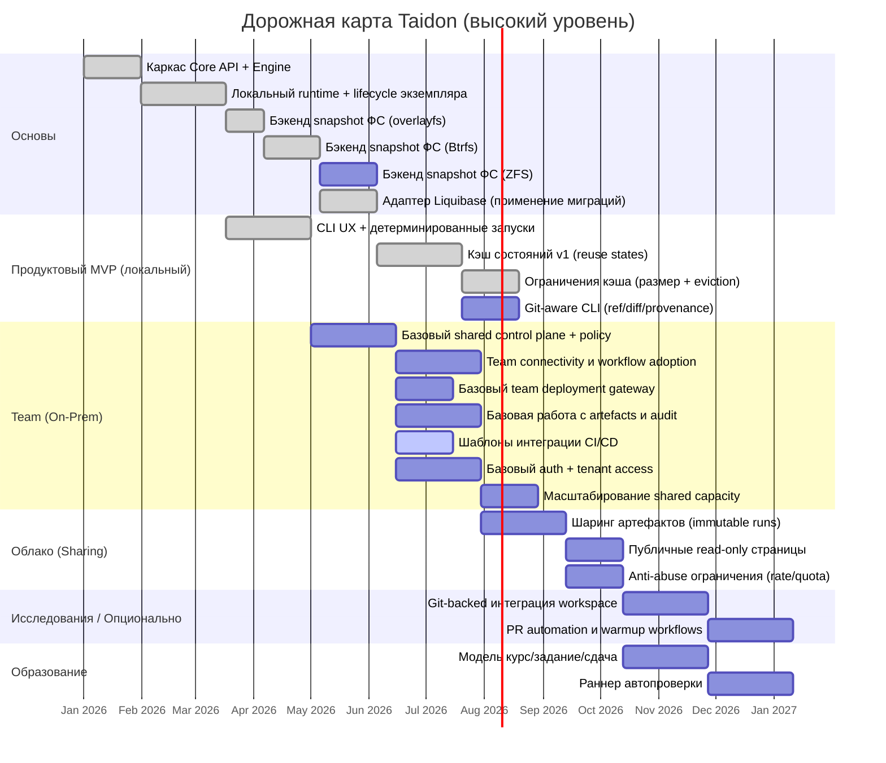

# Roadmap Taidon

Этот roadmap приоритизирует сценарии, use cases и компоненты, чтобы дать раннюю продуктовую ценность при сохранении четкого пути к team (on-prem) и cloud/education предложениям.

---

## Цели и не-цели

### Цели

- Дать быстрый, воспроизводимый database instance для разработчиков (local-first)
- Обеспечить единое инвариантное ядро (Engine + API) для всех профилей деплоймента
- Дать CI/CD интеграцию для team adoption
- Сохранить чистый путь апгрейда к public cloud sharing и образовательным сценариям

### Не-цели (на старте)

- Полный multi-tenant биллинг и платежи
- Поддержка множества DB engines одновременно
- Полный browser-based IDE hosting (VS Code-in-browser)

---

## Обзор дорожной карты

```mermaid
gantt
    title Дорожная карта Taidon (высокий уровень)
    dateFormat  YYYY-MM-DD
    axisFormat  %b %Y

    section Основы
    Каркас Core API + Engine                  :done, a1, 2026-01-01, 30d
    Локальный runtime + lifecycle экземпляра   :done, a2, after a1, 45d
    Бэкенд snapshot ФС (overlayfs)            :done, a2fs, after a2, 20d
    Бэкенд snapshot ФС (Btrfs)                :done, a2b, after a2fs, 30d
    Бэкенд snapshot ФС (ZFS)                  :a2z, after a2b, 30d
    Адаптер Liquibase (применение миграций)   :done, a3, after a2b, 30d

    section Продуктовый MVP (локальный)
    CLI UX + детерминированные запуски        :done, b2, after a2, 45d
    Кэш состояний v1 (reuse states)           :done, b3, after a3, 45d
    Ограничения кэша (размер + eviction)      :done, b3g, after b3, 30d
    Git-aware CLI (ref/diff/provenance)       :b4, after b3, 30d

    section Team (On-Prem)
    Базовый shared control plane + policy      :c1, after b2, 45d
    Team connectivity и workflow adoption      :c0, after c1, 45d
    Базовый team deployment gateway            :c6, after c1, 30d
    Базовая работа с artefacts и audit         :c2, after c1, 45d
    Шаблоны интеграции CI/CD                  :active, c3, after c1, 30d
    Базовый auth + tenant access               :c4, after c1, 45d
    Масштабирование shared capacity            :c5, after c2, 30d

    section Облако (Sharing)
    Шаринг артефактов (immutable runs)        :d1, after c2, 45d
    Публичные read-only страницы              :d2, after d1, 30d
    Anti-abuse ограничения (rate/quota)       :d3, after d1, 30d

    section Исследования / Опционально
    Git-backed интеграция workspace            :o1, after d2, 45d
    PR automation и warmup workflows           :o2, after o1, 45d

    section Образование
    Модель курс/задание/сдача                 :e1, after d2, 45d
    Раннер автопроверки                       :e2, after e1, 45d
```

> Даты — placeholder-ы для визуализации порядка. Roadmap построен вокруг milestones.

---

## Статус (на 2026-03-16)

- **Сделано**: локальная поверхность API (health, config, names, instances, runs, states, prepare jobs, tasks), локальный runtime и lifecycle, end-to-end pipeline init/prepare/run, хранение job/task и события, абстракция StateFS, базовая часть state cache и ретеншн, локальная CLI-поверхность (`sqlrs init`, `sqlrs config`, `sqlrs ls`, `sqlrs status`, `sqlrs plan:psql`, `sqlrs plan:lb`, `sqlrs prepare:psql`, `sqlrs prepare:lb`, `sqlrs run:psql`, `sqlrs run:pgbench`, `sqlrs rm`), WSL init flow (включая установку nsenter), логирование instance-delete.
- **Сделано (ФС)**: заглушка snapshot на overlayfs (copy) и бэкенд снимков на Btrfs.
- **Сделано (PR #37-#41, hardening)**: добавлены release happy-path e2e сценарии
  для Chinook/Sakila с расширением матрицы (включая Btrfs), поведение
  `init --btrfs` выровнено между Linux и Windows, Windows WSL/docker probe
  встроен в release-проверки, усилена детерминированность output/workspace.
- **Сделано (MVP command surface)**: локальный MVP-набор команд стабилен вокруг
  `init/config/ls/status/plan/prepare/run/rm`; legacy-нейминг команд в
  документации считается устаревшим.
- **Сделано (bounded cache core)**: локальный engine уже поддерживает
  `cache.capacity.*` конфиг, strict enforcement перед/после snapshot-фаз,
  детерминированный eviction неиспользуемых leaf-states и structured errors
  при нехватке места.
- **Сделано (bounded cache hardening)**: операторская диагностика для local
  профиля уже входит в публичную CLI-поверхность через `sqlrs status`,
  `sqlrs status --cache` и `sqlrs ls --states --cache-details`; persisted
  `size_bytes` metadata и отдельный release cache-pressure сценарий тоже уже
  на месте.
- **В работе (базовый CI-template слой)**: GitHub Actions release/e2e пайплайны
  уже активны; более широкие team-шаблоны (например, GitLab и on-prem варианты)
  ещё впереди.
- **Следующий публичный local-фокус**: explicit repo-tracked workflow aliases,
  advisory discovery tooling и последующий Git-aware CLI
  (`diff`, `--ref`, provenance, cache explain).
- **Запланировано**: ZFS snapshot backend, опциональная VS Code интеграция,
  team on-prem baseline, облачный sharing, образование.

---

## Ближайший Следующий Шаг (Выбран)

- **Направление**: перейти от hardening локального MVP к M2 developer
  experience, сохраняя roadmap сфокусированным на публичных open/local
  deliverables.
- **Выбранный первый PR**: file-based prepare aliases для
  `sqlrs plan <ref>` и `sqlrs prepare <ref>`.
- **Следующий PR-срез**:
  - держать публичную документацию синхронной с уже shipped local cache diagnostics и release coverage;
  - определить repo-tracked prepare alias files (`*.prep.s9s.yaml`) и правила alias-ref resolution;
  - держать alias files отдельно от `.sqlrs/config.yaml` и runtime `names`;
  - обновить user guides и тесты вокруг alias-based local execution.
- **Почему сейчас**: local MVP surface и bounded cache hardening уже достаточно
  зрелые; следующая наибольшая публичная ценность теперь в снижении трения
  вокруг репозитория и в лучшей диагностике воспроизводимости для разработчиков.

---

## Milestones

### M0. Архитектурный baseline

**Результат**: стабильные концепты и контракты до тяжелой реализации.

- Зафиксировать канонические сущности: project, instance, run, artefact, share
- Зафиксировать core API surface (create/prepare/run/remove + status/events)
- Принять подход к runtime изоляции для MVP (локальные контейнеры vs альтернативы)

**Статус**: сделано (архитектура закреплена ADR и локальным OpenAPI для engine).

**Ключевые документы, которые нужно подготовить дальше**:

- [`api-contract.md`](api-contract.md)
- [`instance-lifecycle.md`](instance-lifecycle.md)
- [`state-cache-design.md`](architecture/state-cache-design.RU.md)

---

### M1. Local MVP (сценарий A1)

**Основной сценарий**: A1 локальная разработка с Liquibase.

**Целевые use cases**:

- UC-1 Поднять изолированный экземпляр БД
- UC-2 Применить миграции (Liquibase / SQL)
- UC-3 Запустить тесты / запросы / скрипты
- UC-4 Кэшировать и переиспользовать состояния БД

**Deliverables**:

- Taidon Engine + API (локальный режим) — **сделано** (локальный OpenAPI spec)
- Локальный runtime (контейнеры) с lifecycle экземпляра — **сделано**
- CLI (локальный): `sqlrs init`, `sqlrs config`, `sqlrs ls`, `sqlrs status`, `sqlrs plan:psql`, `sqlrs plan:lb`, `sqlrs prepare:psql`, `sqlrs prepare:lb`, `sqlrs run:psql`, `sqlrs run:pgbench`, `sqlrs rm` — **сделано**
- Cache v1 (prepare jobs + reuse state + retention) — **сделано (ядро)**
- Ограничения ёмкости кэша (лимиты размера + eviction) — **сделано**
  (core enforcement, CLI diagnostics, persisted size metadata, release
  cache-pressure coverage для локального профиля)
- Бэкенды snapshot ФС — **сделано** (заглушка overlayfs copy, Btrfs), **в планах** (ZFS)
- Liquibase адаптер (apply changelog) — **сделано (MVP scope)** (базовый локальный поток через `prepare:lb`/`plan:lb` реализован)
- Release happy-path e2e gate — **сделано** (покрытие Linux/macOS/Windows WSL
  для сценариев Chinook/Sakila, включая Btrfs в матрице валидации и отдельный
  local cache-pressure сценарий в release-проверках)

**Опционально (nice-to-have)**:

- VS Code extension v0:
  - list instances
  - apply migrations
  - show logs and run results

**Exit criteria**:

- Cold start создает рабочий экземпляр
- Warm start переиспользует кэшированное состояние и значительно быстрее
- Миграции детерминированы и воспроизводимы

**Статус**: сделано (MVP baseline). Оставшийся публичный local follow-up теперь
в основном находится в M2 developer experience и в опциональных runtime
расширениях вроде ZFS.

---

### M2. Developer Experience (Post-MVP Local)

**Цель**: снизить трение при локальном onboarding и улучшить инструменты воспроизводимости.

**Целевые use cases**:

- UC-1, UC-2, UC-3 (с минимальной конфигурацией)

**Deliverables**:

- Project-tracked workflow aliases:
  - `*.prep.s9s.yaml` и `*.run.s9s.yaml`
  - явное alias-ref resolution для `plan`, `prepare` и `run`
- Advisory discovery tooling:
  - `sqlrs discover --aliases`
  - последующие analyzers для `.gitignore`, `.vscode` и prepare shaping
- Git-aware CLI (passive):
  - `diff`, `--ref` (blob/worktree), provenance, cache explain
- VS Code extension v1 (optional):
  - one-click copy DSN
  - открыть SQL редактор (через существующие DB инструменты VS Code)

**Exit criteria**:

- Разработчик может выполнять типовые сценарии через явные repo-tracked recipes
  с низким локальным setup friction и понятной диагностикой происхождения/
  содержимого кэша.

---

### M3. Team On-Prem (сценарий A2)

**Основной сценарий**: общий Taidon для команды или подразделения.

**Целевые use cases**:

- UC-5 Интеграция с CI/CD
- UC-1..UC-4 в общем аутентифицированном deployment

**Deliverables**:

- Shared control-plane baseline для аутентифицированных multi-user deployment
- Team deployment gateway и service entrypoint baseline
- Shared state, artifact и audit handling с retention controls
- Базовый auth, tenant access, quotas и policy enforcement
- CI/CD integration templates и operator deployment path
- Baseline для team workflow compatibility и shared capacity scaling

**Exit criteria**:

- Несколько разработчиков могут параллельно запускать изолированные экземпляры
- Квоты предотвращают истощение ресурсов
- CI пайплайны стабильно поднимают и уничтожают экземпляры

---

### M4. Public Cloud Sharing (сценарий B3)

**Основной сценарий**: быстрые эксперименты и публичный шаринг.

**Целевые use cases**:

- UC-6 Делиться результатами экспериментов

**Deliverables**:

- Immutable run snapshots:
  - shareable bundles артефактов
  - redaction секретов
- Public read-only pages:
  - просмотр результатов
  - кнопка reproduce (clone в workspace пользователя)
- Anti-abuse controls:
  - rate limiting
  - лимиты экземпляров
  - enforcement TTL

**Exit criteria**:

- Пользователь может поделиться run ссылкой
- Другой пользователь может воспроизвести это в контролируемом окружении

---

### R1. Hosted Git Integration (опционально / research)

**Цель**: связать hosted/shared окружения с ревизиями репозитория, не делая
локальные открытые workflow зависимыми от hosted-инфраструктуры.

**Deliverables**:

- Git-backed project integration для hosted/shared environments
- Запуск или refresh workloads из выбранной ревизии репозитория
- Secure repository access и provenance-aware refresh flow

**Exit criteria**:

- Пользователь может привязать Git репозиторий и запустить экземпляр из выбранной ветки/коммита
- Обновления репозитория доступны в экземпляре без ручного ре-импорта

---

### R2. PR Automation (опционально / research)

**Цель**: автоматизировать warmup и diff workflow вокруг PR без раскрытия
credentials или runtime connection details.

**Deliverables**:

- Hosted automation path для PR-triggered warmup и diff workflows
- Integration surface для checks, callbacks или bot-driven review signals
- Reproducible PR summaries без раскрытия credentials или DSN
- Lifecycle hooks для refresh или retire подготовленного backend state

**Exit criteria**:

- PR label или slash command запускает warmup в контролируемом runner
- Check Run показывает summary diff/warmup без раскрытия секретов

---

### M5. Education (сценарии C4a/C4b)

**Основной сценарий**: задания, сдачи и оценивание.

**Целевые use cases**:

- UC-7 Подготовка заданий
- UC-8 Сдача и проверка результатов

**Deliverables**:

- Модель course/assignment/submission
- Autograding runner:
  - instructor-defined checks (SQL/tests)
  - структурированный отчет по оценке
- Instructor dashboard:
  - список сдач
  - сравнение результатов

**Exit criteria**:

- Преподаватель может опубликовать шаблон задания
- Студенты отправляют runs
- Преподаватель может оценивать консистентно

---

## Обоснование приоритизации

1. Local MVP (A1) дает немедленную продуктовую ценность и проверяет производительность ядра
2. Drop-in adoption снижает трение и ускоряет обратную связь
3. Team on-prem (A2) открывает enterprise-путь (квоты, auth, CI)
4. Sharing (B3) становится безопасным, когда есть артефакты, auth и квоты
5. Education (C4) естественно строится на sharing плюс role-based access

---

## Контроль области и решения, которые нужно зафиксировать рано

- DB engines для MVP (начать с одного, потом расширять)
- Механизм runtime-изоляции (container/k8s) и подход к snapshot
- Семантика кэша и правила инвалидации
- Границы безопасности (network egress, time limits, resource limits)
- Политика стабильности API (стратегия версионирования)

---

## Риски и смягчения

- Регрессии производительности из-за сильной изоляции
  - Смягчение: cache-first архитектура и benchmark gates
- Недетерминированные миграции и flaky states
  - Смягчение: строгий хэшинг, pinned images, воспроизводимые seeds
- Векторы абьюза в облаке (untrusted SQL)
  - Смягчение: сильная sandboxing, квоты, network policies, TTL

---

## Следующие документы для детализации

- [`api-contract.md`](api-contract.md) (REST/gRPC + events)
- [`sql-runner-api.md`](architecture/sql-runner-api.RU.md) (timeouts, cancel, streaming, cache-aware planning)
- [`runtime-and-isolation.md`](runtime-and-isolation.md) (local + k8s)
- [`liquibase-integration.md`](architecture/liquibase-integration.RU.md) (modes, config discovery)
- [`state-cache-design.md`](architecture/state-cache-design.RU.md) (snapshotting, hashing, retention)
- [`cli-spec.md`](cli-spec.md) (commands and exit codes)
- [`security-model.md`](security-model.md) (cloud-hardening, redaction, audit)
- [`runtime-snapshotting.md`](architecture/runtime-snapshotting.RU.md) (details of the snapshot mechanics)
- [`git-aware-passive.md`](architecture/git-aware-passive.RU.md) (CLI by ref, zero-copy, provenance)
- [`git-aware-active.md`](architecture/git-aware-active.RU.md) (PR automation, warmup/diff checks)
- [`k8s-architecture.md`](architecture/k8s-architecture.RU.md) (single entry gateway in k8s)
