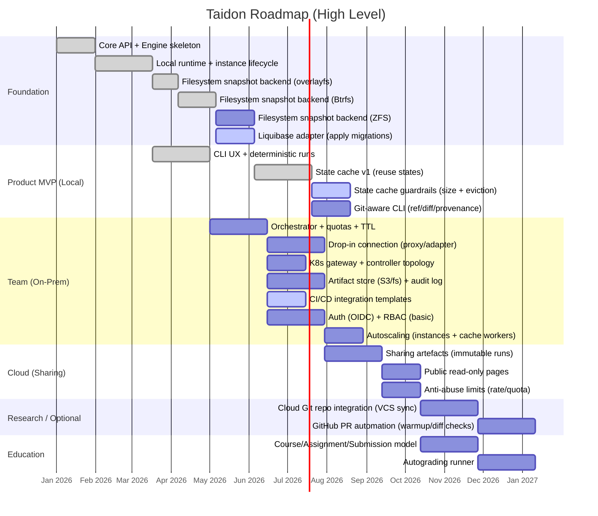

# Taidon Roadmap

This roadmap prioritises scenarios, use cases, and components to maximise early
product value while keeping a clear path to team (on-prem) and cloud/education offerings.

---

## Goals and Non-Goals

### Goals

- Deliver a fast, reproducible database instance for developers (local-first)
- Provide a single invariant core (Engine + API) across all deployment profiles
- Enable CI/CD integration for team adoption
- Preserve a clean upgrade path to public cloud sharing and education workflows

### Non-Goals (initially)

- Full multi-tenant billing and payments
- Support for many database engines at once
- Full browser-based IDE hosting (VS Code-in-browser)

---

## Roadmap Overview

> Dates are placeholders to visualise ordering. The roadmap is milestone-driven.

---

## Status (as of 2026-02-22)

- **Done**: local engine API surface (health, config, names, instances, runs,
  states, prepare jobs, tasks), local runtime and lifecycle, end-to-end
  init/prepare/run pipeline, job/task persistence and events, StateFS abstraction,
  state cache foundations and retention rules, CLI local surface (`sqlrs init`,
  `sqlrs config`, `sqlrs ls`, `sqlrs status`, `sqlrs plan:psql`, `sqlrs plan:lb`,
  `sqlrs prepare:psql`, `sqlrs prepare:lb`, `sqlrs run:psql`, `sqlrs run:pgbench`,
  `sqlrs rm`), WSL init flow (incl. nsenter install), instance-delete logging.
- **Done (filesystem)**: overlayfs-based copy stub and Btrfs snapshot backend.
- **Done (PR #37-#41 hardening)**: release happy-path e2e scenarios landed for
  Chinook/Sakila with matrix expansion (incl. Btrfs), `init --btrfs` behaviour
  unified across Linux/Windows, Windows WSL/docker probe moved into release
  verification, and deterministic output/workspace handling was tightened.
- **Done (MVP command surface)**: local MVP command set is stable around
  `init/config/ls/status/plan/prepare/run/rm`; legacy command naming is
  deprecated in docs.
- **In progress**: state-cache capacity controls (max size and eviction policy)
  to prevent unbounded workspace growth in long-lived environments.
- **In progress (CI templates baseline)**: GitHub Actions-based release/e2e flows
  are active; broader team templates (e.g., GitLab and on-prem deployment variants)
  are still pending.
- **Planned**: git-aware CLI, team on-prem orchestration (including drop-in
  proxy/adapter), cloud sharing, education.

---

## Immediate Next Step (Selected)

- **Direction**: add bounded cache behaviour before scaling team usage.
- **Next PR slice**:
  - introduce configurable cache size limits (global and per-workspace profile);
  - implement deterministic eviction for unreferenced states (TTL + size pressure);
  - expose cache occupancy and eviction decisions in CLI/diagnostics output;
  - extend release e2e checks to verify cache-pressure behaviour.
- **Rationale**: local MVP is already usable without a drop-in proxy; unbounded
  cache growth is now the highest operational risk and should be addressed first.

---

## Milestones

### M0. Architecture Baseline

**Outcome**: stable concepts and contracts before heavy implementation.

- Freeze canonical entities: project, instance, run, artefact, share
- Freeze core API surface (create/prepare/run/remove + status/events)
- Decide runtime isolation approach for MVP (local containers vs other)

**Status**: Done (architecture captured via ADRs and the local engine OpenAPI spec).

**Key documents to produce next**:

- [`api-contract.md`](api-contract.md)
- [`instance-lifecycle.md`](instance-lifecycle.md)
- [`state-cache-design.md`](architecture/state-cache-design.md)

---

### M1. Local MVP (Scenario A1)

**Primary scenario**: A1 local development with Liquibase.

**Target use cases**:

- UC-1 Provision isolated database instance
- UC-2 Apply migrations (Liquibase / SQL)
- UC-3 Run tests / queries / scripts
- UC-4 Cache and reuse database states

**Deliverables**:

- Taidon Engine + API (local mode) — **Done** (local OpenAPI spec)
- Local runtime (containers) with instance lifecycle — **Done**
- CLI surface (local): `sqlrs init`, `sqlrs config`, `sqlrs ls`, `sqlrs status`,
  `sqlrs plan:psql`, `sqlrs plan:lb`, `sqlrs prepare:psql`, `sqlrs prepare:lb`,
  `sqlrs run:psql`, `sqlrs run:pgbench`, `sqlrs rm` — **Done**
- Cache v1 (prepare jobs + state reuse + retention) — **Done (core)**
- Cache capacity guardrails (size limits + eviction) — **In progress**
- Filesystem snapshot backends — **Done** (overlayfs copy stub, Btrfs),
  **Planned** (ZFS)
- Liquibase adapter (apply changelog) — **Done (MVP scope)** (local flow via
  `prepare:lb`/`plan:lb` is implemented)
- Release happy-path e2e gate — **Done** (Linux/macOS/Windows WSL coverage for
  Chinook/Sakila scenarios, with Btrfs included in matrix validation)

**Optional (nice-to-have)**:

- VS Code extension v0:
  - list instances
  - apply migrations
  - show logs and run results

**Exit criteria**:

- A cold start produces a working instance
- A warm start reuses cached state and is significantly faster
- Migrations are deterministic and reproducible

**Status**: Done (MVP baseline). Ongoing hardening continues via cache capacity
controls and observability improvements.

---

### M2. Developer Experience (Post-MVP Local)

**Purpose**: reduce local onboarding friction and improve reproducibility tooling.

**Target use cases**:

- UC-1, UC-2, UC-3 (with minimal config)

**Deliverables**:

- Config conventions:
  - discover migrations from repo layout
  - profiles (dev/test) and secrets handling
- Git-aware CLI (passive):
  - `--ref` (blob/worktree), `diff`, provenance, cache explain
- VS Code extension v1 (optional):
  - one-click copy DSN
  - open SQL editor (via existing VS Code DB tooling)

**Exit criteria**:

- A developer can run common workflows with minimal config and clear cache
  provenance diagnostics.

---

### M3. Team On-Prem (Scenario A2)

**Primary scenario**: shared Taidon for a team/department.

**Target use cases**:

- UC-5 Integrate with CI/CD
- UC-4 Cache and reuse database states (shared)
- UC-1..UC-3 at scale

**Deliverables**:

- Orchestrator service:
  - job queue
  - quotas
  - TTL policies
- K8s shared deployment baseline:
  - single entrypoint Gateway (TCP)
  - Controller-managed DB runner pods
- Artifact store:
  - logs, reports, exports
  - retention policies
- Auth and RBAC (basic):
  - OIDC login
  - organisation/team scopes
- CI templates:
  - GitHub Actions / GitLab CI examples
- Drop-in connection strategy (team deployment profile):
  - Proxy/adapter compatible with shared orchestrator networking and policy
  - Includes connection detection/visibility for ephemeral instances
- Autoscaling controller (instances + cache workers):
  - HPA/VPA profiles using backlog/cache metrics
  - Warm pool for fast start; graceful drain on scale-in

**Exit criteria**:

- Multiple developers can run isolated instances concurrently
- Quotas prevent resource exhaustion
- CI pipelines can provision and teardown instances reliably

---

### M4. Public Cloud Sharing (Scenario B3)

**Primary scenario**: quick experiments and public sharing.

**Target use cases**:

- UC-6 Share experiment results

**Deliverables**:

- Immutable run snapshots:
  - shareable artefact bundles
  - redaction of secrets
- Public read-only pages:
  - view results
  - reproduce button (clone into user workspace)
- Anti-abuse controls:
  - rate limiting
  - instance limits
  - TTL enforcement

**Exit criteria**:

- A user can share a run via link
- Another user can reproduce it in a controlled environment

---

### R1. Cloud Git Integration (Optional / Research)

**Purpose**: connect the cloud instance with Git repositories.

**Deliverables**:

- VCS/Git connector (API) with private-repo support
- Bind project to branch/commit; start instance from the selected revision
- One-time tokens/SSO for Git (secrets managed in cloud)
- Optional auto-sync/pull to refresh instance state

**Exit criteria**:

- User can attach a Git repo and start a instance from a chosen branch/commit
- Repo updates are available in the instance without manual re-import

---

### R2. GitHub PR Automation (Optional / Research)

**Purpose**: automate warmup and diffs around PRs without leaking secrets.

**Deliverables**:

- GitHub App / webhook receiver
- PR slash commands:
  - `/taidon warmup --prepare <path>`
  - `/taidon diff --from-ref base --to-ref head --prepare <path>`
  - `/taidon compare --from-ref base --from-prepare <path> --to-ref head --to-prepare
    <path> --run "..."`
- Check Runs:
  - warmup status
  - Taidon-aware diff summary
- Warmup via `sqlrs run` in prepare-only mode (no DSN in PR)
- Eviction hints from Git events (merge/tag/PR closed)

**Exit criteria**:

- PR label or slash command triggers warmup in a controlled runner
- Check Run shows diff/warmup summary without exposing secrets

---

### M5. Education (Scenarios C4a/C4b)

**Primary scenario**: assignments, submissions, and grading.

**Target use cases**:

- UC-7 Prepare assignments
- UC-8 Submit and review results

**Deliverables**:

- Course/assignment/submission model
- Autograding runner:
  - instructor-defined checks (SQL/tests)
  - structured grading report
- Instructor dashboard:
  - list submissions
  - compare results

**Exit criteria**:

- Instructor can publish assignment template
- Students submit runs
- Instructor can evaluate consistently

---

## Prioritisation Rationale

1. Local MVP (A1) yields immediate product value and validates core performance
2. Drop-in adoption reduces friction and improves feedback velocity
3. Team on-prem (A2) unlocks the enterprise path (quotas, auth, CI)
4. Sharing (B3) becomes safe once artefacts, auth, and quotas exist
5. Education (C4) builds naturally on sharing plus role-based access

---

## Scope Controls and Decisions to Lock Early

- Database engines for MVP (start with one, expand later)
- Runtime isolation mechanism (container/k8s) and snapshot approach
- Cache semantics and invalidation rules
- Security boundaries (network egress, time limits, resource limits)
- API stability policy (versioning strategy)

---

## Risks and Mitigations

- Performance regressions due to heavy isolation
  - Mitigation: cache-first architecture and benchmark gates
- Non-deterministic migrations and flaky states
  - Mitigation: strict hashing, pinned images, reproducible seed strategy
- Cloud abuse vectors (untrusted SQL)
  - Mitigation: strong sandboxing, quotas, network policies, TTL

---

## Next Documents to Detail

- [`api-contract.md`](api-contract.md) (REST/gRPC + events)
- [`sql-runner-api.md`](architecture/sql-runner-api.md) (timeouts, cancel,
  streaming, cache-aware planning)
- [`runtime-and-isolation.md`](runtime-and-isolation.md) (local + k8s)
- [`liquibase-integration.md`](architecture/liquibase-integration.md) (modes,
  config discovery)
- [`state-cache-design.md`](architecture/state-cache-design.md) (snapshotting,
  hashing, retention)
- [`cli-spec.md`](cli-spec.md) (commands and exit codes)
- [`security-model.md`](security-model.md) (cloud-hardening, redaction, audit)
- [`runtime-snapshotting.md`](architecture/runtime-snapshotting.md) (details of
  the snapshot mechanics)
- [`git-aware-passive.md`](architecture/git-aware-passive.md) (CLI by ref,
  zero-copy, provenance)
- [`git-aware-active.md`](architecture/git-aware-active.md) (PR automation,
  warmup/diff checks)
- [`k8s-architecture.md`](architecture/k8s-architecture.md) (single entry gateway
  in k8s)
