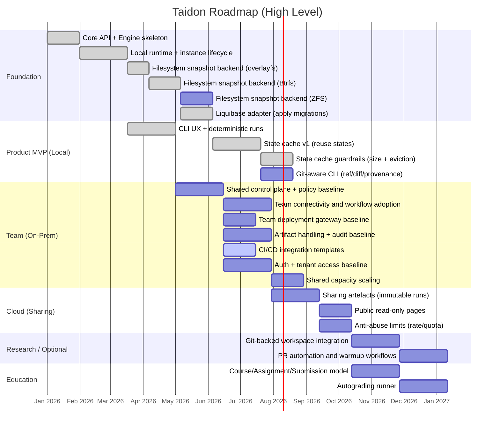

# Taidon Roadmap

This roadmap prioritises scenarios, use cases, and components to maximise early
product value while keeping a clear path to team (on-prem) and cloud/education offerings.

---

## Goals and Non-Goals

### Goals

- Deliver a fast, reproducible database instance for developers (local-first)
- Provide a single invariant core (Engine + API) across all deployment profiles
- Enable CI/CD integration for team adoption
- Preserve a clean upgrade path to public cloud sharing and education workflows

### Non-Goals (initially)

- Full multi-tenant billing and payments
- Support for many database engines at once
- Full browser-based IDE hosting (VS Code-in-browser)

---

## Roadmap Overview

```mermaid
gantt
    title Taidon Roadmap (High Level)
    dateFormat  YYYY-MM-DD
    axisFormat  %b %Y

    section Foundation
    Core API + Engine skeleton                 :done, a1, 2026-01-01, 30d
    Local runtime + instance lifecycle         :done, a2, after a1, 45d
    Filesystem snapshot backend (overlayfs)    :done, a2fs, after a2, 20d
    Filesystem snapshot backend (Btrfs)        :done, a2b, after a2fs, 30d
    Filesystem snapshot backend (ZFS)          :a2z, after a2b, 30d
    Liquibase adapter (apply migrations)       :done, a3, after a2b, 30d

    section Product MVP (Local)
    CLI UX + deterministic runs                :done, b2, after a2, 45d
    State cache v1 (reuse states)              :done, b3, after a3, 45d
    State cache guardrails (size + eviction)   :done, b3g, after b3, 30d
    Git-aware CLI (ref/diff/provenance)        :b4, after b3, 30d

    section Team (On-Prem)
    Shared control plane + policy baseline     :c1, after b2, 45d
    Team connectivity and workflow adoption    :c0, after c1, 45d
    Team deployment gateway baseline           :c6, after c1, 30d
    Artifact handling + audit baseline         :c2, after c1, 45d
    CI/CD integration templates                :active, c3, after c1, 30d
    Auth + tenant access baseline              :c4, after c1, 45d
    Shared capacity scaling                    :c5, after c2, 30d

    section Cloud (Sharing)
    Sharing artefacts (immutable runs)         :d1, after c2, 45d
    Public read-only pages                     :d2, after d1, 30d
    Anti-abuse limits (rate/quota)             :d3, after d1, 30d

    section Research / Optional
    Git-backed workspace integration           :o1, after d2, 45d
    PR automation and warmup workflows         :o2, after o1, 45d

    section Education
    Course/Assignment/Submission model         :e1, after d2, 45d
    Autograding runner                         :e2, after e1, 45d
```

> Dates are placeholders to visualise ordering. The roadmap is milestone-driven.

---

## Status (as of 2026-03-19)

- **Done**: local engine API surface (health, config, names, instances, runs,
  states, prepare jobs, tasks), local runtime and lifecycle, end-to-end
  init/prepare/run pipeline, job/task persistence and events, StateFS abstraction,
  state cache foundations and retention rules, CLI local surface (`sqlrs init`,
  `sqlrs config`, `sqlrs ls`, `sqlrs status`, `sqlrs plan:psql`, `sqlrs plan:lb`,
  `sqlrs prepare:psql`, `sqlrs prepare:lb`, `sqlrs run:psql`, `sqlrs run:pgbench`,
  `sqlrs rm`), WSL init flow (incl. nsenter install), instance-delete logging.
- **Done (filesystem)**: overlayfs-based copy stub and Btrfs snapshot backend.
- **Done (PR #37-#41 hardening)**: release happy-path e2e scenarios landed for
  Chinook/Sakila with matrix expansion (incl. Btrfs), `init --btrfs` behaviour
  unified across Linux/Windows, Windows WSL/docker probe moved into release
  verification, and deterministic output/workspace handling was tightened.
- **Done (MVP command surface)**: local MVP command set is stable around
  `init/config/ls/status/plan/prepare/run/rm`; legacy command naming is
  deprecated in docs.
- **Done (bounded cache core)**: the local engine already supports
  `cache.capacity.*` configuration, strict enforcement before/after snapshot
  phases, deterministic eviction of unreferenced leaf states, and structured
  errors when space cannot be reclaimed.
- **Done (bounded cache hardening)**: local operator-facing diagnostics now ship
  in the public CLI surface via `sqlrs status`, `sqlrs status --cache`, and
  `sqlrs ls --states --cache-details`; persisted `size_bytes` metadata and a
  dedicated release cache-pressure scenario are also in place for the local
  profile.
- **Done (M2 alias execution baseline)**: repo-tracked prepare and run aliases
  now back `sqlrs plan <ref>`, `sqlrs prepare <ref>`, and standalone
  `sqlrs run <ref> --instance ...` through `*.prep.s9s.yaml` and
  `*.run.s9s.yaml` files, with exact-file escape via trailing `.`, cwd-relative
  alias-ref resolution, alias-file-relative file-bearing paths, and mixed raw
  and alias `prepare ... run` composition with `--instance` guardrails.
- **Done (release alias/workspace coverage)**: release/e2e scenarios now
  exercise repo-tracked prepare aliases for Chinook, Sakila, and
  Liquibase/JHipster examples, keeping alias/workspace conventions under
  verification.
- **In progress (CI templates baseline)**: GitHub Actions-based release/e2e flows
  are active; broader team templates (e.g., GitLab and on-prem deployment variants)
  are still pending.
- **Next public local focus**: finish the remaining M2 local DX layers with
  explicit alias inspection (`sqlrs alias ls/show/validate`), then
  `sqlrs discover --aliases`, follow-up discover analyzers, shared input-graph
  primitives, and `sqlrs diff` path mode before the later Git-aware CLI
  follow-up (`--ref`, provenance, cache explain).
- **Planned**: ZFS snapshot backend, optional VS Code integration, team on-prem
  baseline, cloud sharing, education.

---

## Immediate Next Step (Selected)

- **Direction**: finish the remaining repository-guided M2 local DX surface now
  that alias execution and workspace conventions have landed.
- **Selected next PR**: alias inspection commands
  (`sqlrs alias ls/show/validate`).
- **Next PR slice**:
  - add `sqlrs alias ls` to enumerate `*.prep.s9s.yaml` and `*.run.s9s.yaml`
    within the active workspace;
  - add `sqlrs alias show <ref>` to print the resolved alias definition and the
    concrete file it maps to;
  - add `sqlrs alias validate [<ref>]` to check one or all alias files before
    execution;
  - reuse the same cwd-relative alias-ref resolution and exact-file escape rules
    already used by `plan/prepare/run`;
  - cover missing files, schema/kind errors, wrong alias type, and inspection
    behaviour in docs and tests.
- **Immediately after**: `sqlrs discover --aliases`, generic discover analyzers,
  shared local input-graph primitives, `sqlrs diff` path mode, bounded local
  `--ref`, then provenance and cache explain.
- **Rationale**: alias execution is already usable and covered by release
  scenarios; the highest remaining local DX gap is direct inspection and
  validation of repo-tracked recipes before moving into advisory discovery and
  Git-aware flows.

---

## Milestones

### M0. Architecture Baseline

**Outcome**: stable concepts and contracts before heavy implementation.

- Freeze canonical entities: project, instance, run, artefact, share
- Freeze core API surface (create/prepare/run/remove + status/events)
- Decide runtime isolation approach for MVP (local containers vs other)

**Status**: Done (architecture captured via ADRs and the local engine OpenAPI spec).

**Key documents to produce next**:

- [`api-contract.md`](api-contract.md)
- [`instance-lifecycle.md`](instance-lifecycle.md)
- [`state-cache-design.md`](architecture/state-cache-design.md)

---

### M1. Local MVP (Scenario A1)

**Primary scenario**: A1 local development with Liquibase.

**Target use cases**:

- UC-1 Provision isolated database instance
- UC-2 Apply migrations (Liquibase / SQL)
- UC-3 Run tests / queries / scripts
- UC-4 Cache and reuse database states

**Deliverables**:

- Taidon Engine + API (local mode) — **Done** (local OpenAPI spec)
- Local runtime (containers) with instance lifecycle — **Done**
- CLI surface (local): `sqlrs init`, `sqlrs config`, `sqlrs ls`, `sqlrs status`,
  `sqlrs plan:psql`, `sqlrs plan:lb`, `sqlrs prepare:psql`, `sqlrs prepare:lb`,
  `sqlrs run:psql`, `sqlrs run:pgbench`, `sqlrs rm` — **Done**
- Cache v1 (prepare jobs + state reuse + retention) — **Done (core)**
- Cache capacity guardrails (size limits + eviction) — **Done** (core
  enforcement, CLI diagnostics, persisted size metadata, release
  cache-pressure coverage for the local profile)
- Filesystem snapshot backends — **Done** (overlayfs copy stub, Btrfs),
  **Planned** (ZFS)
- Liquibase adapter (apply changelog) — **Done (MVP scope)** (local flow via
  `prepare:lb`/`plan:lb` is implemented)
- Release happy-path e2e gate — **Done** (Linux/macOS/Windows WSL coverage for
  Chinook, Sakila, and Liquibase/JHipster alias-driven scenarios, with Btrfs in
  matrix validation and a dedicated local cache-pressure scenario in release
  checks)

**Optional (nice-to-have)**:

- VS Code extension v0:
  - list instances
  - apply migrations
  - show logs and run results

**Exit criteria**:

- A cold start produces a working instance
- A warm start reuses cached state and is significantly faster
- Migrations are deterministic and reproducible

**Status**: Done (MVP baseline). Remaining public local follow-up now sits
primarily in M2 developer experience and optional runtime extensions such as ZFS.

---

### M2. Developer Experience (Post-MVP Local)

**Purpose**: reduce local onboarding friction and improve reproducibility tooling.

**Target use cases**:

- UC-1, UC-2, UC-3 (with minimal config)

**Deliverables**:

- Project-tracked workflow aliases:
  - `*.prep.s9s.yaml` and `*.run.s9s.yaml`
  - explicit cwd-relative alias-ref resolution for `plan`, `prepare`, and `run`
  - alias-file-relative resolution for file-bearing paths stored inside alias
    files
  - normal `prepare ... run` composition across raw and alias modes
  - explicit alias inspection via `sqlrs alias ls/show/validate`
- Advisory discovery tooling:
  - `sqlrs discover --aliases`
  - follow-up analyzers for `.gitignore`, `.vscode`, and prepare shaping
- Git-aware CLI (passive):
  - `diff`, `--ref` (blob/worktree), provenance, cache explain
- VS Code extension v1 (optional):
  - one-click copy DSN
  - open SQL editor (via existing VS Code DB tooling)

**Exit criteria**:

- A developer can run common workflows using explicit repo-tracked recipes with
  low local setup friction and clear cache provenance diagnostics.

**Status**: In progress. Alias execution baseline is landed (`plan/prepare/run`
aliases, cwd-relative refs, alias-file-relative payloads, mixed
`prepare ... run`), with alias inspection, discovery, `diff` path mode,
bounded `--ref`, and provenance/cache explain still ahead.

---

### M3. Team On-Prem (Scenario A2)

**Primary scenario**: shared Taidon for a team or department.

**Target use cases**:

- UC-5 Integrate with CI/CD
- UC-1..UC-4 in a shared authenticated deployment

**Deliverables**:

- Shared control-plane baseline for authenticated multi-user deployments
- Team deployment gateway and service entrypoint baseline
- Shared state, artifact, and audit handling with retention controls
- Basic auth, tenant access, quotas, and policy enforcement
- CI/CD integration templates and operator deployment path
- Team workflow compatibility and capacity scaling baseline

**Exit criteria**:

- Multiple developers can run isolated instances concurrently
- Quotas prevent resource exhaustion
- CI pipelines can provision and teardown instances reliably

---

### M4. Public Cloud Sharing (Scenario B3)

**Primary scenario**: quick experiments and public sharing.

**Target use cases**:

- UC-6 Share experiment results

**Deliverables**:

- Immutable run snapshots:
  - shareable artefact bundles
  - redaction of secrets
- Public read-only pages:
  - view results
  - reproduce button (clone into user workspace)
- Anti-abuse controls:
  - rate limiting
  - instance limits
  - TTL enforcement

**Exit criteria**:

- A user can share a run via link
- Another user can reproduce it in a controlled environment

---

### R1. Hosted Git Integration (Optional / Research)

**Purpose**: connect hosted or shared environments to repository revisions
without making local workflows dependent on hosted infrastructure.

**Deliverables**:

- Git-backed project integration for hosted/shared environments
- Start or refresh workloads from a selected repository revision
- Secure repository access and provenance-aware refresh flow

**Exit criteria**:

- User can attach a Git repo and start a instance from a chosen branch/commit
- Repo updates are available in the instance without manual re-import

---

### R2. PR Automation (Optional / Research)

**Purpose**: automate warmup and diff workflows around PRs without exposing
credentials or runtime connection details.

**Deliverables**:

- Hosted automation path for PR-triggered warmup and diff workflows
- Integration surface for checks, callbacks, or bot-driven review signals
- Reproducible PR summaries without exposing credentials or DSNs
- Lifecycle hooks for refreshing or retiring prepared backend state

**Exit criteria**:

- PR label or slash command triggers warmup in a controlled runner
- Check Run shows diff/warmup summary without exposing secrets

---

### M5. Education (Scenarios C4a/C4b)

**Primary scenario**: assignments, submissions, and grading.

**Target use cases**:

- UC-7 Prepare assignments
- UC-8 Submit and review results

**Deliverables**:

- Course/assignment/submission model
- Autograding runner:
  - instructor-defined checks (SQL/tests)
  - structured grading report
- Instructor dashboard:
  - list submissions
  - compare results

**Exit criteria**:

- Instructor can publish assignment template
- Students submit runs
- Instructor can evaluate consistently

---

## Prioritisation Rationale

1. Local MVP (A1) yields immediate product value and validates core performance
2. Drop-in adoption reduces friction and improves feedback velocity
3. Team on-prem (A2) unlocks the enterprise path (quotas, auth, CI)
4. Sharing (B3) becomes safe once artefacts, auth, and quotas exist
5. Education (C4) builds naturally on sharing plus role-based access

---

## Scope Controls and Decisions to Lock Early

- Database engines for MVP (start with one, expand later)
- Runtime isolation mechanism (container/k8s) and snapshot approach
- Cache semantics and invalidation rules
- Security boundaries (network egress, time limits, resource limits)
- API stability policy (versioning strategy)

---

## Risks and Mitigations

- Performance regressions due to heavy isolation
  - Mitigation: cache-first architecture and benchmark gates
- Non-deterministic migrations and flaky states
  - Mitigation: strict hashing, pinned images, reproducible seed strategy
- Cloud abuse vectors (untrusted SQL)
  - Mitigation: strong sandboxing, quotas, network policies, TTL

---

## Next Documents to Detail

- [`api-contract.md`](api-contract.md) (REST/gRPC + events)
- [`sql-runner-api.md`](architecture/sql-runner-api.md) (timeouts, cancel,
  streaming, cache-aware planning)
- [`runtime-and-isolation.md`](runtime-and-isolation.md) (local + k8s)
- [`liquibase-integration.md`](architecture/liquibase-integration.md) (modes,
  config discovery)
- [`state-cache-design.md`](architecture/state-cache-design.md) (snapshotting,
  hashing, retention)
- [`cli-spec.md`](cli-spec.md) (commands and exit codes)
- [`security-model.md`](security-model.md) (cloud-hardening, redaction, audit)
- [`runtime-snapshotting.md`](architecture/runtime-snapshotting.md) (details of
  the snapshot mechanics)
- [`git-aware-passive.md`](architecture/git-aware-passive.md) (CLI by ref,
  zero-copy, provenance)
- [`git-aware-active.md`](architecture/git-aware-active.md) (PR automation,
  warmup/diff checks)
- [`k8s-architecture.md`](architecture/k8s-architecture.md) (single entry gateway
  in k8s)
